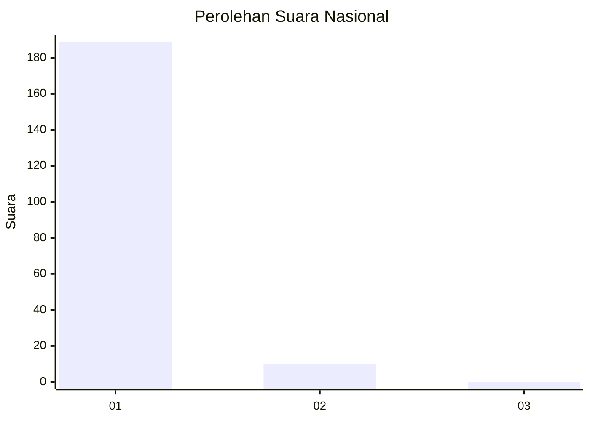
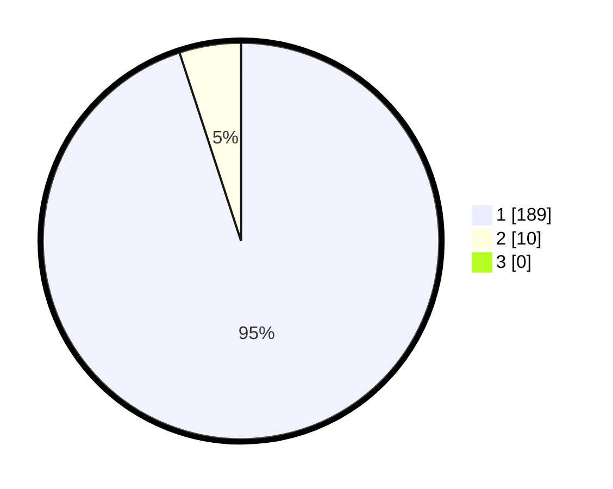

# Hasil

## Grafik

## Tabel

| No. | Nama Paslon    | Suara | Suara (raw) | Persentase |
|:--- |:-------------- | -----:| -----------:| ----------:|
| 1   | ANIES MUHAIMIN | 189   | [189][p-1]  | 94,97      |
| 2   | PRABOWO GIBRAN | 10    | [10][p-2]   | 5,03       |
| 3   | GANJAR MAHFUD  | 0     | [0][p-3]    | 0,00       |

[p-1]: https://github.com/gigit-pemilu/pemilu-2024/blob/main/pilpres/hitung-suara/sub/11-aceh/sub/08-aceh-utara/sub/13-tanah-pasir/sub/2006-gampong-pande/sub/003-tps/sub/paslon-1.txt
[p-2]: https://github.com/gigit-pemilu/pemilu-2024/blob/main/pilpres/hitung-suara/sub/11-aceh/sub/08-aceh-utara/sub/13-tanah-pasir/sub/2006-gampong-pande/sub/003-tps/sub/paslon-2.txt
[p-3]: https://github.com/gigit-pemilu/pemilu-2024/blob/main/pilpres/hitung-suara/sub/11-aceh/sub/08-aceh-utara/sub/13-tanah-pasir/sub/2006-gampong-pande/sub/003-tps/sub/paslon-3.txt

## Foto C Plano

https://sirekap-obj-formc.kpu.go.id/0b2b/pemilu/ppwp/11/08/13/20/06/1108132006003-20240304-122020--b70efd6c-e570-4a4e-9ea2-2244032c110b.jpg

https://sirekap-obj-formc.kpu.go.id/0b2b/pemilu/ppwp/11/08/13/20/06/1108132006003-20240304-122040--58394e55-c91f-463c-bba8-22ba79efece9.jpg

https://sirekap-obj-formc.kpu.go.id/0b2b/pemilu/ppwp/11/08/13/20/06/1108132006003-20240304-122059--8f74e626-26c7-4eb8-a2f3-8a5446841266.jpg

## Metadata

| Key        | Value               |
| ---------- | ------------------- |
| Time Stamp | 2024-03-10 23:00:00 |

