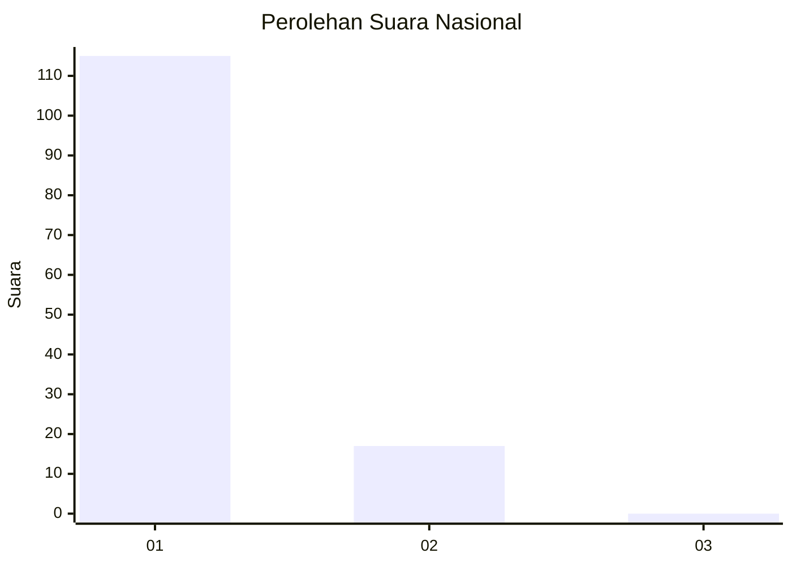
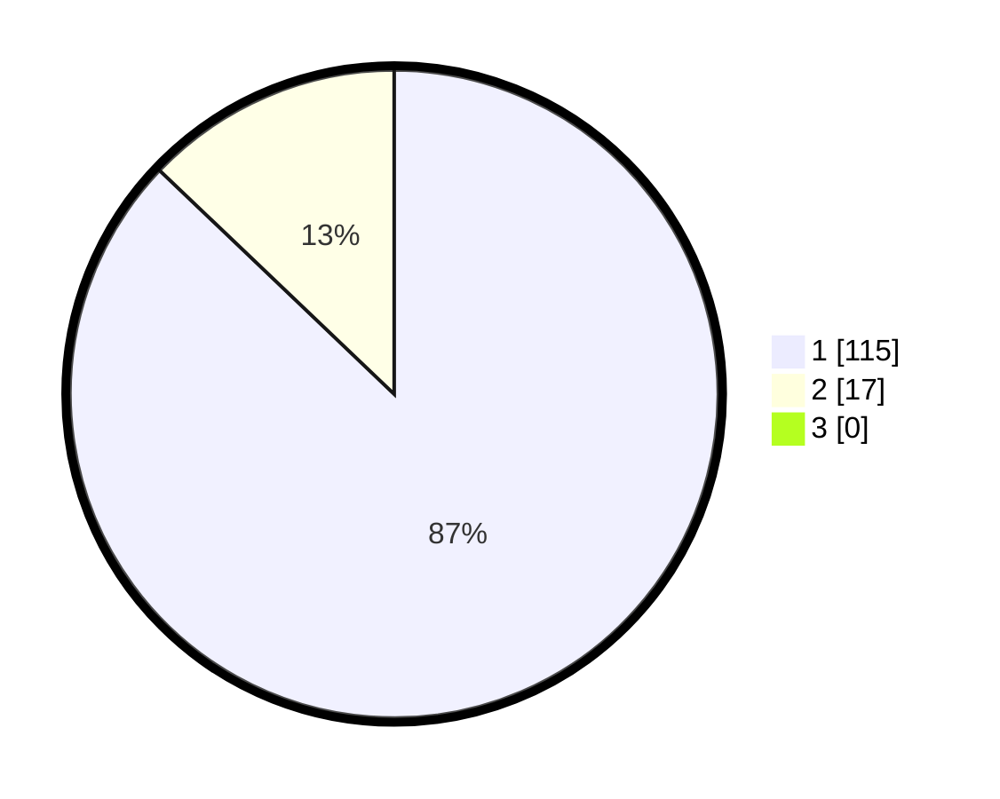

# Hasil

## Grafik

## Tabel

| No. | Nama Paslon    | Suara | Suara (raw) | Persentase |
|:--- |:-------------- | -----:| -----------:| ----------:|
| 1   | ANIES MUHAIMIN | 115   | [115][p-1]  | 87,12      |
| 2   | PRABOWO GIBRAN | 17    | [17][p-2]   | 12,88      |
| 3   | GANJAR MAHFUD  | 0     | [0][p-3]    | 0,00       |

[p-1]: https://github.com/gigit-pemilu/pemilu-2024/blob/main/pilpres/hitung-suara/sub/11-aceh/sub/08-aceh-utara/sub/13-tanah-pasir/sub/2007-matang-ranup-laseh/sub/001-tps/sub/paslon-1.txt
[p-2]: https://github.com/gigit-pemilu/pemilu-2024/blob/main/pilpres/hitung-suara/sub/11-aceh/sub/08-aceh-utara/sub/13-tanah-pasir/sub/2007-matang-ranup-laseh/sub/001-tps/sub/paslon-2.txt
[p-3]: https://github.com/gigit-pemilu/pemilu-2024/blob/main/pilpres/hitung-suara/sub/11-aceh/sub/08-aceh-utara/sub/13-tanah-pasir/sub/2007-matang-ranup-laseh/sub/001-tps/sub/paslon-3.txt

## Foto C Plano

https://sirekap-obj-formc.kpu.go.id/5180/pemilu/ppwp/11/08/13/20/07/1108132007001-20240303-151249--6f04a925-35c8-4520-b8db-bf2288ee3647.jpg

https://sirekap-obj-formc.kpu.go.id/5180/pemilu/ppwp/11/08/13/20/07/1108132007001-20240303-151316--98771787-8546-4b1b-a994-1a168b869093.jpg

https://sirekap-obj-formc.kpu.go.id/5180/pemilu/ppwp/11/08/13/20/07/1108132007001-20240303-151341--77de2478-fb4f-42cc-a4bb-37dcfd2a54cd.jpg

## Metadata

| Key        | Value               |
| ---------- | ------------------- |
| Time Stamp | 2024-03-10 23:00:00 |

