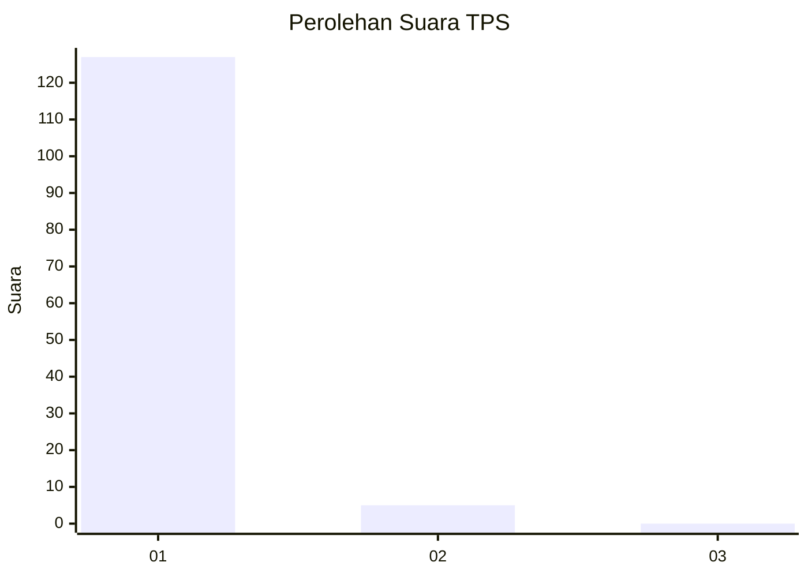
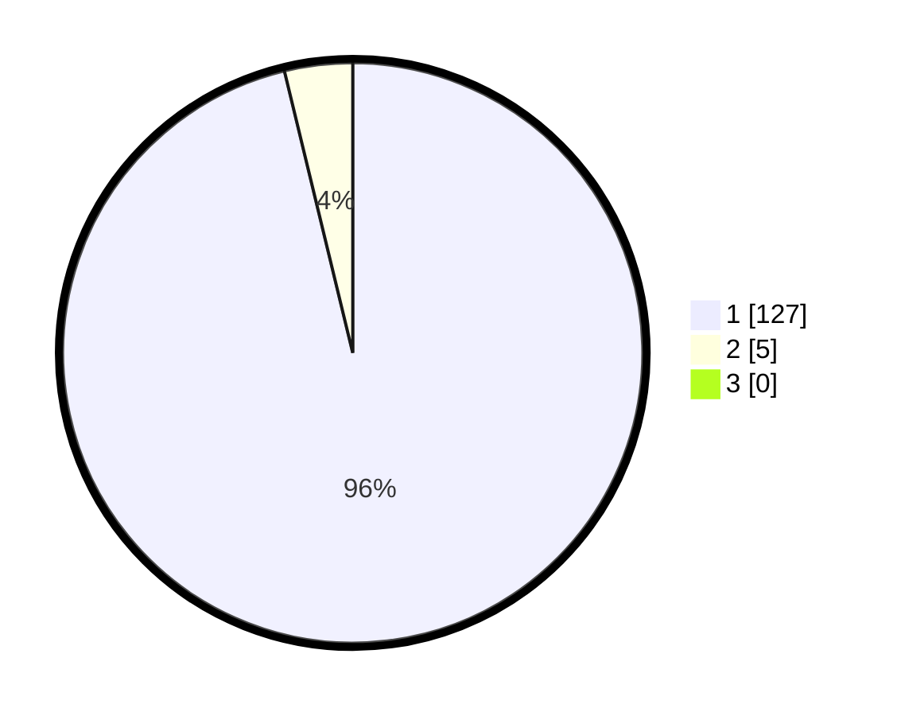

# Hasil

## Grafik

## Tabel

| No. | Nama Paslon    | Suara | Suara (raw) | Persentase |
|:--- |:-------------- | -----:| -----------:| ----------:|
| 1   | ANIES MUHAIMIN | 127   | [127][p-1]  | 96,21      |
| 2   | PRABOWO GIBRAN | 5     | [5][p-2]    | 3,79       |
| 3   | GANJAR MAHFUD  | 0     | [0][p-3]    | 0,00       |

[p-1]: https://github.com/gigit-pemilu/pemilu-2024-11-aceh/blob/main/pilpres/hitung-suara/sub/11-aceh/sub/08-aceh-utara/sub/13-tanah-pasir/sub/2009-kumbang/sub/002-tps/sub/paslon-1.txt
[p-2]: https://github.com/gigit-pemilu/pemilu-2024-11-aceh/blob/main/pilpres/hitung-suara/sub/11-aceh/sub/08-aceh-utara/sub/13-tanah-pasir/sub/2009-kumbang/sub/002-tps/sub/paslon-2.txt
[p-3]: https://github.com/gigit-pemilu/pemilu-2024-11-aceh/blob/main/pilpres/hitung-suara/sub/11-aceh/sub/08-aceh-utara/sub/13-tanah-pasir/sub/2009-kumbang/sub/002-tps/sub/paslon-3.txt

## Foto C Plano

https://sirekap-obj-formc.kpu.go.id/6cdc/pemilu/ppwp/11/08/13/20/09/1108132009002-20240215-132626--3c58f581-29b8-4851-9628-c0f0dbc9471b.jpg

https://sirekap-obj-formc.kpu.go.id/6cdc/pemilu/ppwp/11/08/13/20/09/1108132009002-20240215-132923--4ca9cd27-6cae-42a5-93e5-6e8ca1c6cf61.jpg

https://sirekap-obj-formc.kpu.go.id/6cdc/pemilu/ppwp/11/08/13/20/09/1108132009002-20240215-133158--1e26f024-ca4e-4209-8d44-2e5638d58a07.jpg

## Metadata

| Key        | Value               |
| ---------- | ------------------- |
| Time Stamp | 2024-02-17 16:00:02 |

