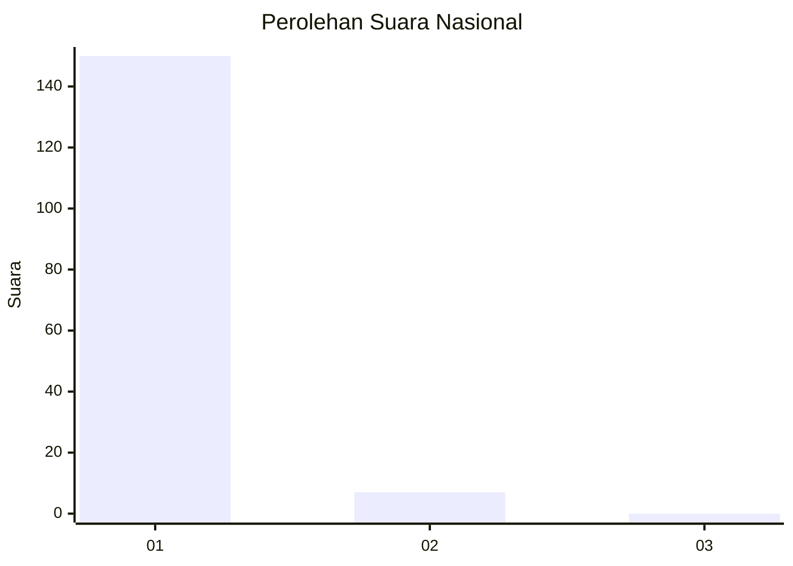
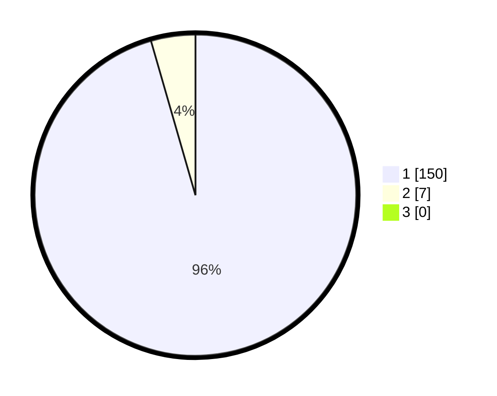

# Hasil

## Grafik

## Tabel

| No. | Nama Paslon    | Suara | Suara (raw) | Persentase |
|:--- |:-------------- | -----:| -----------:| ----------:|
| 1   | ANIES MUHAIMIN | 150   | [150][p-1]  | 95,54      |
| 2   | PRABOWO GIBRAN | 7     | [7][p-2]    | 4,46       |
| 3   | GANJAR MAHFUD  | 0     | [0][p-3]    | 0,00       |

[p-1]: https://github.com/gigit-pemilu/pemilu-2024/blob/main/pilpres/hitung-suara/sub/11-aceh/sub/08-aceh-utara/sub/13-tanah-pasir/sub/2010-prie/sub/001-tps/sub/paslon-1.txt
[p-2]: https://github.com/gigit-pemilu/pemilu-2024/blob/main/pilpres/hitung-suara/sub/11-aceh/sub/08-aceh-utara/sub/13-tanah-pasir/sub/2010-prie/sub/001-tps/sub/paslon-2.txt
[p-3]: https://github.com/gigit-pemilu/pemilu-2024/blob/main/pilpres/hitung-suara/sub/11-aceh/sub/08-aceh-utara/sub/13-tanah-pasir/sub/2010-prie/sub/001-tps/sub/paslon-3.txt

## Foto C Plano

https://sirekap-obj-formc.kpu.go.id/1593/pemilu/ppwp/11/08/13/20/10/1108132010001-20240302-205143--df319144-32e5-4053-bdae-9e2df032fbbb.jpg

https://sirekap-obj-formc.kpu.go.id/1593/pemilu/ppwp/11/08/13/20/10/1108132010001-20240302-205211--38516539-f2f3-4c84-a5ed-216b497712c2.jpg

https://sirekap-obj-formc.kpu.go.id/1593/pemilu/ppwp/11/08/13/20/10/1108132010001-20240302-205238--432b66c8-280e-40d1-9766-b7eeb1be3963.jpg

## Metadata

| Key        | Value               |
| ---------- | ------------------- |
| Time Stamp | 2024-03-10 23:00:00 |

