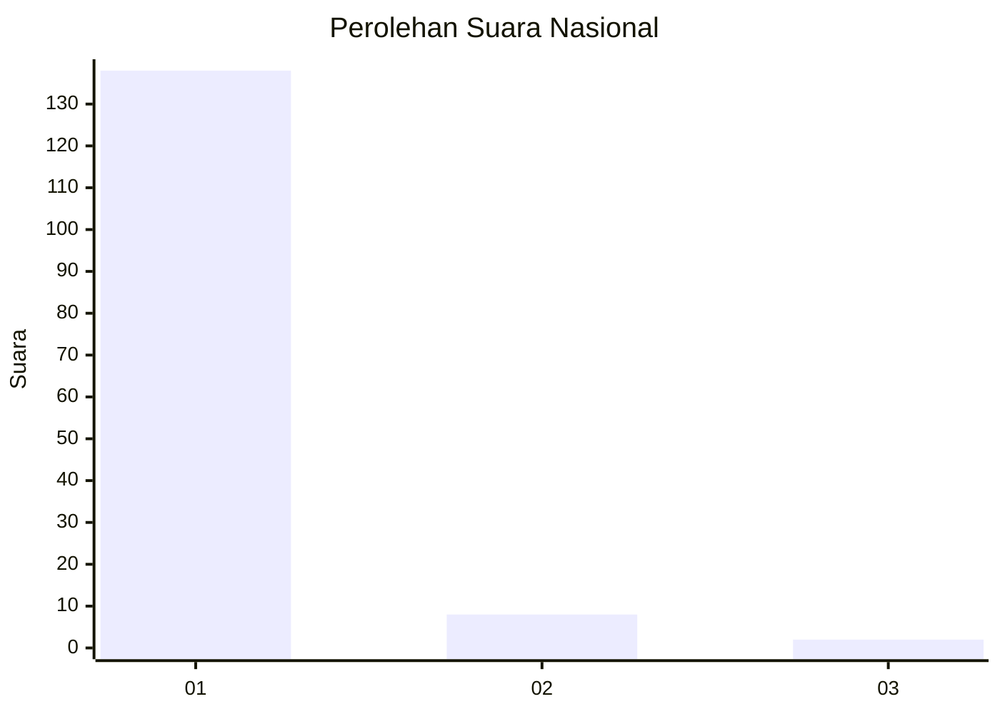
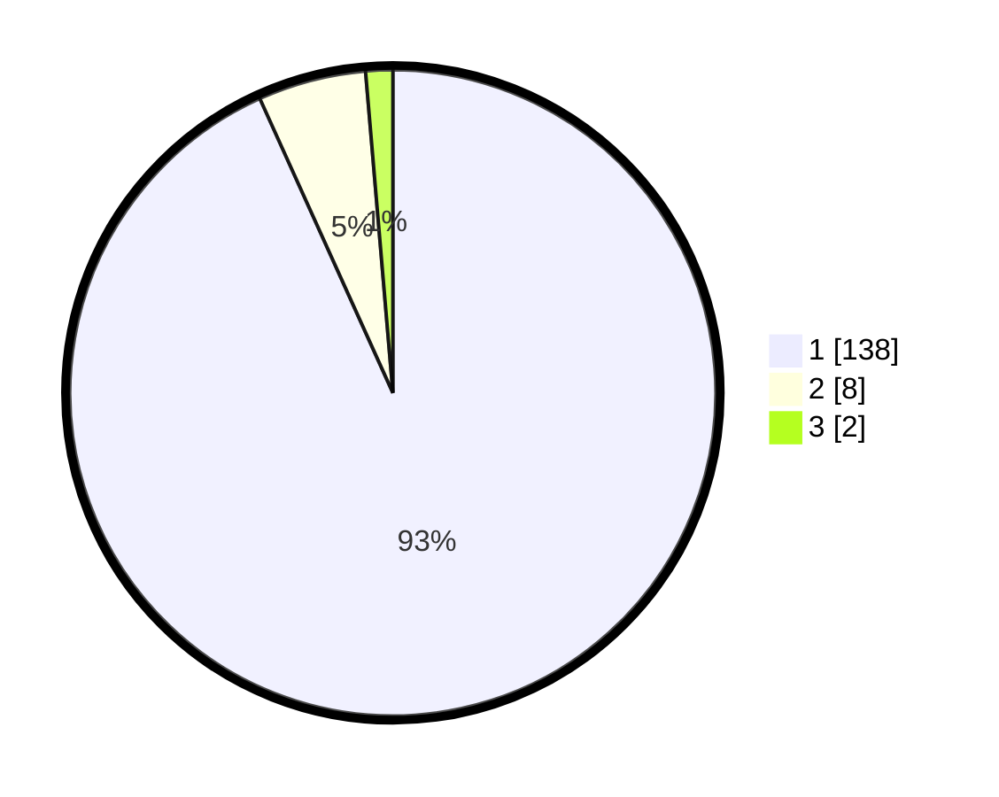

# Hasil

## Grafik

## Tabel

| No. | Nama Paslon    | Suara | Suara (raw) | Persentase |
|:--- |:-------------- | -----:| -----------:| ----------:|
| 1   | ANIES MUHAIMIN | 138   | [138][p-1]  | 93,24      |
| 2   | PRABOWO GIBRAN | 8     | [8][p-2]    | 5,41       |
| 3   | GANJAR MAHFUD  | 2     | [2][p-3]    | 1,35       |

[p-1]: https://github.com/gigit-pemilu/pemilu-2024/blob/main/pilpres/hitung-suara/sub/11-aceh/sub/08-aceh-utara/sub/13-tanah-pasir/sub/2010-prie/sub/002-tps/sub/paslon-1.txt
[p-2]: https://github.com/gigit-pemilu/pemilu-2024/blob/main/pilpres/hitung-suara/sub/11-aceh/sub/08-aceh-utara/sub/13-tanah-pasir/sub/2010-prie/sub/002-tps/sub/paslon-2.txt
[p-3]: https://github.com/gigit-pemilu/pemilu-2024/blob/main/pilpres/hitung-suara/sub/11-aceh/sub/08-aceh-utara/sub/13-tanah-pasir/sub/2010-prie/sub/002-tps/sub/paslon-3.txt

## Foto C Plano

https://sirekap-obj-formc.kpu.go.id/9008/pemilu/ppwp/11/08/13/20/10/1108132010002-20240302-171135--eb73ee73-a3b9-44a1-905d-a414a5fed8c0.jpg

https://sirekap-obj-formc.kpu.go.id/9008/pemilu/ppwp/11/08/13/20/10/1108132010002-20240302-171212--22683af4-b68e-4abc-a68c-58d29ca914ac.jpg

https://sirekap-obj-formc.kpu.go.id/9008/pemilu/ppwp/11/08/13/20/10/1108132010002-20240302-171402--1fd35191-88a4-4690-8cf8-ff9ae219d388.jpg

## Metadata

| Key        | Value               |
| ---------- | ------------------- |
| Time Stamp | 2024-03-10 23:00:00 |

