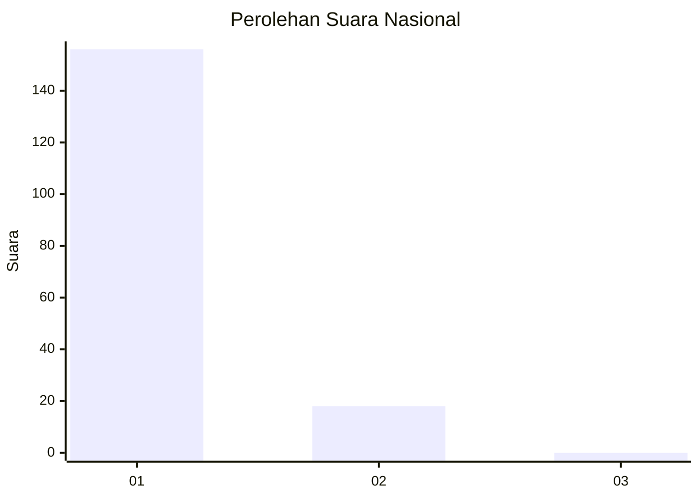
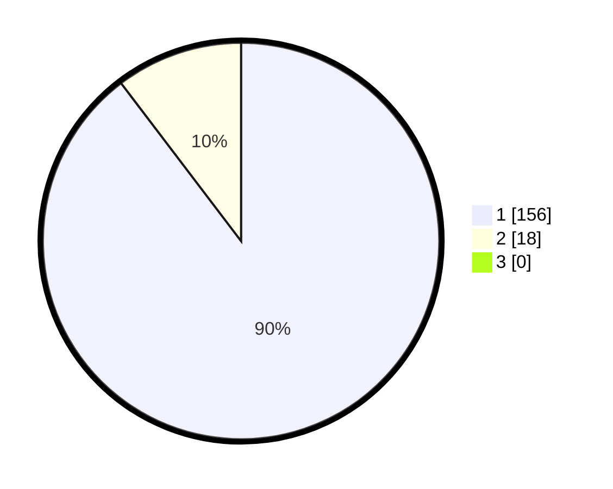

# Hasil

## Grafik

## Tabel

| No. | Nama Paslon    | Suara | Suara (raw) | Persentase |
|:--- |:-------------- | -----:| -----------:| ----------:|
| 1   | ANIES MUHAIMIN | 156   | [156][p-1]  | 89,66      |
| 2   | PRABOWO GIBRAN | 18    | [18][p-2]   | 10,34      |
| 3   | GANJAR MAHFUD  | 0     | [0][p-3]    | 0,00       |

[p-1]: https://github.com/gigit-pemilu/pemilu-2024/blob/main/pilpres/hitung-suara/sub/11-aceh/sub/08-aceh-utara/sub/13-tanah-pasir/sub/2011-keutapang/sub/001-tps/sub/paslon-1.txt
[p-2]: https://github.com/gigit-pemilu/pemilu-2024/blob/main/pilpres/hitung-suara/sub/11-aceh/sub/08-aceh-utara/sub/13-tanah-pasir/sub/2011-keutapang/sub/001-tps/sub/paslon-2.txt
[p-3]: https://github.com/gigit-pemilu/pemilu-2024/blob/main/pilpres/hitung-suara/sub/11-aceh/sub/08-aceh-utara/sub/13-tanah-pasir/sub/2011-keutapang/sub/001-tps/sub/paslon-3.txt

## Foto C Plano

https://sirekap-obj-formc.kpu.go.id/566b/pemilu/ppwp/11/08/13/20/11/1108132011001-20240229-164712--2b511b0e-5368-4f53-a1f6-320fa2948506.jpg

https://sirekap-obj-formc.kpu.go.id/566b/pemilu/ppwp/11/08/13/20/11/1108132011001-20240215-111653--578c4c22-c6ce-45b5-813e-274520cc1de0.jpg

https://sirekap-obj-formc.kpu.go.id/566b/pemilu/ppwp/11/08/13/20/11/1108132011001-20240215-111918--06ee2833-f75e-4bf5-ade9-e4fd693c7cc1.jpg

## Metadata

| Key        | Value               |
| ---------- | ------------------- |
| Time Stamp | 2024-02-29 17:00:00 |

