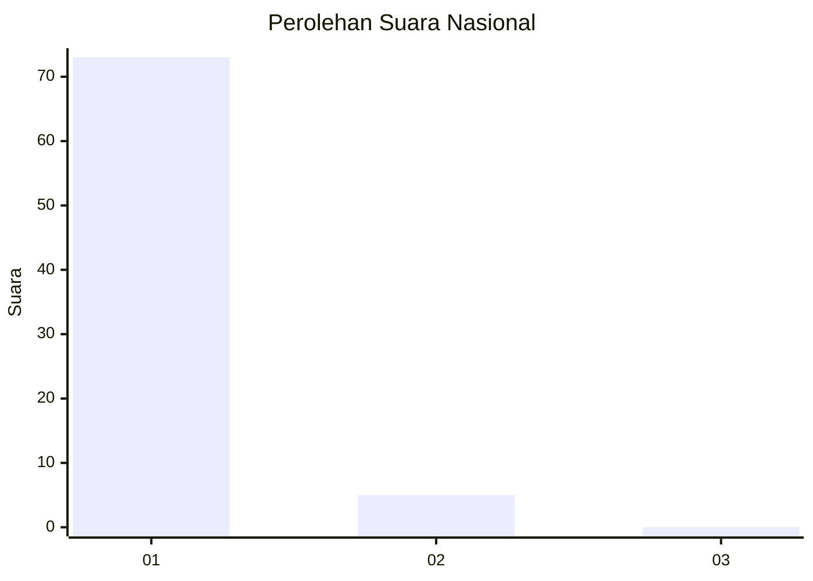
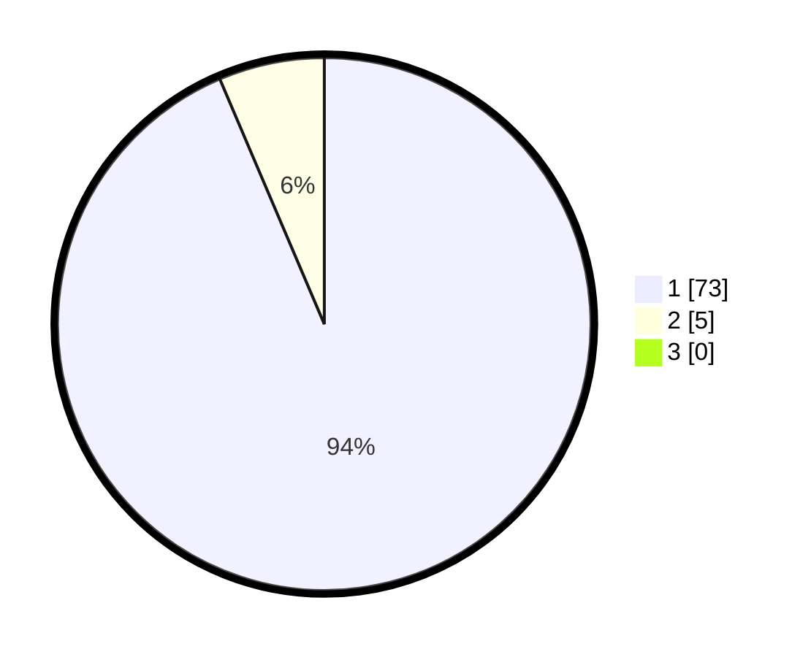

# Hasil

## Grafik

## Tabel

| No. | Nama Paslon    | Suara | Suara (raw) | Persentase |
|:--- |:-------------- | -----:| -----------:| ----------:|
| 1   | ANIES MUHAIMIN | 73    | [73][p-1]   | 93,59      |
| 2   | PRABOWO GIBRAN | 5     | [5][p-2]    | 6,41       |
| 3   | GANJAR MAHFUD  | 0     | [0][p-3]    | 0,00       |

[p-1]: https://github.com/gigit-pemilu/pemilu-2024/blob/main/pilpres/hitung-suara/sub/11-aceh/sub/08-aceh-utara/sub/13-tanah-pasir/sub/2012-keude-jrat-manyang/sub/001-tps/sub/paslon-1.txt
[p-2]: https://github.com/gigit-pemilu/pemilu-2024/blob/main/pilpres/hitung-suara/sub/11-aceh/sub/08-aceh-utara/sub/13-tanah-pasir/sub/2012-keude-jrat-manyang/sub/001-tps/sub/paslon-2.txt
[p-3]: https://github.com/gigit-pemilu/pemilu-2024/blob/main/pilpres/hitung-suara/sub/11-aceh/sub/08-aceh-utara/sub/13-tanah-pasir/sub/2012-keude-jrat-manyang/sub/001-tps/sub/paslon-3.txt

## Foto C Plano

https://sirekap-obj-formc.kpu.go.id/c0a8/pemilu/ppwp/11/08/13/20/12/1108132012001-20240229-171432--56759f77-07e5-446f-8a99-32114f98f843.jpg

https://sirekap-obj-formc.kpu.go.id/c0a8/pemilu/ppwp/11/08/13/20/12/1108132012001-20240215-012801--f4d5fcab-51a0-425a-9990-1a7bc7c526b0.jpg

https://sirekap-obj-formc.kpu.go.id/c0a8/pemilu/ppwp/11/08/13/20/12/1108132012001-20240215-013256--89e4fe0e-127a-44e6-bc03-9abda0eb6e86.jpg

## Metadata

| Key        | Value               |
| ---------- | ------------------- |
| Time Stamp | 2024-02-29 18:00:00 |

