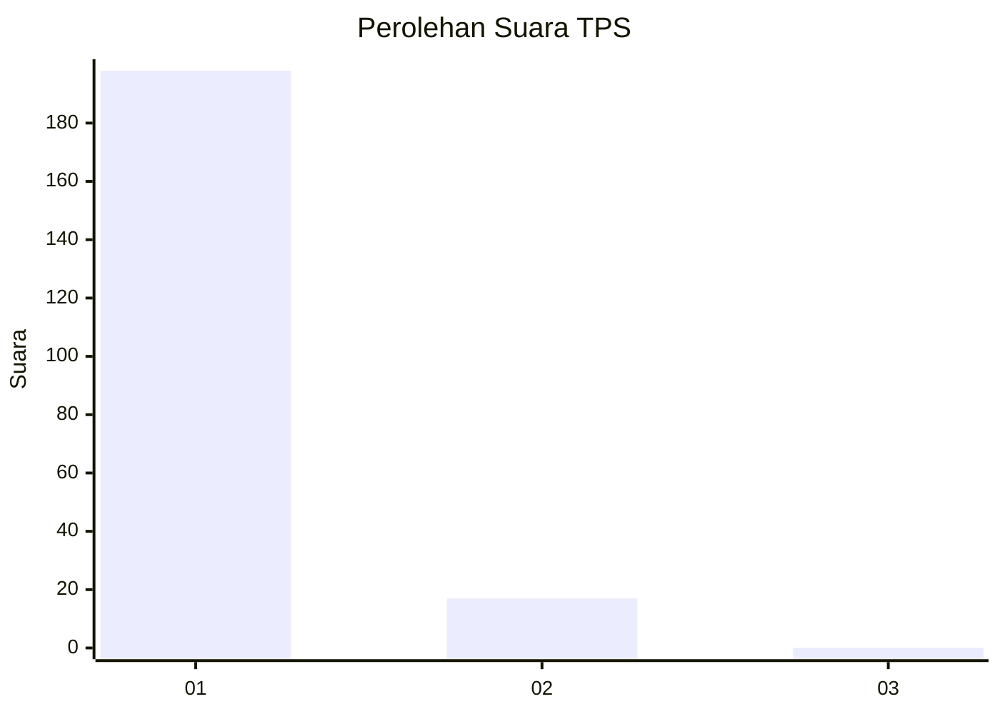
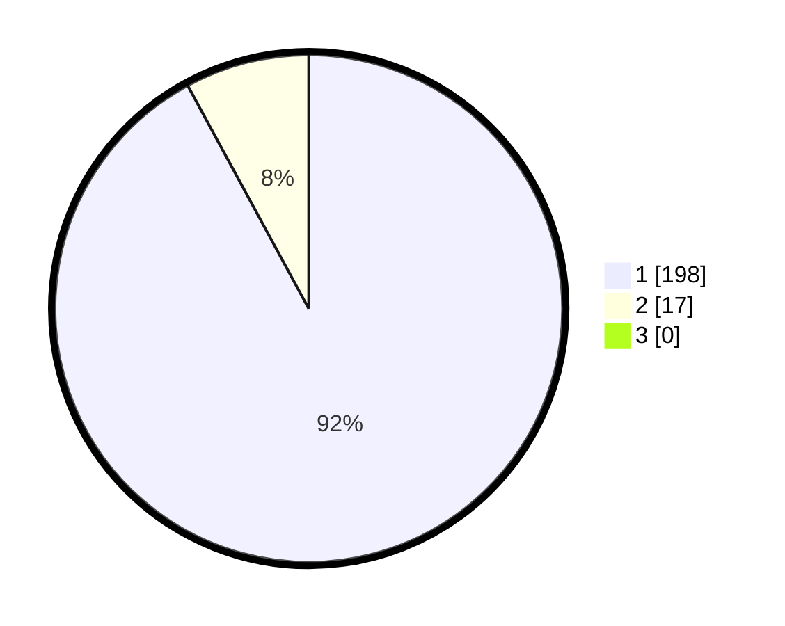

# Hasil

## Grafik

## Tabel

| No. | Nama Paslon    | Suara | Suara (raw) | Persentase |
|:--- |:-------------- | -----:| -----------:| ----------:|
| 1   | ANIES MUHAIMIN | 198   | [198][p-1]  | 92,09      |
| 2   | PRABOWO GIBRAN | 17    | [17][p-2]   | 7,91       |
| 3   | GANJAR MAHFUD  | 0     | [0][p-3]    | 0,00       |

[p-1]: https://github.com/gigit-pemilu/pemilu-2024-11-aceh/blob/main/pilpres/hitung-suara/sub/11-aceh/sub/08-aceh-utara/sub/13-tanah-pasir/sub/2013-teupin-gapeuh/sub/001-tps/sub/paslon-1.txt
[p-2]: https://github.com/gigit-pemilu/pemilu-2024-11-aceh/blob/main/pilpres/hitung-suara/sub/11-aceh/sub/08-aceh-utara/sub/13-tanah-pasir/sub/2013-teupin-gapeuh/sub/001-tps/sub/paslon-2.txt
[p-3]: https://github.com/gigit-pemilu/pemilu-2024-11-aceh/blob/main/pilpres/hitung-suara/sub/11-aceh/sub/08-aceh-utara/sub/13-tanah-pasir/sub/2013-teupin-gapeuh/sub/001-tps/sub/paslon-3.txt

## Foto C Plano

https://sirekap-obj-formc.kpu.go.id/e03d/pemilu/ppwp/11/08/13/20/13/1108132013001-20240215-130039--553e3696-8ead-482c-8ab5-04fb5a22dd26.jpg

https://sirekap-obj-formc.kpu.go.id/e03d/pemilu/ppwp/11/08/13/20/13/1108132013001-20240215-122803--c60977cf-4b21-4c69-a2c0-6da64792685a.jpg

https://sirekap-obj-formc.kpu.go.id/e03d/pemilu/ppwp/11/08/13/20/13/1108132013001-20240215-122508--f088025f-af1e-4654-baad-954003e2bf1c.jpg

## Metadata

| Key        | Value               |
| ---------- | ------------------- |
| Time Stamp | 2024-02-17 16:00:02 |

