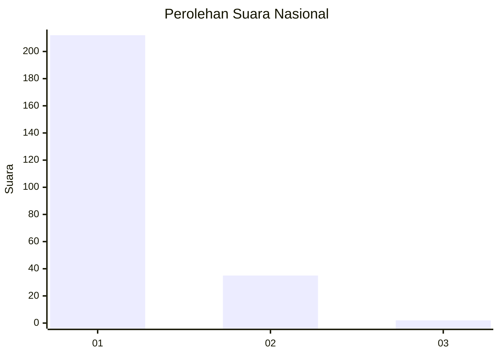
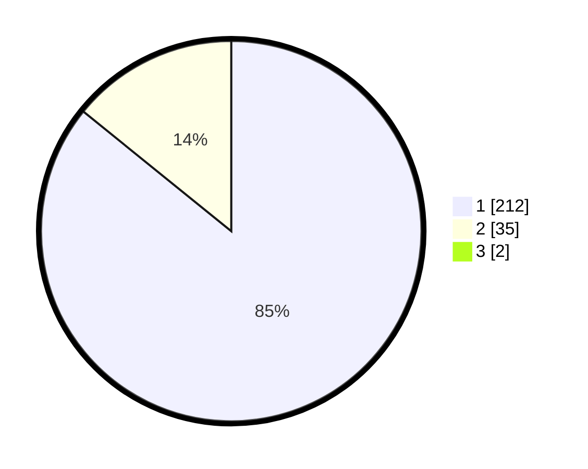

# Hasil

## Grafik

## Tabel

| No. | Nama Paslon    | Suara | Suara (raw) | Persentase |
|:--- |:-------------- | -----:| -----------:| ----------:|
| 1   | ANIES MUHAIMIN | 212   | [212][p-1]  | 85,14      |
| 2   | PRABOWO GIBRAN | 35    | [35][p-2]   | 14,06      |
| 3   | GANJAR MAHFUD  | 2     | [2][p-3]    | 0,80       |

[p-1]: https://github.com/gigit-pemilu/pemilu-2024/blob/main/pilpres/hitung-suara/sub/11-aceh/sub/08-aceh-utara/sub/13-tanah-pasir/sub/2016-ulee-tanoh/sub/001-tps/sub/paslon-1.txt
[p-2]: https://github.com/gigit-pemilu/pemilu-2024/blob/main/pilpres/hitung-suara/sub/11-aceh/sub/08-aceh-utara/sub/13-tanah-pasir/sub/2016-ulee-tanoh/sub/001-tps/sub/paslon-2.txt
[p-3]: https://github.com/gigit-pemilu/pemilu-2024/blob/main/pilpres/hitung-suara/sub/11-aceh/sub/08-aceh-utara/sub/13-tanah-pasir/sub/2016-ulee-tanoh/sub/001-tps/sub/paslon-3.txt

## Foto C Plano

https://sirekap-obj-formc.kpu.go.id/a8b1/pemilu/ppwp/11/08/13/20/16/1108132016001-20240215-071006--fcb79320-9bd0-43de-a910-481b9ed22dbf.jpg

https://sirekap-obj-formc.kpu.go.id/a8b1/pemilu/ppwp/11/08/13/20/16/1108132016001-20240215-071106--7db3cb3e-dac0-4f7b-9ba6-c20d4b0a7f0e.jpg

https://sirekap-obj-formc.kpu.go.id/a8b1/pemilu/ppwp/11/08/13/20/16/1108132016001-20240215-071202--9b123377-230f-4788-bffb-b70a93a407fc.jpg

## Metadata

| Key        | Value               |
| ---------- | ------------------- |
| Time Stamp | 2024-02-17 16:00:02 |

