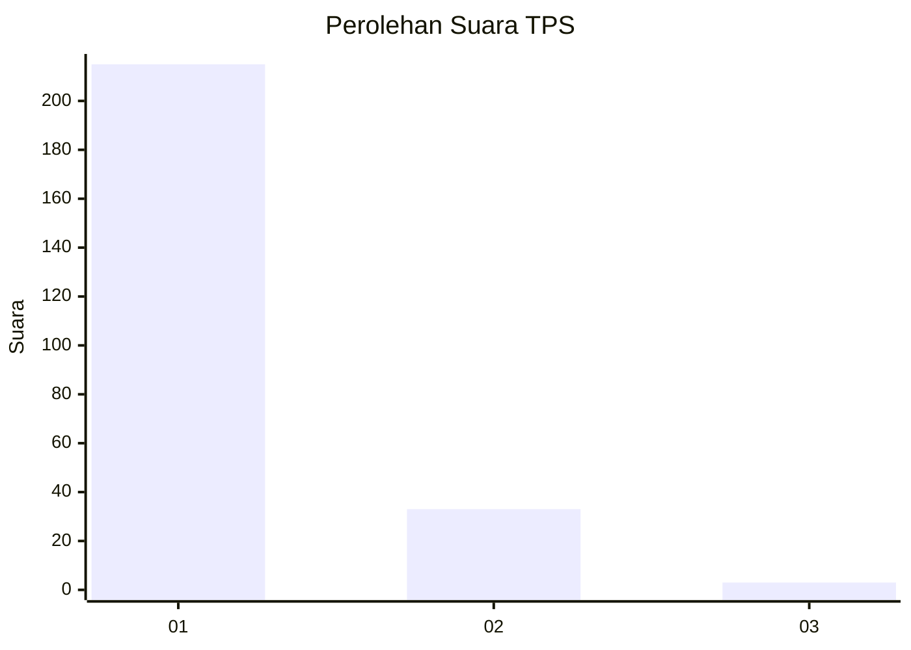
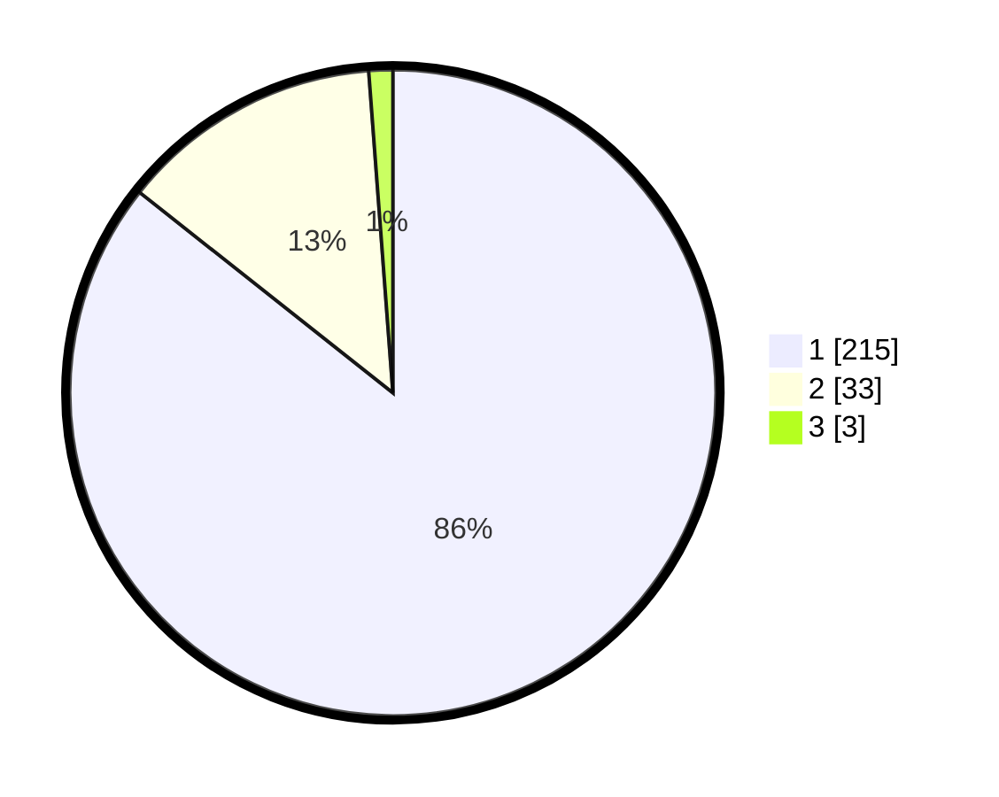

# Hasil

## Grafik

## Tabel

| No. | Nama Paslon    | Suara | Suara (raw) | Persentase |
|:--- |:-------------- | -----:| -----------:| ----------:|
| 1   | ANIES MUHAIMIN | 215   | [215][p-1]  | 85,66      |
| 2   | PRABOWO GIBRAN | 33    | [33][p-2]   | 13,15      |
| 3   | GANJAR MAHFUD  | 3     | [3][p-3]    | 1,20       |

[p-1]: https://github.com/gigit-pemilu/pemilu-2024-11-aceh/blob/main/pilpres/hitung-suara/sub/11-aceh/sub/08-aceh-utara/sub/13-tanah-pasir/sub/2016-ulee-tanoh/sub/002-tps/sub/paslon-1.txt
[p-2]: https://github.com/gigit-pemilu/pemilu-2024-11-aceh/blob/main/pilpres/hitung-suara/sub/11-aceh/sub/08-aceh-utara/sub/13-tanah-pasir/sub/2016-ulee-tanoh/sub/002-tps/sub/paslon-2.txt
[p-3]: https://github.com/gigit-pemilu/pemilu-2024-11-aceh/blob/main/pilpres/hitung-suara/sub/11-aceh/sub/08-aceh-utara/sub/13-tanah-pasir/sub/2016-ulee-tanoh/sub/002-tps/sub/paslon-3.txt

## Foto C Plano

https://sirekap-obj-formc.kpu.go.id/2682/pemilu/ppwp/11/08/13/20/16/1108132016002-20240302-115229--1291dc1b-23df-4dd6-92a2-d5bfc10c8e64.jpg

https://sirekap-obj-formc.kpu.go.id/2682/pemilu/ppwp/11/08/13/20/16/1108132016002-20240302-115252--960a1a59-fcd1-45e5-bceb-f6fc7d87a9fd.jpg

https://sirekap-obj-formc.kpu.go.id/2682/pemilu/ppwp/11/08/13/20/16/1108132016002-20240302-115314--04087d31-01e9-4116-ba30-598127399d42.jpg

## Metadata

| Key        | Value               |
| ---------- | ------------------- |
| Time Stamp | 2024-03-10 23:00:00 |

