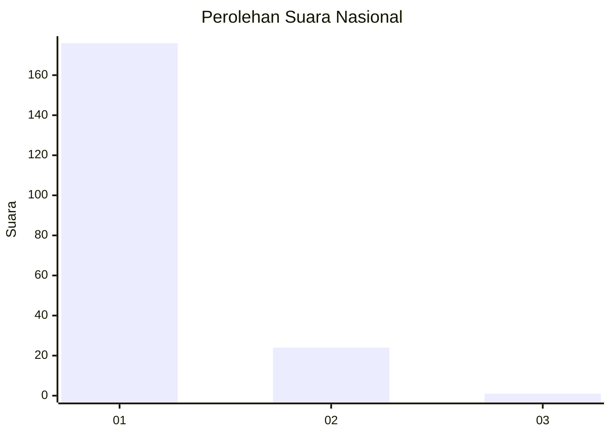
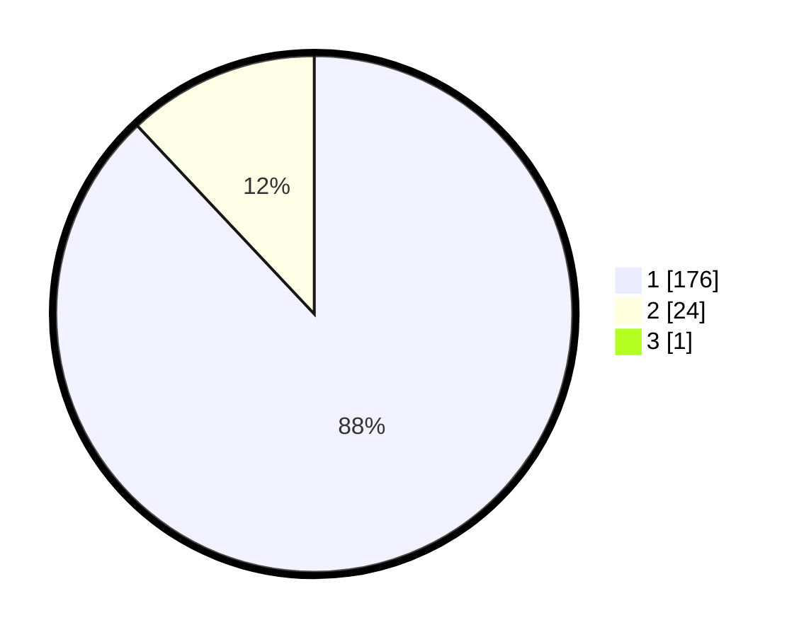

# Hasil

## Grafik

## Tabel

| No. | Nama Paslon    | Suara | Suara (raw) | Persentase |
|:--- |:-------------- | -----:| -----------:| ----------:|
| 1   | ANIES MUHAIMIN | 176   | [176][p-1]  | 87,56      |
| 2   | PRABOWO GIBRAN | 24    | [24][p-2]   | 11,94      |
| 3   | GANJAR MAHFUD  | 1     | [1][p-3]    | 0,50       |

[p-1]: https://github.com/gigit-pemilu/pemilu-2024/blob/main/pilpres/hitung-suara/sub/11-aceh/sub/08-aceh-utara/sub/13-tanah-pasir/sub/2017-matang-janeng/sub/001-tps/sub/paslon-1.txt
[p-2]: https://github.com/gigit-pemilu/pemilu-2024/blob/main/pilpres/hitung-suara/sub/11-aceh/sub/08-aceh-utara/sub/13-tanah-pasir/sub/2017-matang-janeng/sub/001-tps/sub/paslon-2.txt
[p-3]: https://github.com/gigit-pemilu/pemilu-2024/blob/main/pilpres/hitung-suara/sub/11-aceh/sub/08-aceh-utara/sub/13-tanah-pasir/sub/2017-matang-janeng/sub/001-tps/sub/paslon-3.txt

## Foto C Plano

https://sirekap-obj-formc.kpu.go.id/ef14/pemilu/ppwp/11/08/13/20/17/1108132017001-20240302-154954--6d358d49-5493-432e-a0af-05dbab58bc95.jpg

https://sirekap-obj-formc.kpu.go.id/ef14/pemilu/ppwp/11/08/13/20/17/1108132017001-20240302-155046--4cee0801-bc7d-4039-866b-2e61a1a37f07.jpg

https://sirekap-obj-formc.kpu.go.id/ef14/pemilu/ppwp/11/08/13/20/17/1108132017001-20240302-155135--46531757-ee00-44ab-a304-044e6dde71b3.jpg

## Metadata

| Key        | Value               |
| ---------- | ------------------- |
| Time Stamp | 2024-03-10 23:00:00 |

