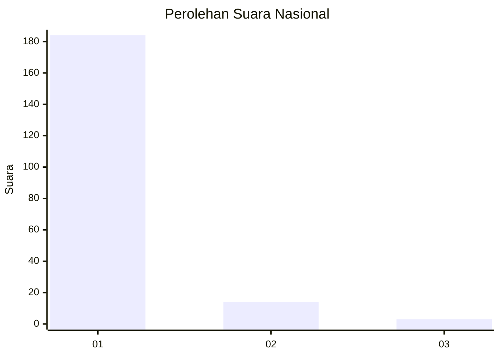
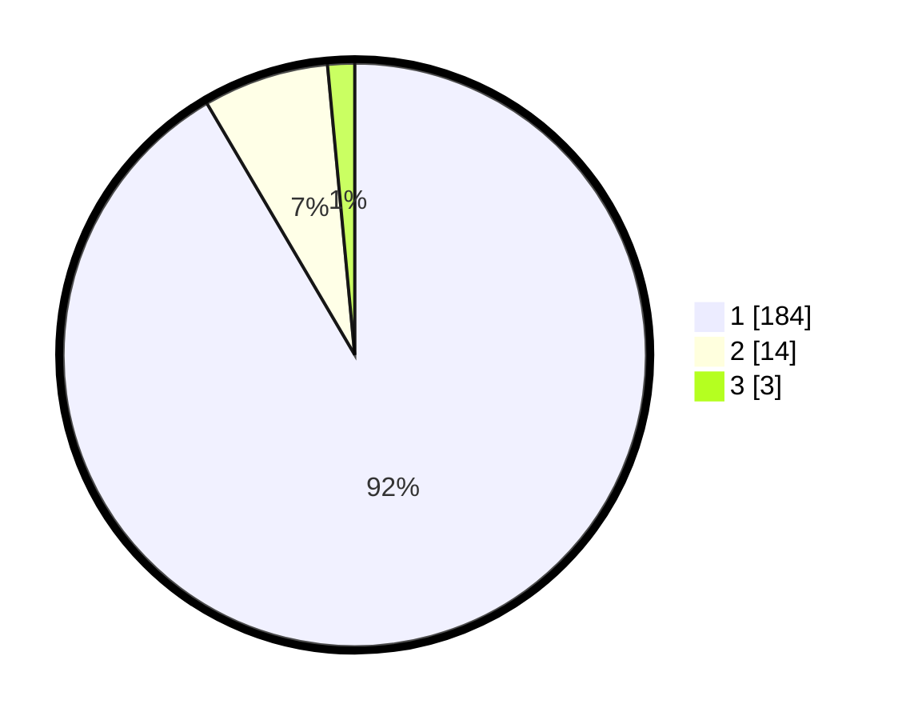

# Hasil

## Grafik

## Tabel

| No. | Nama Paslon    | Suara | Suara (raw) | Persentase |
|:--- |:-------------- | -----:| -----------:| ----------:|
| 1   | ANIES MUHAIMIN | 184   | [184][p-1]  | 91,54      |
| 2   | PRABOWO GIBRAN | 14    | [14][p-2]   | 6,97       |
| 3   | GANJAR MAHFUD  | 3     | [3][p-3]    | 1,49       |

[p-1]: https://github.com/gigit-pemilu/pemilu-2024/blob/main/pilpres/hitung-suara/sub/11-aceh/sub/08-aceh-utara/sub/14-t-jambo-aye/sub/2005-meunasah-geudong/sub/001-tps/sub/paslon-1.txt
[p-2]: https://github.com/gigit-pemilu/pemilu-2024/blob/main/pilpres/hitung-suara/sub/11-aceh/sub/08-aceh-utara/sub/14-t-jambo-aye/sub/2005-meunasah-geudong/sub/001-tps/sub/paslon-2.txt
[p-3]: https://github.com/gigit-pemilu/pemilu-2024/blob/main/pilpres/hitung-suara/sub/11-aceh/sub/08-aceh-utara/sub/14-t-jambo-aye/sub/2005-meunasah-geudong/sub/001-tps/sub/paslon-3.txt

## Foto C Plano

https://sirekap-obj-formc.kpu.go.id/7130/pemilu/ppwp/11/08/14/20/05/1108142005001-20240215-150510--95cb73b9-d75d-452b-bd0f-ca5fc608a8f4.jpg

https://sirekap-obj-formc.kpu.go.id/7130/pemilu/ppwp/11/08/14/20/05/1108142005001-20240215-150938--7bd5166d-4f11-42ce-bd62-1c0003cab88f.jpg

https://sirekap-obj-formc.kpu.go.id/7130/pemilu/ppwp/11/08/14/20/05/1108142005001-20240215-151520--c4d5dead-9b30-4159-ac59-69accd0bc2d6.jpg

## Metadata

| Key        | Value               |
| ---------- | ------------------- |
| Time Stamp | 2024-02-17 16:00:02 |

