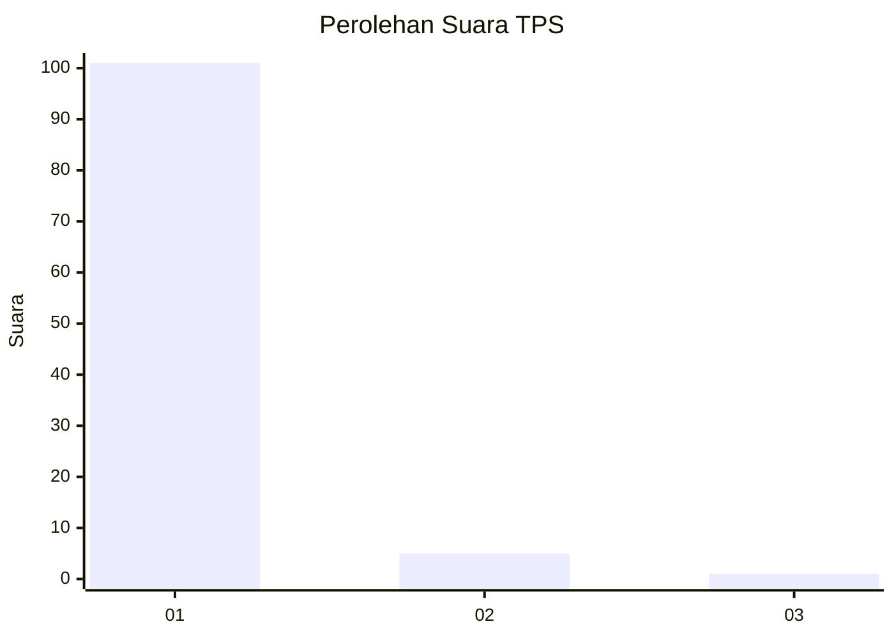
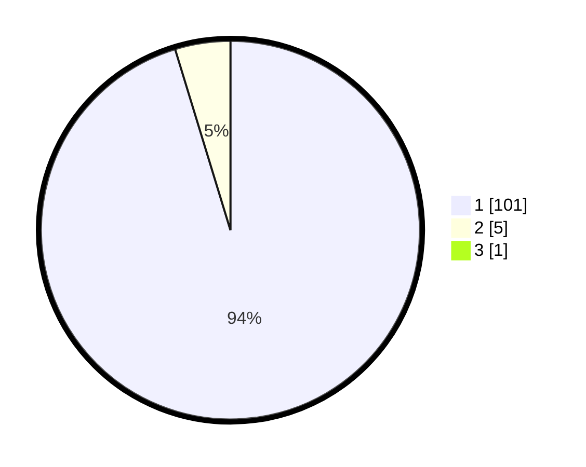

# Hasil

## Grafik

## Tabel

| No. | Nama Paslon    | Suara | Suara (raw) | Persentase |
|:--- |:-------------- | -----:| -----------:| ----------:|
| 1   | ANIES MUHAIMIN | 101   | [101][p-1]  | 94,39      |
| 2   | PRABOWO GIBRAN | 5     | [5][p-2]    | 4,67       |
| 3   | GANJAR MAHFUD  | 1     | [1][p-3]    | 0,93       |

[p-1]: https://github.com/gigit-pemilu/pemilu-2024-11-aceh/blob/main/pilpres/hitung-suara/sub/11-aceh/sub/08-aceh-utara/sub/14-t-jambo-aye/sub/2018-tanjong-punti/sub/001-tps/sub/paslon-1.txt
[p-2]: https://github.com/gigit-pemilu/pemilu-2024-11-aceh/blob/main/pilpres/hitung-suara/sub/11-aceh/sub/08-aceh-utara/sub/14-t-jambo-aye/sub/2018-tanjong-punti/sub/001-tps/sub/paslon-2.txt
[p-3]: https://github.com/gigit-pemilu/pemilu-2024-11-aceh/blob/main/pilpres/hitung-suara/sub/11-aceh/sub/08-aceh-utara/sub/14-t-jambo-aye/sub/2018-tanjong-punti/sub/001-tps/sub/paslon-3.txt

## Foto C Plano

https://sirekap-obj-formc.kpu.go.id/9461/pemilu/ppwp/11/08/14/20/18/1108142018001-20240215-094444--bbb6a819-13f4-4247-a324-1e14396b90e2.jpg

https://sirekap-obj-formc.kpu.go.id/9461/pemilu/ppwp/11/08/14/20/18/1108142018001-20240214-214215--b2dc1330-4dd4-4b3c-832a-d4023f39e70e.jpg

https://sirekap-obj-formc.kpu.go.id/9461/pemilu/ppwp/11/08/14/20/18/1108142018001-20240214-214247--dff69b66-6836-4dc4-93e1-79107f16534d.jpg

## Metadata

| Key        | Value               |
| ---------- | ------------------- |
| Time Stamp | 2024-02-15 19:00:26 |

