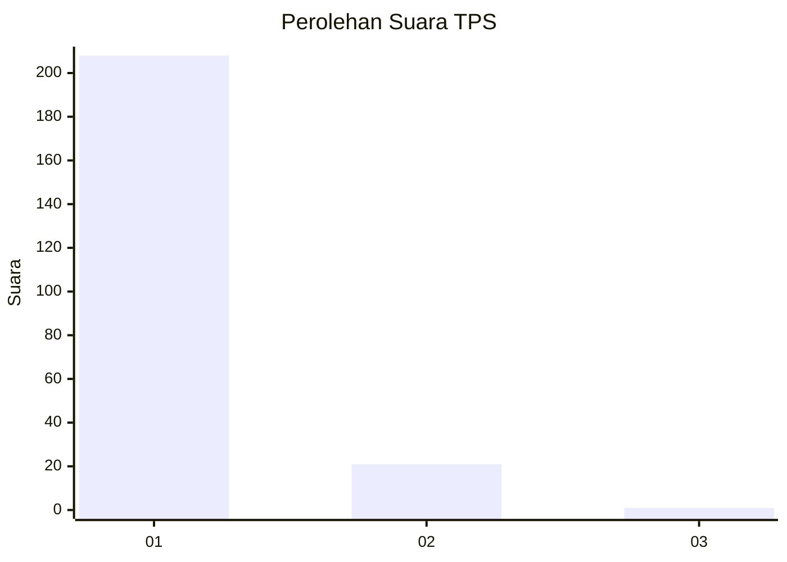
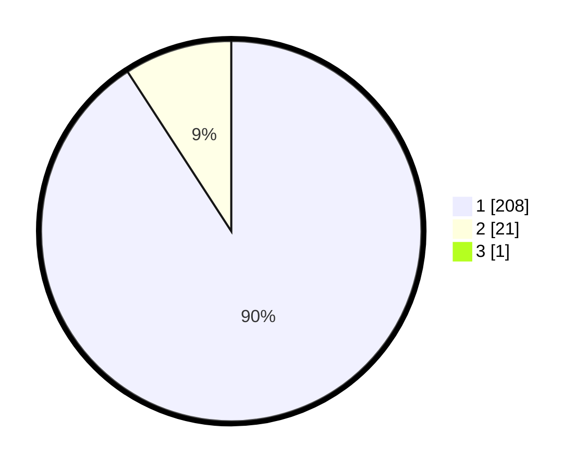

# Hasil

## Grafik

## Tabel

| No. | Nama Paslon    | Suara | Suara (raw) | Persentase |
|:--- |:-------------- | -----:| -----------:| ----------:|
| 1   | ANIES MUHAIMIN | 208   | [208][p-1]  | 90,43      |
| 2   | PRABOWO GIBRAN | 21    | [21][p-2]   | 9,13       |
| 3   | GANJAR MAHFUD  | 1     | [1][p-3]    | 0,43       |

[p-1]: https://github.com/gigit-pemilu/pemilu-2024-11-aceh/blob/main/pilpres/hitung-suara/sub/11-aceh/sub/08-aceh-utara/sub/14-t-jambo-aye/sub/2023-matang-serdang/sub/002-tps/sub/paslon-1.txt
[p-2]: https://github.com/gigit-pemilu/pemilu-2024-11-aceh/blob/main/pilpres/hitung-suara/sub/11-aceh/sub/08-aceh-utara/sub/14-t-jambo-aye/sub/2023-matang-serdang/sub/002-tps/sub/paslon-2.txt
[p-3]: https://github.com/gigit-pemilu/pemilu-2024-11-aceh/blob/main/pilpres/hitung-suara/sub/11-aceh/sub/08-aceh-utara/sub/14-t-jambo-aye/sub/2023-matang-serdang/sub/002-tps/sub/paslon-3.txt

## Foto C Plano

https://sirekap-obj-formc.kpu.go.id/22ef/pemilu/ppwp/11/08/14/20/23/1108142023002-20240215-035647--db8207d3-90ec-49b2-9d99-753194c1de76.jpg

https://sirekap-obj-formc.kpu.go.id/22ef/pemilu/ppwp/11/08/14/20/23/1108142023002-20240221-164238--cbec612e-78c1-4968-8669-2fb57e5ee17c.jpg

https://sirekap-obj-formc.kpu.go.id/22ef/pemilu/ppwp/11/08/14/20/23/1108142023002-20240215-035853--cd466932-a929-41db-b265-679c708647d3.jpg

## Metadata

| Key        | Value               |
| ---------- | ------------------- |
| Time Stamp | 2024-02-24 22:31:28 |

