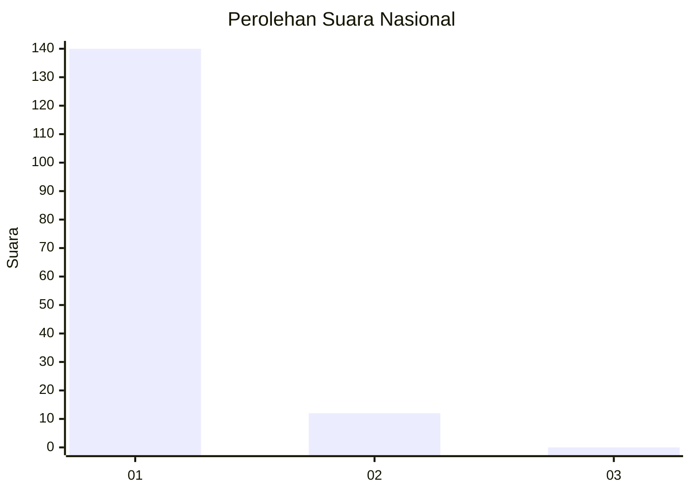
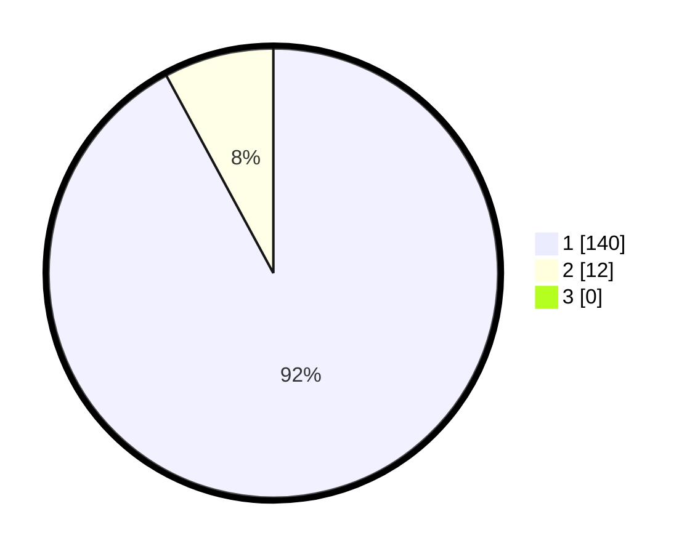

# Hasil

## Grafik

## Tabel

| No. | Nama Paslon    | Suara | Suara (raw) | Persentase |
|:--- |:-------------- | -----:| -----------:| ----------:|
| 1   | ANIES MUHAIMIN | 140   | [140][p-1]  | 92,11      |
| 2   | PRABOWO GIBRAN | 12    | [12][p-2]   | 7,89       |
| 3   | GANJAR MAHFUD  | 0     | [0][p-3]    | 0,00       |

[p-1]: https://github.com/gigit-pemilu/pemilu-2024/blob/main/pilpres/hitung-suara/sub/11-aceh/sub/08-aceh-utara/sub/14-t-jambo-aye/sub/2025-buket-padang/sub/002-tps/sub/paslon-1.txt
[p-2]: https://github.com/gigit-pemilu/pemilu-2024/blob/main/pilpres/hitung-suara/sub/11-aceh/sub/08-aceh-utara/sub/14-t-jambo-aye/sub/2025-buket-padang/sub/002-tps/sub/paslon-2.txt
[p-3]: https://github.com/gigit-pemilu/pemilu-2024/blob/main/pilpres/hitung-suara/sub/11-aceh/sub/08-aceh-utara/sub/14-t-jambo-aye/sub/2025-buket-padang/sub/002-tps/sub/paslon-3.txt

## Foto C Plano

https://sirekap-obj-formc.kpu.go.id/1f9b/pemilu/ppwp/11/08/14/20/25/1108142025002-20240215-075216--d68439e7-2a04-4837-8422-ea93a246de57.jpg

https://sirekap-obj-formc.kpu.go.id/1f9b/pemilu/ppwp/11/08/14/20/25/1108142025002-20240215-075318--f18f46b0-4ce0-456c-99b1-cfedd357c3cc.jpg

https://sirekap-obj-formc.kpu.go.id/1f9b/pemilu/ppwp/11/08/14/20/25/1108142025002-20240215-004546--836b1d01-de97-4e32-bec0-36e94c08769b.jpg

## Metadata

| Key        | Value               |
| ---------- | ------------------- |
| Time Stamp | 2024-02-15 15:30:25 |

