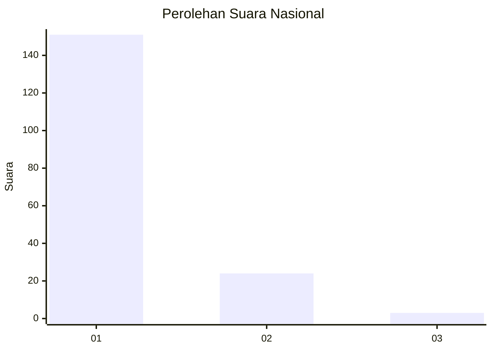
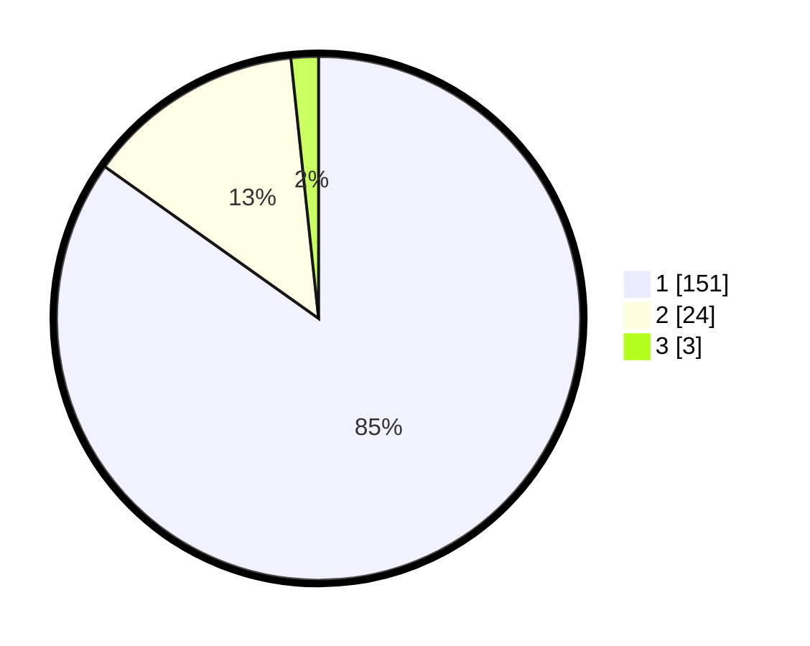

# Hasil

## Grafik

## Tabel

| No. | Nama Paslon    | Suara | Suara (raw) | Persentase |
|:--- |:-------------- | -----:| -----------:| ----------:|
| 1   | ANIES MUHAIMIN | 151   | [151][p-1]  | 84,83      |
| 2   | PRABOWO GIBRAN | 24    | [24][p-2]   | 13,48      |
| 3   | GANJAR MAHFUD  | 3     | [3][p-3]    | 1,69       |

[p-1]: https://github.com/gigit-pemilu/pemilu-2024/blob/main/pilpres/hitung-suara/sub/11-aceh/sub/08-aceh-utara/sub/14-t-jambo-aye/sub/2029-matang-raya/sub/001-tps/sub/paslon-1.txt
[p-2]: https://github.com/gigit-pemilu/pemilu-2024/blob/main/pilpres/hitung-suara/sub/11-aceh/sub/08-aceh-utara/sub/14-t-jambo-aye/sub/2029-matang-raya/sub/001-tps/sub/paslon-2.txt
[p-3]: https://github.com/gigit-pemilu/pemilu-2024/blob/main/pilpres/hitung-suara/sub/11-aceh/sub/08-aceh-utara/sub/14-t-jambo-aye/sub/2029-matang-raya/sub/001-tps/sub/paslon-3.txt

## Foto C Plano

https://sirekap-obj-formc.kpu.go.id/96b3/pemilu/ppwp/11/08/14/20/29/1108142029001-20240222-101307--b51e6764-4a21-4f06-990e-20ebcc2dd6c2.jpg

https://sirekap-obj-formc.kpu.go.id/96b3/pemilu/ppwp/11/08/14/20/29/1108142029001-20240222-101805--13fceb46-efc0-4f91-875d-93a0659b8617.jpg

https://sirekap-obj-formc.kpu.go.id/96b3/pemilu/ppwp/11/08/14/20/29/1108142029001-20240215-093828--25c879aa-e974-4a6b-8d43-767b1be08737.jpg

## Metadata

| Key        | Value               |
| ---------- | ------------------- |
| Time Stamp | 2024-02-25 17:00:00 |

