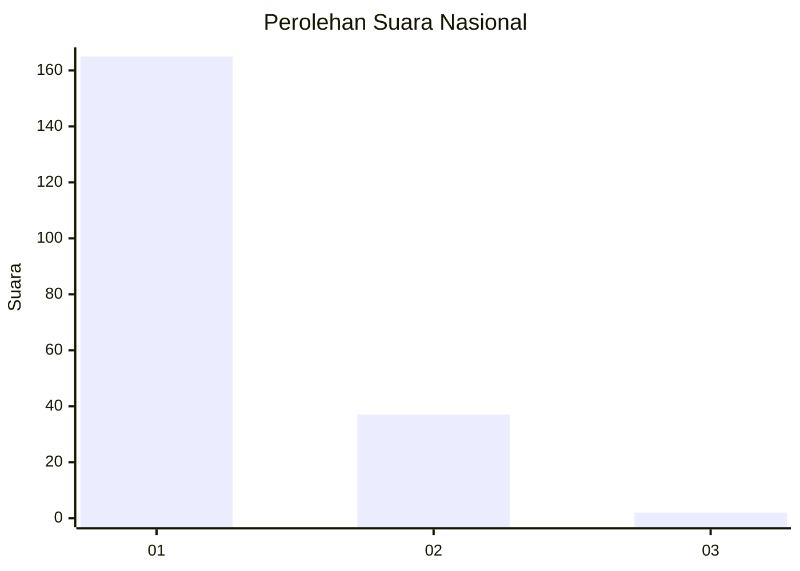
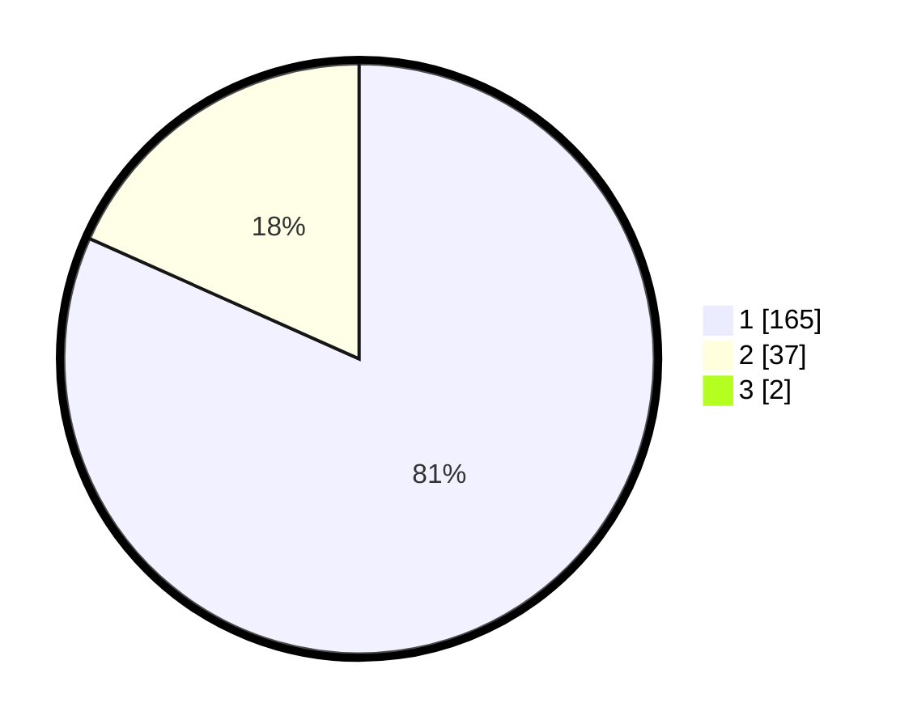

# Hasil

## Grafik

## Tabel

| No. | Nama Paslon    | Suara | Suara (raw) | Persentase |
|:--- |:-------------- | -----:| -----------:| ----------:|
| 1   | ANIES MUHAIMIN | 165   | [165][p-1]  | 80,88      |
| 2   | PRABOWO GIBRAN | 37    | [37][p-2]   | 18,14      |
| 3   | GANJAR MAHFUD  | 2     | [2][p-3]    | 0,98       |

[p-1]: https://github.com/gigit-pemilu/pemilu-2024/blob/main/pilpres/hitung-suara/sub/11-aceh/sub/08-aceh-utara/sub/14-t-jambo-aye/sub/2030-tanjong-ceungai/sub/004-tps/sub/paslon-1.txt
[p-2]: https://github.com/gigit-pemilu/pemilu-2024/blob/main/pilpres/hitung-suara/sub/11-aceh/sub/08-aceh-utara/sub/14-t-jambo-aye/sub/2030-tanjong-ceungai/sub/004-tps/sub/paslon-2.txt
[p-3]: https://github.com/gigit-pemilu/pemilu-2024/blob/main/pilpres/hitung-suara/sub/11-aceh/sub/08-aceh-utara/sub/14-t-jambo-aye/sub/2030-tanjong-ceungai/sub/004-tps/sub/paslon-3.txt

## Foto C Plano

https://sirekap-obj-formc.kpu.go.id/e224/pemilu/ppwp/11/08/14/20/30/1108142030004-20240214-213209--b91a2a93-b13d-43fd-bc24-77232ed0f2fe.jpg

https://sirekap-obj-formc.kpu.go.id/e224/pemilu/ppwp/11/08/14/20/30/1108142030004-20240214-213309--f13735af-c261-4939-b1b5-3202891be09f.jpg

https://sirekap-obj-formc.kpu.go.id/e224/pemilu/ppwp/11/08/14/20/30/1108142030004-20240214-213441--fc867327-7477-4b69-924c-77f0ea0d26b3.jpg

## Metadata

| Key        | Value               |
| ---------- | ------------------- |
| Time Stamp | 2024-02-15 15:30:25 |

