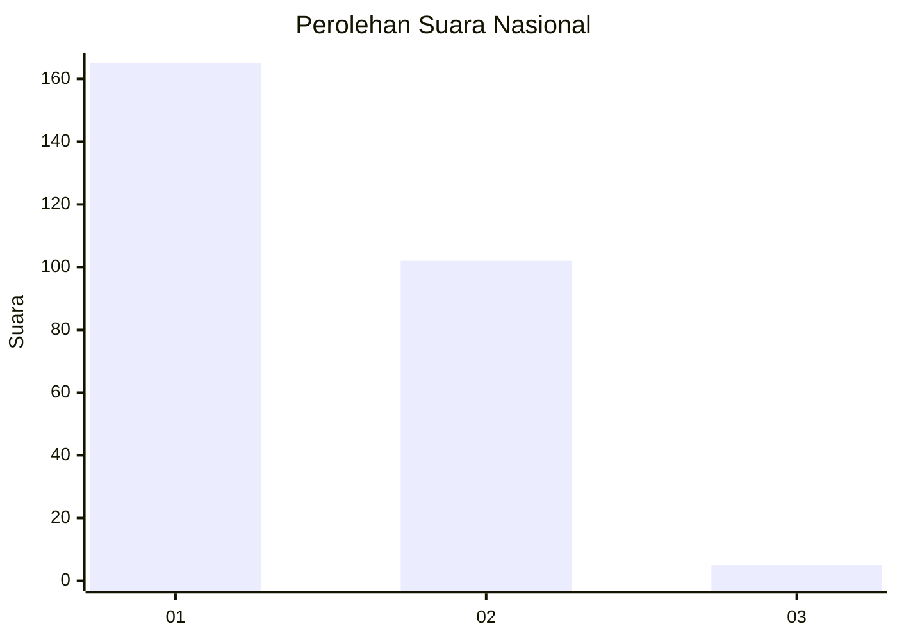
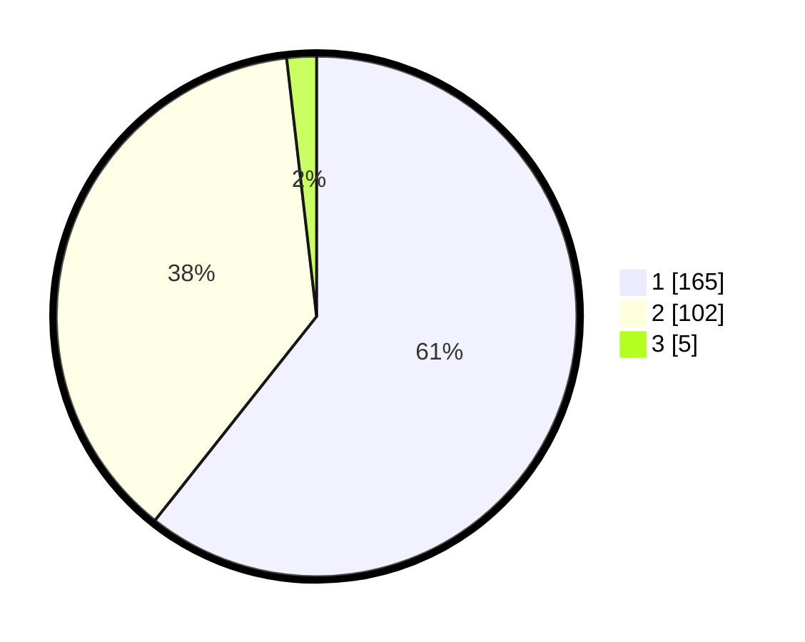

# Hasil

## Grafik

## Tabel

| No. | Nama Paslon    | Suara | Suara (raw) | Persentase |
|:--- |:-------------- | -----:| -----------:| ----------:|
| 1   | ANIES MUHAIMIN | 165   | [165][p-1]  | 60,66      |
| 2   | PRABOWO GIBRAN | 102   | [102][p-2]  | 37,50      |
| 3   | GANJAR MAHFUD  | 5     | [5][p-3]    | 1,84       |

[p-1]: https://github.com/gigit-pemilu/pemilu-2024/blob/main/pilpres/hitung-suara/sub/11-aceh/sub/08-aceh-utara/sub/14-t-jambo-aye/sub/2032-meunasah-panton-labu/sub/002-tps/sub/paslon-1.txt
[p-2]: https://github.com/gigit-pemilu/pemilu-2024/blob/main/pilpres/hitung-suara/sub/11-aceh/sub/08-aceh-utara/sub/14-t-jambo-aye/sub/2032-meunasah-panton-labu/sub/002-tps/sub/paslon-2.txt
[p-3]: https://github.com/gigit-pemilu/pemilu-2024/blob/main/pilpres/hitung-suara/sub/11-aceh/sub/08-aceh-utara/sub/14-t-jambo-aye/sub/2032-meunasah-panton-labu/sub/002-tps/sub/paslon-3.txt

## Foto C Plano

https://sirekap-obj-formc.kpu.go.id/cd91/pemilu/ppwp/11/08/14/20/32/1108142032002-20240214-234727--31d56eb6-ffd5-425c-a8e9-5a559068f24c.jpg

https://sirekap-obj-formc.kpu.go.id/cd91/pemilu/ppwp/11/08/14/20/32/1108142032002-20240214-234958--16126023-5ecb-4e25-8edd-b80544dafb5f.jpg

https://sirekap-obj-formc.kpu.go.id/cd91/pemilu/ppwp/11/08/14/20/32/1108142032002-20240214-235633--ab799ce0-806b-4176-a272-1db95dd56953.jpg

## Metadata

| Key        | Value               |
| ---------- | ------------------- |
| Time Stamp | 2024-02-16 12:51:22 |

