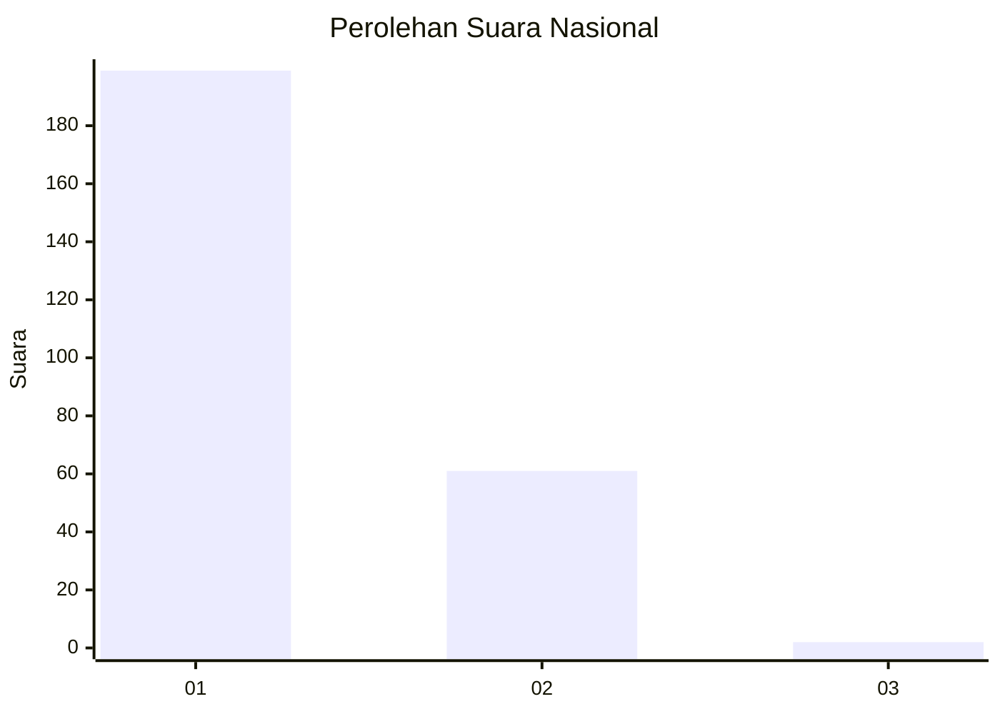
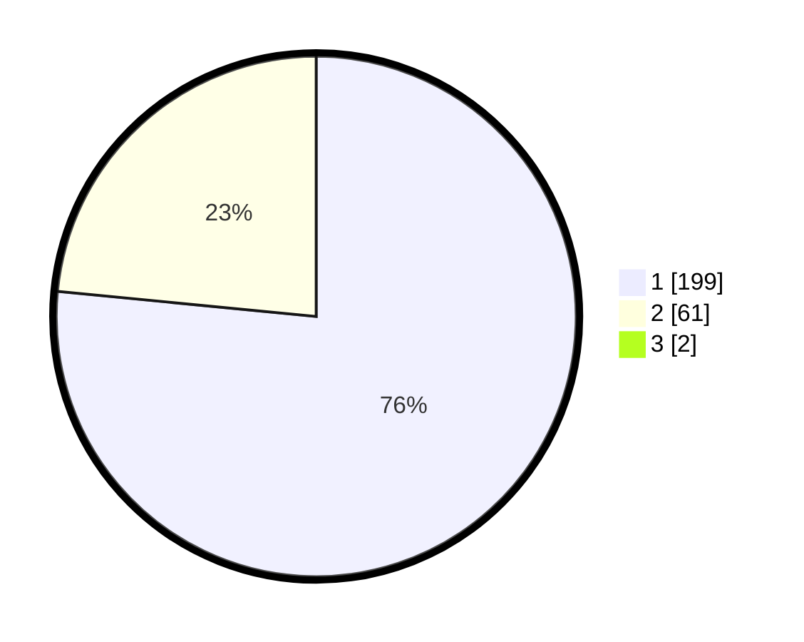

# Hasil

## Grafik

## Tabel

| No. | Nama Paslon    | Suara | Suara (raw) | Persentase |
|:--- |:-------------- | -----:| -----------:| ----------:|
| 1   | ANIES MUHAIMIN | 199   | [199][p-1]  | 75,95      |
| 2   | PRABOWO GIBRAN | 61    | [61][p-2]   | 23,28      |
| 3   | GANJAR MAHFUD  | 2     | [2][p-3]    | 0,76       |

[p-1]: https://github.com/gigit-pemilu/pemilu-2024/blob/main/pilpres/hitung-suara/sub/11-aceh/sub/08-aceh-utara/sub/14-t-jambo-aye/sub/2032-meunasah-panton-labu/sub/007-tps/sub/paslon-1.txt
[p-2]: https://github.com/gigit-pemilu/pemilu-2024/blob/main/pilpres/hitung-suara/sub/11-aceh/sub/08-aceh-utara/sub/14-t-jambo-aye/sub/2032-meunasah-panton-labu/sub/007-tps/sub/paslon-2.txt
[p-3]: https://github.com/gigit-pemilu/pemilu-2024/blob/main/pilpres/hitung-suara/sub/11-aceh/sub/08-aceh-utara/sub/14-t-jambo-aye/sub/2032-meunasah-panton-labu/sub/007-tps/sub/paslon-3.txt

## Foto C Plano

https://sirekap-obj-formc.kpu.go.id/eddf/pemilu/ppwp/11/08/14/20/32/1108142032007-20240214-215424--4b7cb750-1c9c-4058-b6b1-ad2f72ed6d3c.jpg

https://sirekap-obj-formc.kpu.go.id/eddf/pemilu/ppwp/11/08/14/20/32/1108142032007-20240215-022042--48bf2736-8d90-4655-b7dc-07190e3b24e7.jpg

https://sirekap-obj-formc.kpu.go.id/eddf/pemilu/ppwp/11/08/14/20/32/1108142032007-20240215-022139--4d8d3b89-4cdc-4af2-9838-2ddc9647d48a.jpg

## Metadata

| Key        | Value               |
| ---------- | ------------------- |
| Time Stamp | 2024-02-15 15:30:25 |

