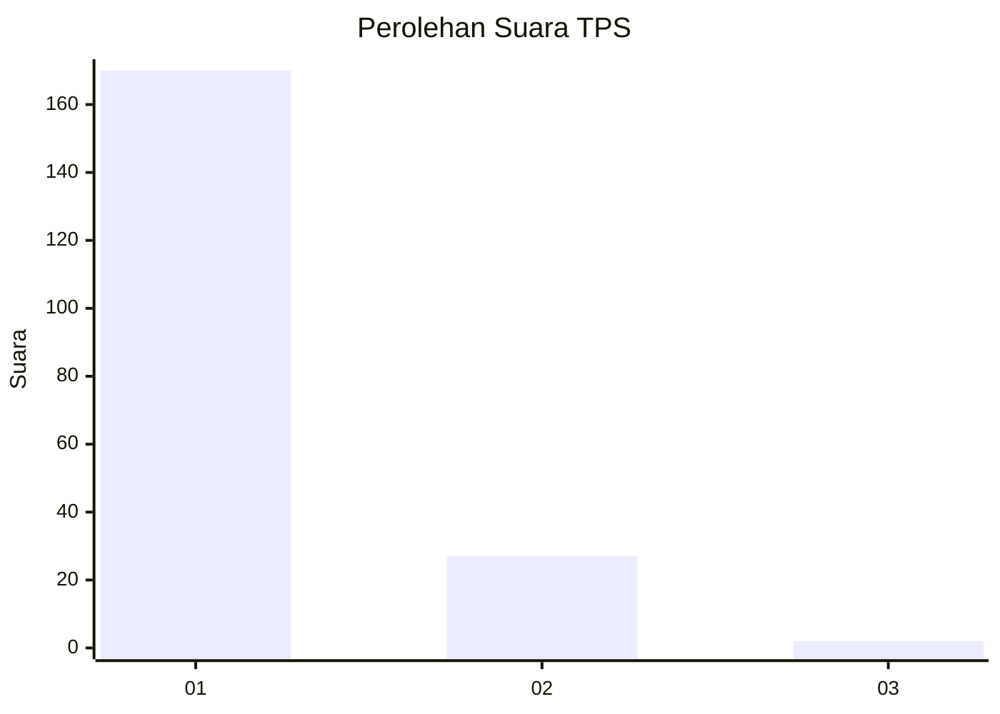
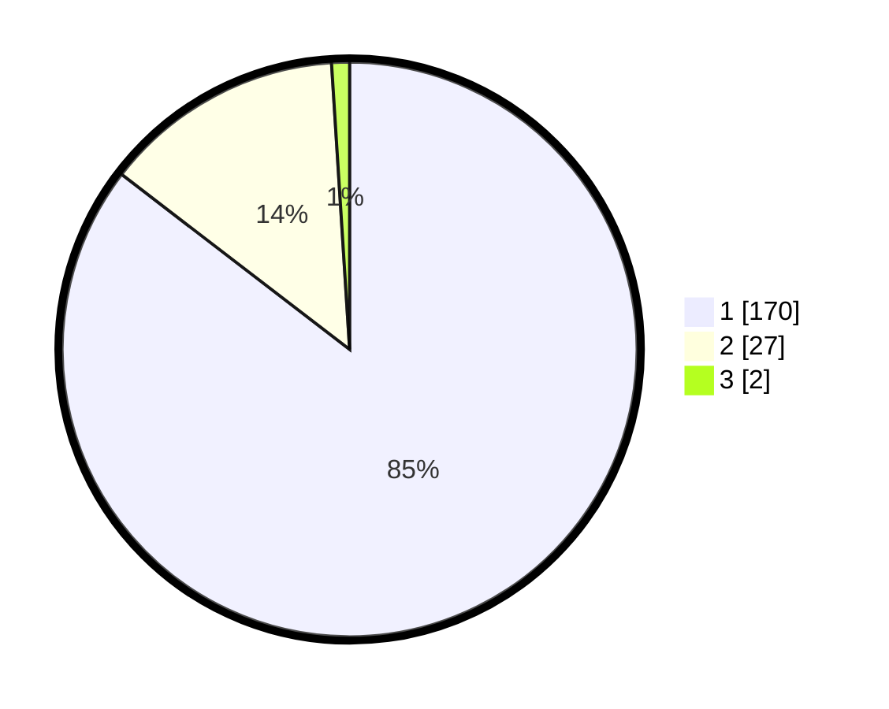

# Hasil

## Grafik

## Tabel

| No. | Nama Paslon    | Suara | Suara (raw) | Persentase |
|:--- |:-------------- | -----:| -----------:| ----------:|
| 1   | ANIES MUHAIMIN | 170   | [170][p-1]  | 85,43      |
| 2   | PRABOWO GIBRAN | 27    | [27][p-2]   | 13,57      |
| 3   | GANJAR MAHFUD  | 2     | [2][p-3]    | 1,01       |

[p-1]: https://github.com/gigit-pemilu/pemilu-2024-11-aceh/blob/main/pilpres/hitung-suara/sub/11-aceh/sub/08-aceh-utara/sub/14-t-jambo-aye/sub/2034-rawang-itek/sub/003-tps/sub/paslon-1.txt
[p-2]: https://github.com/gigit-pemilu/pemilu-2024-11-aceh/blob/main/pilpres/hitung-suara/sub/11-aceh/sub/08-aceh-utara/sub/14-t-jambo-aye/sub/2034-rawang-itek/sub/003-tps/sub/paslon-2.txt
[p-3]: https://github.com/gigit-pemilu/pemilu-2024-11-aceh/blob/main/pilpres/hitung-suara/sub/11-aceh/sub/08-aceh-utara/sub/14-t-jambo-aye/sub/2034-rawang-itek/sub/003-tps/sub/paslon-3.txt

## Foto C Plano

https://sirekap-obj-formc.kpu.go.id/9e05/pemilu/ppwp/11/08/14/20/34/1108142034003-20240215-111717--6c957898-8a21-4096-a19f-a3a5b6a4d500.jpg

https://sirekap-obj-formc.kpu.go.id/9e05/pemilu/ppwp/11/08/14/20/34/1108142034003-20240215-111901--c66124f1-c02e-4d5f-a21c-ec916b994de7.jpg

https://sirekap-obj-formc.kpu.go.id/9e05/pemilu/ppwp/11/08/14/20/34/1108142034003-20240215-112028--06bb3063-f116-47a2-91cb-f294257d0d59.jpg

## Metadata

| Key        | Value               |
| ---------- | ------------------- |
| Time Stamp | 2024-02-17 16:36:25 |

