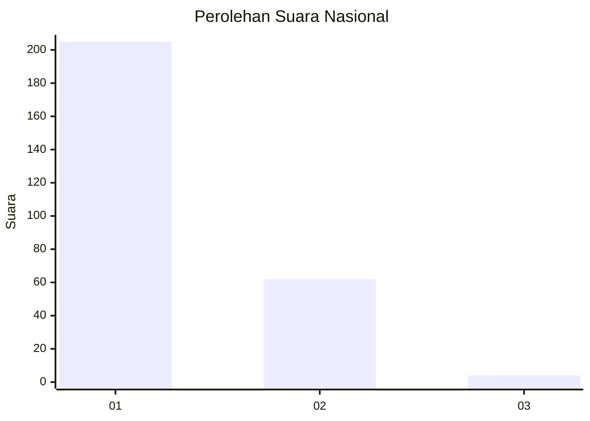
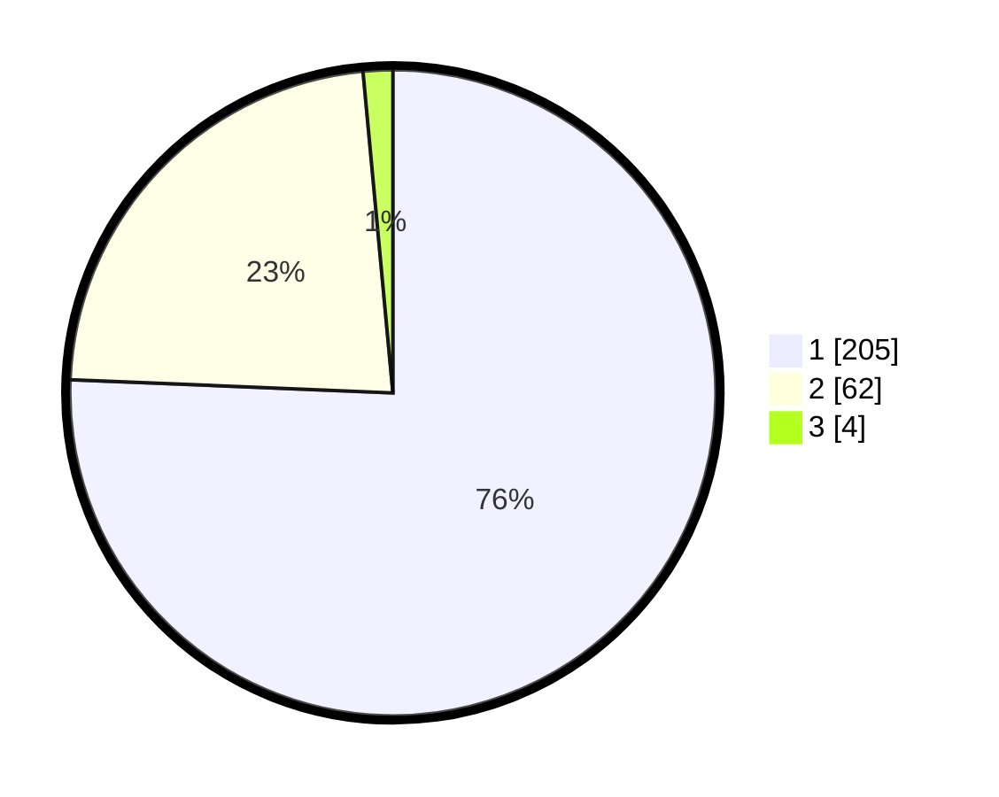

# Hasil

## Grafik

## Tabel

| No. | Nama Paslon    | Suara | Suara (raw) | Persentase |
|:--- |:-------------- | -----:| -----------:| ----------:|
| 1   | ANIES MUHAIMIN | 205   | [205][p-1]  | 75,65      |
| 2   | PRABOWO GIBRAN | 62    | [62][p-2]   | 22,88      |
| 3   | GANJAR MAHFUD  | 4     | [4][p-3]    | 1,48       |

[p-1]: https://github.com/gigit-pemilu/pemilu-2024/blob/main/pilpres/hitung-suara/sub/11-aceh/sub/08-aceh-utara/sub/14-t-jambo-aye/sub/2035-samakurok/sub/002-tps/sub/paslon-1.txt
[p-2]: https://github.com/gigit-pemilu/pemilu-2024/blob/main/pilpres/hitung-suara/sub/11-aceh/sub/08-aceh-utara/sub/14-t-jambo-aye/sub/2035-samakurok/sub/002-tps/sub/paslon-2.txt
[p-3]: https://github.com/gigit-pemilu/pemilu-2024/blob/main/pilpres/hitung-suara/sub/11-aceh/sub/08-aceh-utara/sub/14-t-jambo-aye/sub/2035-samakurok/sub/002-tps/sub/paslon-3.txt

## Foto C Plano

https://sirekap-obj-formc.kpu.go.id/7047/pemilu/ppwp/11/08/14/20/35/1108142035002-20240222-151656--07b1a940-f880-48ab-8e92-a0cdfac5b5c9.jpg

https://sirekap-obj-formc.kpu.go.id/7047/pemilu/ppwp/11/08/14/20/35/1108142035002-20240215-115236--1dfcb7f8-6993-405e-a7ad-859d471f8072.jpg

https://sirekap-obj-formc.kpu.go.id/7047/pemilu/ppwp/11/08/14/20/35/1108142035002-20240215-115417--0169ba95-eabe-4db3-99da-8cc0d2d4b9b5.jpg

## Metadata

| Key        | Value               |
| ---------- | ------------------- |
| Time Stamp | 2024-02-22 16:00:00 |

