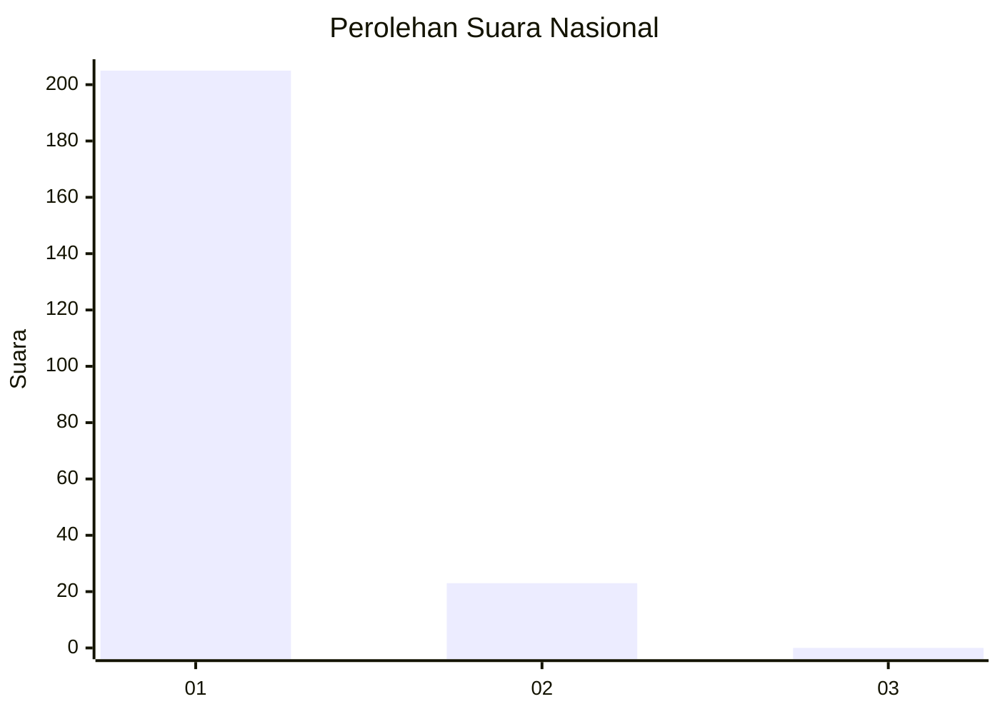
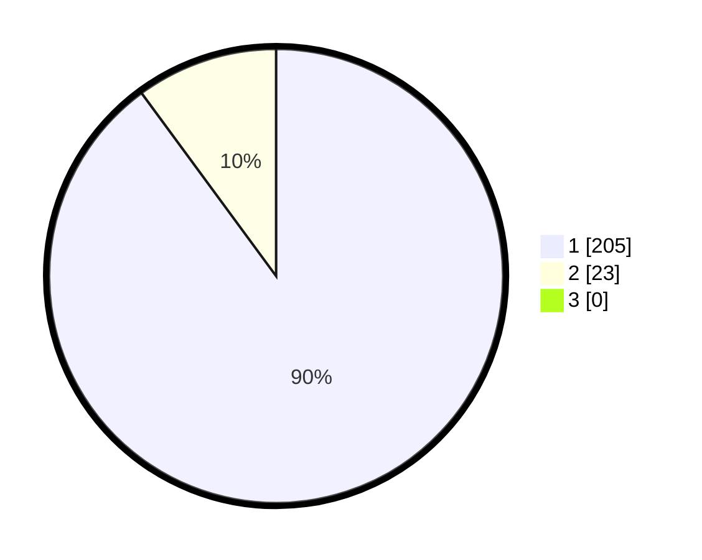

# Hasil

## Grafik

## Tabel

| No. | Nama Paslon    | Suara | Suara (raw) | Persentase |
|:--- |:-------------- | -----:| -----------:| ----------:|
| 1   | ANIES MUHAIMIN | 205   | [205][p-1]  | 89,91      |
| 2   | PRABOWO GIBRAN | 23    | [23][p-2]   | 10,09      |
| 3   | GANJAR MAHFUD  | 0     | [0][p-3]    | 0,00       |

[p-1]: https://github.com/gigit-pemilu/pemilu-2024/blob/main/pilpres/hitung-suara/sub/11-aceh/sub/08-aceh-utara/sub/14-t-jambo-aye/sub/2035-samakurok/sub/003-tps/sub/paslon-1.txt
[p-2]: https://github.com/gigit-pemilu/pemilu-2024/blob/main/pilpres/hitung-suara/sub/11-aceh/sub/08-aceh-utara/sub/14-t-jambo-aye/sub/2035-samakurok/sub/003-tps/sub/paslon-2.txt
[p-3]: https://github.com/gigit-pemilu/pemilu-2024/blob/main/pilpres/hitung-suara/sub/11-aceh/sub/08-aceh-utara/sub/14-t-jambo-aye/sub/2035-samakurok/sub/003-tps/sub/paslon-3.txt

## Foto C Plano

https://sirekap-obj-formc.kpu.go.id/ce84/pemilu/ppwp/11/08/14/20/35/1108142035003-20240222-152501--5489b0ee-481b-471b-b3d3-2c56cfaab436.jpg

https://sirekap-obj-formc.kpu.go.id/ce84/pemilu/ppwp/11/08/14/20/35/1108142035003-20240222-152559--bd2063b5-63f0-4845-b278-9ee877673bfc.jpg

https://sirekap-obj-formc.kpu.go.id/ce84/pemilu/ppwp/11/08/14/20/35/1108142035003-20240222-152725--147286f1-b598-464a-a24d-428f33e1bf09.jpg

## Metadata

| Key        | Value               |
| ---------- | ------------------- |
| Time Stamp | 2024-02-22 16:00:00 |

