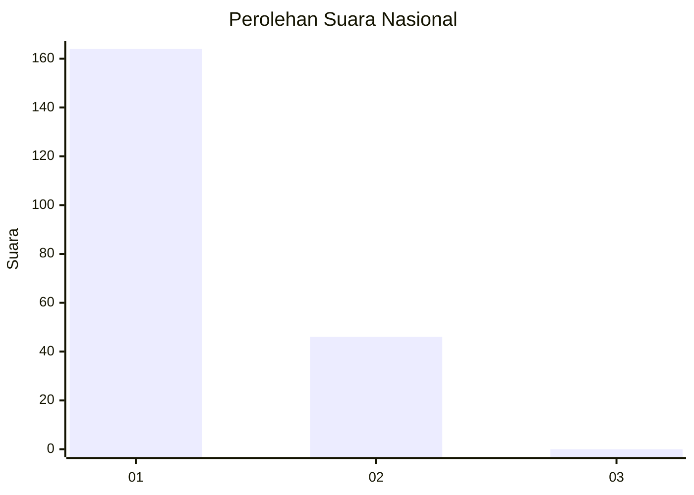
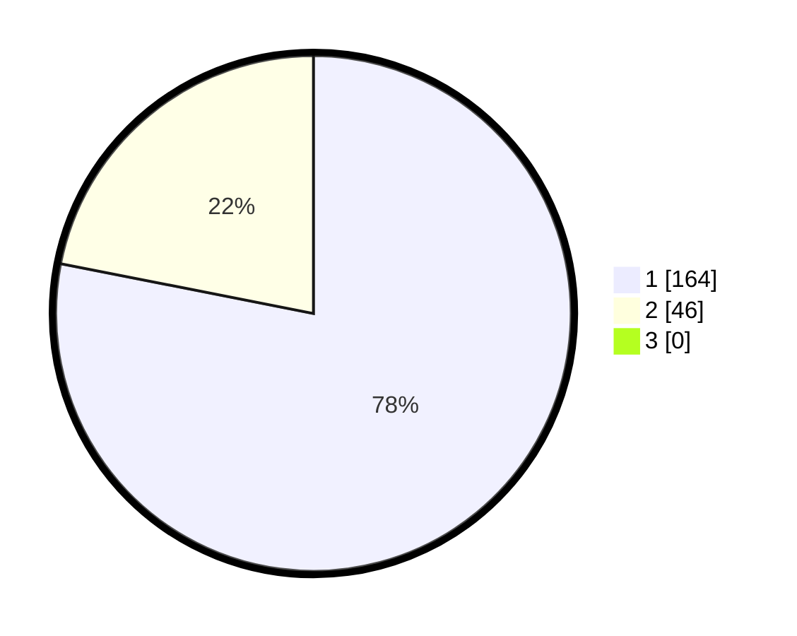

# Hasil

## Grafik

## Tabel

| No. | Nama Paslon    | Suara | Suara (raw) | Persentase |
|:--- |:-------------- | -----:| -----------:| ----------:|
| 1   | ANIES MUHAIMIN | 164   | [164][p-1]  | 78,10      |
| 2   | PRABOWO GIBRAN | 46    | [46][p-2]   | 21,90      |
| 3   | GANJAR MAHFUD  | 0     | [0][p-3]    | 0,00       |

[p-1]: https://github.com/gigit-pemilu/pemilu-2024/blob/main/pilpres/hitung-suara/sub/11-aceh/sub/08-aceh-utara/sub/14-t-jambo-aye/sub/2036-biara-barat/sub/002-tps/sub/paslon-1.txt
[p-2]: https://github.com/gigit-pemilu/pemilu-2024/blob/main/pilpres/hitung-suara/sub/11-aceh/sub/08-aceh-utara/sub/14-t-jambo-aye/sub/2036-biara-barat/sub/002-tps/sub/paslon-2.txt
[p-3]: https://github.com/gigit-pemilu/pemilu-2024/blob/main/pilpres/hitung-suara/sub/11-aceh/sub/08-aceh-utara/sub/14-t-jambo-aye/sub/2036-biara-barat/sub/002-tps/sub/paslon-3.txt

## Foto C Plano

https://sirekap-obj-formc.kpu.go.id/5331/pemilu/ppwp/11/08/14/20/36/1108142036002-20240215-081937--31c68624-41bf-424f-b17a-a7b05b65caef.jpg

https://sirekap-obj-formc.kpu.go.id/5331/pemilu/ppwp/11/08/14/20/36/1108142036002-20240215-082109--8fab696c-953b-468d-ba75-2fb2fa6fb853.jpg

https://sirekap-obj-formc.kpu.go.id/5331/pemilu/ppwp/11/08/14/20/36/1108142036002-20240215-082236--e00b7d1b-9640-40fb-a8ad-42a7842035bc.jpg

## Metadata

| Key        | Value               |
| ---------- | ------------------- |
| Time Stamp | 2024-02-16 12:51:22 |

