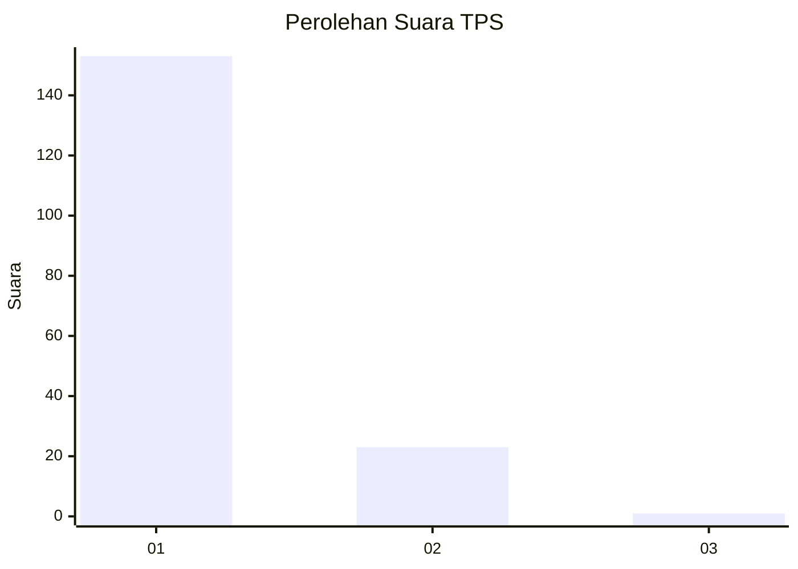
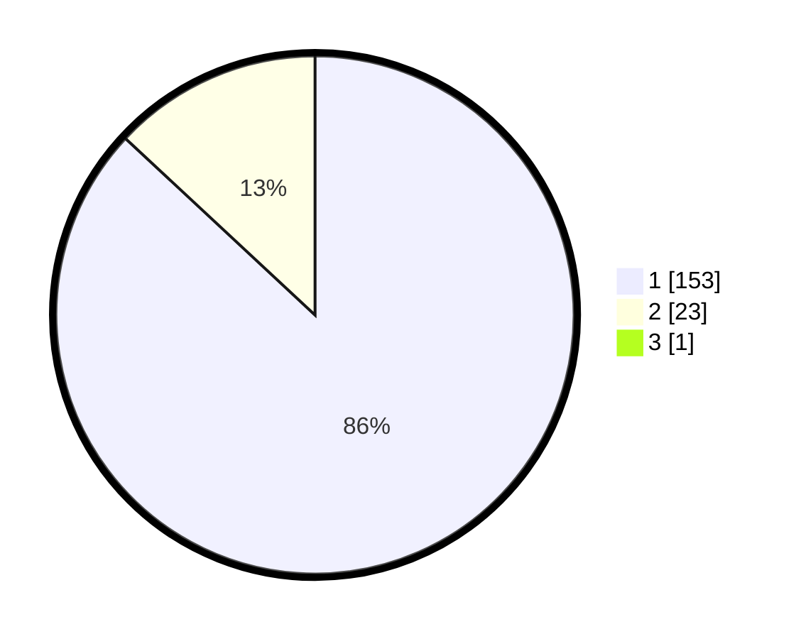

# Hasil

## Grafik

## Tabel

| No. | Nama Paslon    | Suara | Suara (raw) | Persentase |
|:--- |:-------------- | -----:| -----------:| ----------:|
| 1   | ANIES MUHAIMIN | 153   | [153][p-1]  | 86,44      |
| 2   | PRABOWO GIBRAN | 23    | [23][p-2]   | 12,99      |
| 3   | GANJAR MAHFUD  | 1     | [1][p-3]    | 0,56       |

[p-1]: https://github.com/gigit-pemilu/pemilu-2024-11-aceh/blob/main/pilpres/hitung-suara/sub/11-aceh/sub/08-aceh-utara/sub/14-t-jambo-aye/sub/2036-biara-barat/sub/003-tps/sub/paslon-1.txt
[p-2]: https://github.com/gigit-pemilu/pemilu-2024-11-aceh/blob/main/pilpres/hitung-suara/sub/11-aceh/sub/08-aceh-utara/sub/14-t-jambo-aye/sub/2036-biara-barat/sub/003-tps/sub/paslon-2.txt
[p-3]: https://github.com/gigit-pemilu/pemilu-2024-11-aceh/blob/main/pilpres/hitung-suara/sub/11-aceh/sub/08-aceh-utara/sub/14-t-jambo-aye/sub/2036-biara-barat/sub/003-tps/sub/paslon-3.txt

## Foto C Plano

https://sirekap-obj-formc.kpu.go.id/9905/pemilu/ppwp/11/08/14/20/36/1108142036003-20240215-092059--2a81f43c-c674-4992-b050-79c4ddb6dbad.jpg

https://sirekap-obj-formc.kpu.go.id/9905/pemilu/ppwp/11/08/14/20/36/1108142036003-20240215-044543--8e4f30f4-e5ac-4d6a-8714-c19d6cf1bc5d.jpg

https://sirekap-obj-formc.kpu.go.id/9905/pemilu/ppwp/11/08/14/20/36/1108142036003-20240217-170235--d8fa7332-5b4e-4eaf-9b14-1250df103e20.jpg

## Metadata

| Key        | Value               |
| ---------- | ------------------- |
| Time Stamp | 2024-02-17 17:30:00 |

