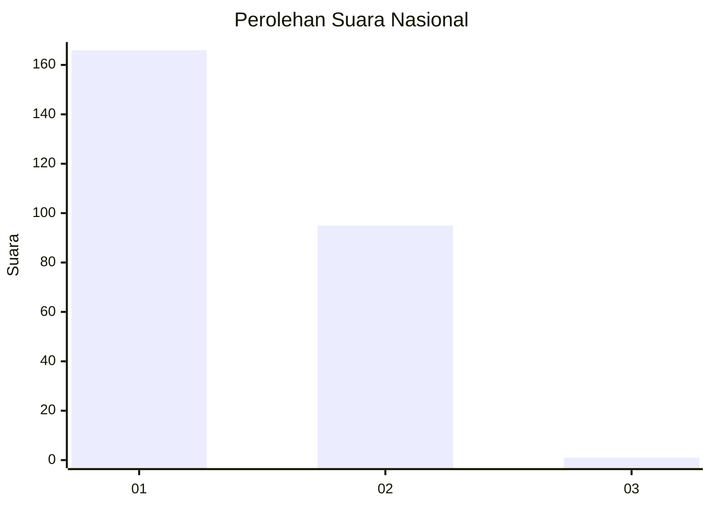
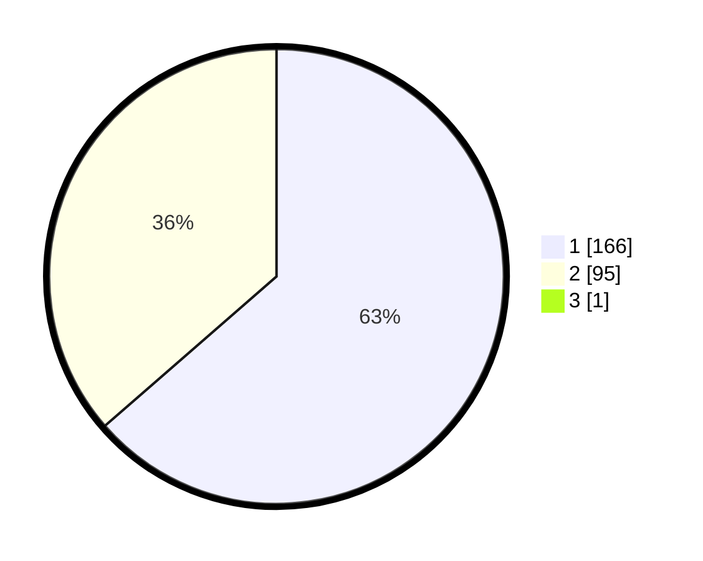

# Hasil

## Grafik

## Tabel

| No. | Nama Paslon    | Suara | Suara (raw) | Persentase |
|:--- |:-------------- | -----:| -----------:| ----------:|
| 1   | ANIES MUHAIMIN | 166   | [166][p-1]  | 63,36      |
| 2   | PRABOWO GIBRAN | 95    | [95][p-2]   | 36,26      |
| 3   | GANJAR MAHFUD  | 1     | [1][p-3]    | 0,38       |

[p-1]: https://github.com/gigit-pemilu/pemilu-2024/blob/main/pilpres/hitung-suara/sub/11-aceh/sub/08-aceh-utara/sub/14-t-jambo-aye/sub/2037-biara-timur/sub/001-tps/sub/paslon-1.txt
[p-2]: https://github.com/gigit-pemilu/pemilu-2024/blob/main/pilpres/hitung-suara/sub/11-aceh/sub/08-aceh-utara/sub/14-t-jambo-aye/sub/2037-biara-timur/sub/001-tps/sub/paslon-2.txt
[p-3]: https://github.com/gigit-pemilu/pemilu-2024/blob/main/pilpres/hitung-suara/sub/11-aceh/sub/08-aceh-utara/sub/14-t-jambo-aye/sub/2037-biara-timur/sub/001-tps/sub/paslon-3.txt

## Foto C Plano

https://sirekap-obj-formc.kpu.go.id/49a9/pemilu/ppwp/11/08/14/20/37/1108142037001-20240215-072345--dd8c2870-a14c-4b1e-ada5-66e5343548e7.jpg

https://sirekap-obj-formc.kpu.go.id/49a9/pemilu/ppwp/11/08/14/20/37/1108142037001-20240215-074046--db556ac5-6b8c-4a2a-a4b7-3e0f70db1bc9.jpg

https://sirekap-obj-formc.kpu.go.id/49a9/pemilu/ppwp/11/08/14/20/37/1108142037001-20240215-074359--60db9b95-8c72-4977-b135-31721bc82837.jpg

## Metadata

| Key        | Value               |
| ---------- | ------------------- |
| Time Stamp | 2024-02-17 16:36:25 |

