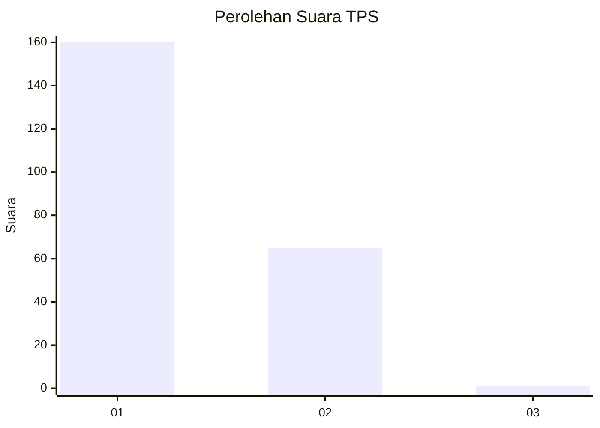
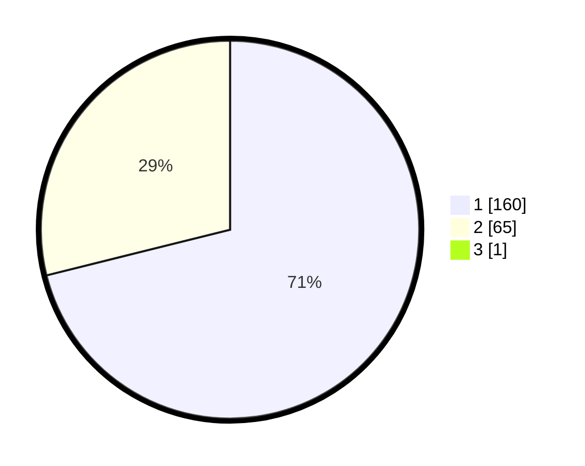

# Hasil

## Grafik

## Tabel

| No. | Nama Paslon    | Suara | Suara (raw) | Persentase |
|:--- |:-------------- | -----:| -----------:| ----------:|
| 1   | ANIES MUHAIMIN | 160   | [160][p-1]  | 70,80      |
| 2   | PRABOWO GIBRAN | 65    | [65][p-2]   | 28,76      |
| 3   | GANJAR MAHFUD  | 1     | [1][p-3]    | 0,44       |

[p-1]: https://github.com/gigit-pemilu/pemilu-2024-11-aceh/blob/main/pilpres/hitung-suara/sub/11-aceh/sub/08-aceh-utara/sub/14-t-jambo-aye/sub/2037-biara-timur/sub/002-tps/sub/paslon-1.txt
[p-2]: https://github.com/gigit-pemilu/pemilu-2024-11-aceh/blob/main/pilpres/hitung-suara/sub/11-aceh/sub/08-aceh-utara/sub/14-t-jambo-aye/sub/2037-biara-timur/sub/002-tps/sub/paslon-2.txt
[p-3]: https://github.com/gigit-pemilu/pemilu-2024-11-aceh/blob/main/pilpres/hitung-suara/sub/11-aceh/sub/08-aceh-utara/sub/14-t-jambo-aye/sub/2037-biara-timur/sub/002-tps/sub/paslon-3.txt

## Foto C Plano

https://sirekap-obj-formc.kpu.go.id/8a36/pemilu/ppwp/11/08/14/20/37/1108142037002-20240215-073447--7c4db2e2-e661-4561-aead-5253a76c72c6.jpg

https://sirekap-obj-formc.kpu.go.id/8a36/pemilu/ppwp/11/08/14/20/37/1108142037002-20240215-074955--57689b4c-e87d-43e6-8cc8-bf7b0be77f23.jpg

https://sirekap-obj-formc.kpu.go.id/8a36/pemilu/ppwp/11/08/14/20/37/1108142037002-20240215-075157--db813949-9c19-4fa8-95d1-03117f4b4e9a.jpg

## Metadata

| Key        | Value               |
| ---------- | ------------------- |
| Time Stamp | 2024-02-17 16:00:02 |

