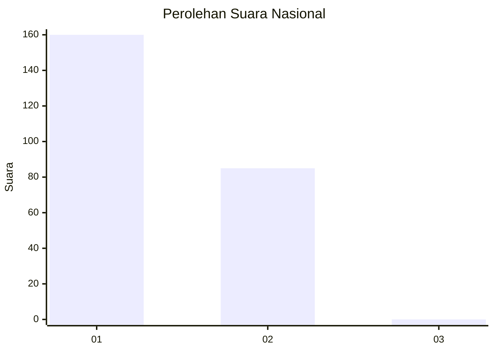
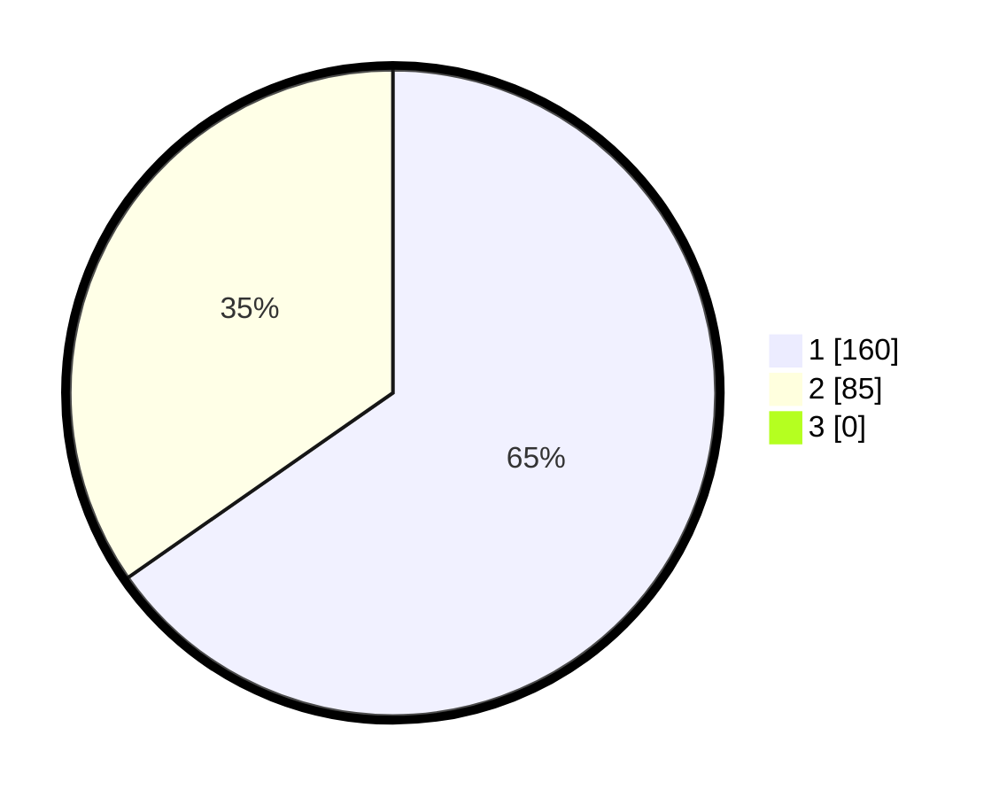

# Hasil

## Grafik

## Tabel

| No. | Nama Paslon    | Suara | Suara (raw) | Persentase |
|:--- |:-------------- | -----:| -----------:| ----------:|
| 1   | ANIES MUHAIMIN | 160   | [160][p-1]  | 65,31      |
| 2   | PRABOWO GIBRAN | 85    | [85][p-2]   | 34,69      |
| 3   | GANJAR MAHFUD  | 0     | [0][p-3]    | 0,00       |

[p-1]: https://github.com/gigit-pemilu/pemilu-2024/blob/main/pilpres/hitung-suara/sub/11-aceh/sub/08-aceh-utara/sub/14-t-jambo-aye/sub/2038-matang-drien/sub/002-tps/sub/paslon-1.txt
[p-2]: https://github.com/gigit-pemilu/pemilu-2024/blob/main/pilpres/hitung-suara/sub/11-aceh/sub/08-aceh-utara/sub/14-t-jambo-aye/sub/2038-matang-drien/sub/002-tps/sub/paslon-2.txt
[p-3]: https://github.com/gigit-pemilu/pemilu-2024/blob/main/pilpres/hitung-suara/sub/11-aceh/sub/08-aceh-utara/sub/14-t-jambo-aye/sub/2038-matang-drien/sub/002-tps/sub/paslon-3.txt

## Foto C Plano

https://sirekap-obj-formc.kpu.go.id/0d15/pemilu/ppwp/11/08/14/20/38/1108142038002-20240215-135900--64a20662-d248-4ca3-b64a-d79fe30396d8.jpg

https://sirekap-obj-formc.kpu.go.id/0d15/pemilu/ppwp/11/08/14/20/38/1108142038002-20240215-140129--7ee31c01-036b-43d0-9c35-e0c19b8989de.jpg

https://sirekap-obj-formc.kpu.go.id/0d15/pemilu/ppwp/11/08/14/20/38/1108142038002-20240215-140242--be1fe178-8731-45ef-898e-1f2321e6ba0d.jpg

## Metadata

| Key        | Value               |
| ---------- | ------------------- |
| Time Stamp | 2024-02-17 16:00:02 |

