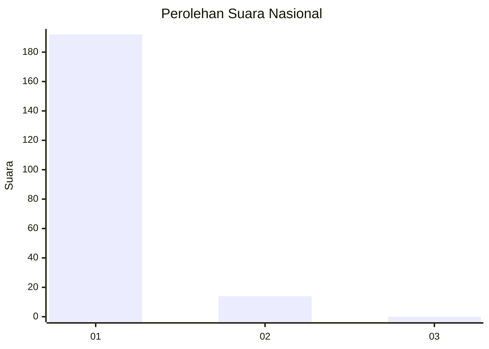
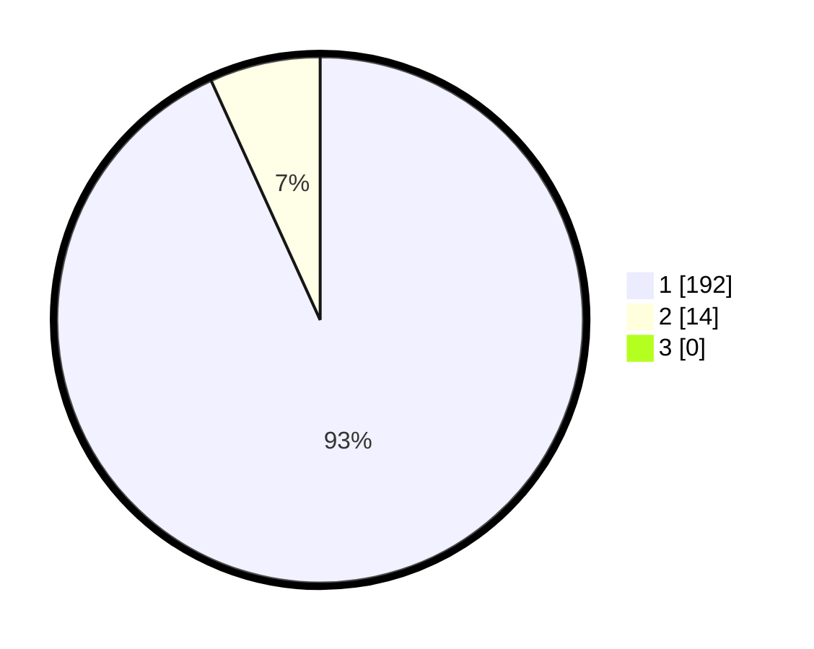

# Hasil

## Grafik

## Tabel

| No. | Nama Paslon    | Suara | Suara (raw) | Persentase |
|:--- |:-------------- | -----:| -----------:| ----------:|
| 1   | ANIES MUHAIMIN | 192   | [192][p-1]  | 93,20      |
| 2   | PRABOWO GIBRAN | 14    | [14][p-2]   | 6,80       |
| 3   | GANJAR MAHFUD  | 0     | [0][p-3]    | 0,00       |

[p-1]: https://github.com/gigit-pemilu/pemilu-2024/blob/main/pilpres/hitung-suara/sub/11-aceh/sub/08-aceh-utara/sub/14-t-jambo-aye/sub/2039-ceumpeudak/sub/002-tps/sub/paslon-1.txt
[p-2]: https://github.com/gigit-pemilu/pemilu-2024/blob/main/pilpres/hitung-suara/sub/11-aceh/sub/08-aceh-utara/sub/14-t-jambo-aye/sub/2039-ceumpeudak/sub/002-tps/sub/paslon-2.txt
[p-3]: https://github.com/gigit-pemilu/pemilu-2024/blob/main/pilpres/hitung-suara/sub/11-aceh/sub/08-aceh-utara/sub/14-t-jambo-aye/sub/2039-ceumpeudak/sub/002-tps/sub/paslon-3.txt

## Foto C Plano

https://sirekap-obj-formc.kpu.go.id/4539/pemilu/ppwp/11/08/14/20/39/1108142039002-20240215-144921--940e4327-c0dd-4639-b739-f6d3bda5b83d.jpg

https://sirekap-obj-formc.kpu.go.id/4539/pemilu/ppwp/11/08/14/20/39/1108142039002-20240215-165912--9fb0104e-3763-48e9-9bfc-7cb2998414fe.jpg

https://sirekap-obj-formc.kpu.go.id/4539/pemilu/ppwp/11/08/14/20/39/1108142039002-20240215-170045--9bff12f4-5391-4b8a-bab9-be1b8aa5a510.jpg

## Metadata

| Key        | Value               |
| ---------- | ------------------- |
| Time Stamp | 2024-02-17 16:36:25 |

