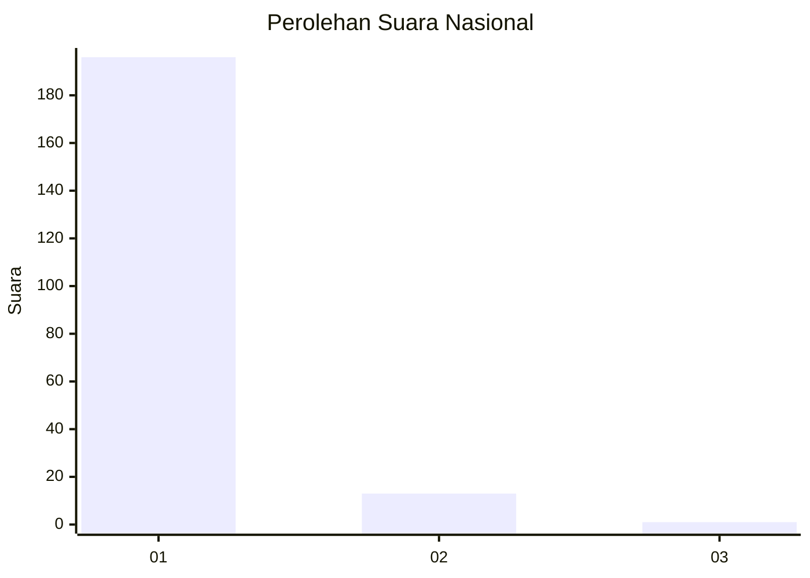
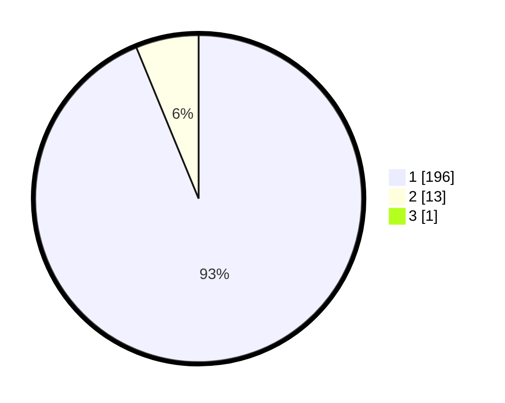

# Hasil

## Grafik

## Tabel

| No. | Nama Paslon    | Suara | Suara (raw) | Persentase |
|:--- |:-------------- | -----:| -----------:| ----------:|
| 1   | ANIES MUHAIMIN | 196   | [196][p-1]  | 93,33      |
| 2   | PRABOWO GIBRAN | 13    | [13][p-2]   | 6,19       |
| 3   | GANJAR MAHFUD  | 1     | [1][p-3]    | 0,48       |

[p-1]: https://github.com/gigit-pemilu/pemilu-2024/blob/main/pilpres/hitung-suara/sub/11-aceh/sub/08-aceh-utara/sub/14-t-jambo-aye/sub/2039-ceumpeudak/sub/003-tps/sub/paslon-1.txt
[p-2]: https://github.com/gigit-pemilu/pemilu-2024/blob/main/pilpres/hitung-suara/sub/11-aceh/sub/08-aceh-utara/sub/14-t-jambo-aye/sub/2039-ceumpeudak/sub/003-tps/sub/paslon-2.txt
[p-3]: https://github.com/gigit-pemilu/pemilu-2024/blob/main/pilpres/hitung-suara/sub/11-aceh/sub/08-aceh-utara/sub/14-t-jambo-aye/sub/2039-ceumpeudak/sub/003-tps/sub/paslon-3.txt

## Foto C Plano

https://sirekap-obj-formc.kpu.go.id/d022/pemilu/ppwp/11/08/14/20/39/1108142039003-20240215-124017--d877754f-18be-42d6-a367-1f395d131517.jpg

https://sirekap-obj-formc.kpu.go.id/d022/pemilu/ppwp/11/08/14/20/39/1108142039003-20240215-124821--b39c384a-6fb9-4596-9e3a-c674daa48168.jpg

https://sirekap-obj-formc.kpu.go.id/d022/pemilu/ppwp/11/08/14/20/39/1108142039003-20240215-124918--cc6872ad-9847-4a62-baad-bced7232be85.jpg

## Metadata

| Key        | Value               |
| ---------- | ------------------- |
| Time Stamp | 2024-02-15 21:01:18 |

