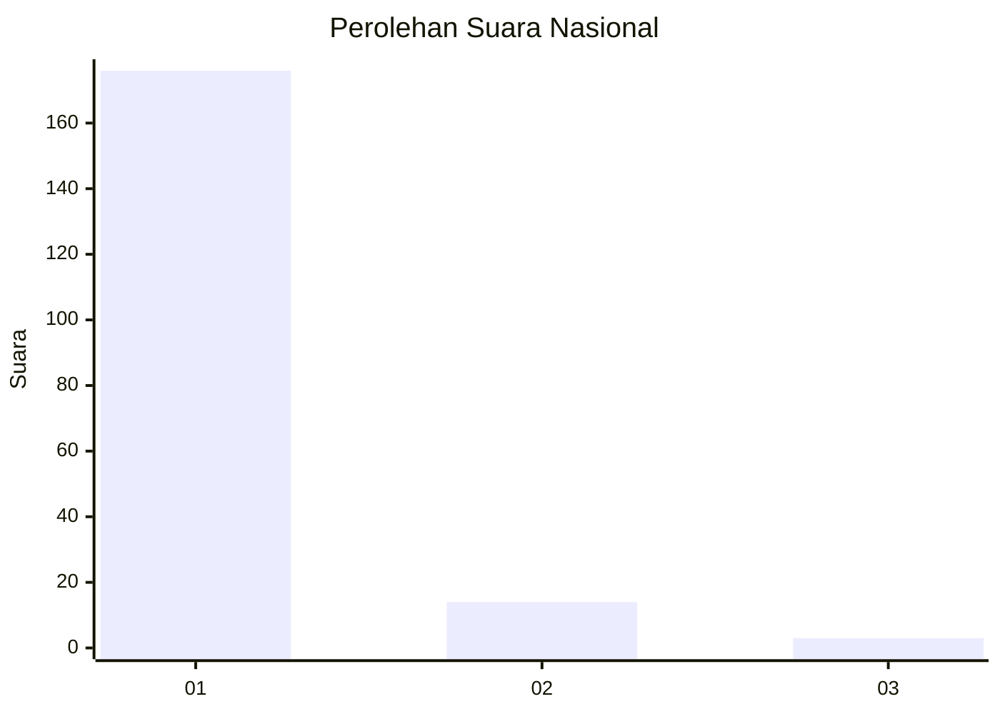
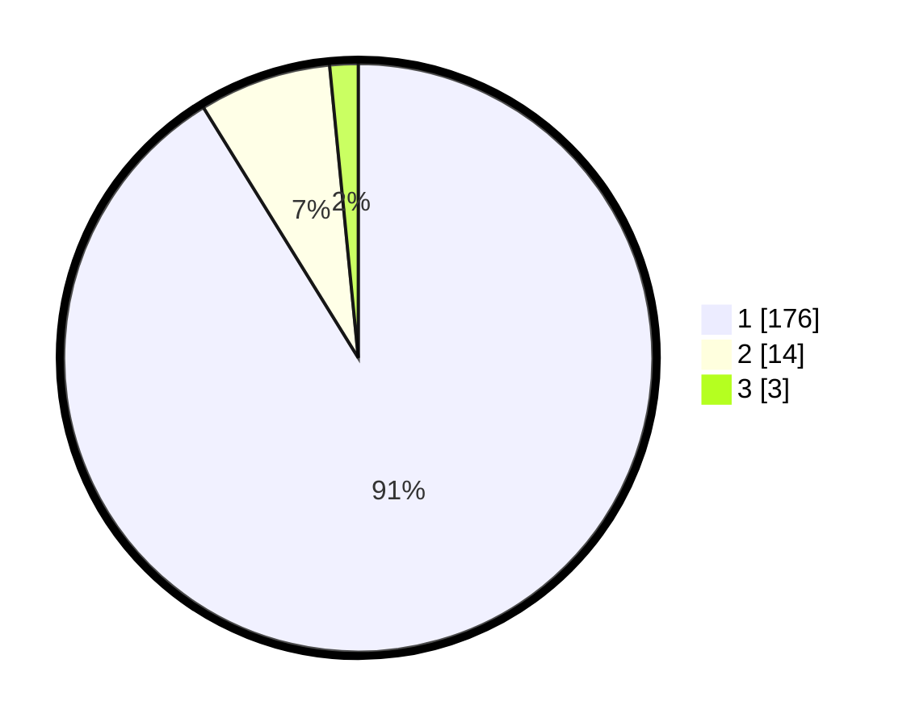

# Hasil

## Grafik

## Tabel

| No. | Nama Paslon    | Suara | Suara (raw) | Persentase |
|:--- |:-------------- | -----:| -----------:| ----------:|
| 1   | ANIES MUHAIMIN | 176   | [176][p-1]  | 91,19      |
| 2   | PRABOWO GIBRAN | 14    | [14][p-2]   | 7,25       |
| 3   | GANJAR MAHFUD  | 3     | [3][p-3]    | 1,55       |

[p-1]: https://github.com/gigit-pemilu/pemilu-2024/blob/main/pilpres/hitung-suara/sub/11-aceh/sub/08-aceh-utara/sub/14-t-jambo-aye/sub/2040-alue-papeun/sub/001-tps/sub/paslon-1.txt
[p-2]: https://github.com/gigit-pemilu/pemilu-2024/blob/main/pilpres/hitung-suara/sub/11-aceh/sub/08-aceh-utara/sub/14-t-jambo-aye/sub/2040-alue-papeun/sub/001-tps/sub/paslon-2.txt
[p-3]: https://github.com/gigit-pemilu/pemilu-2024/blob/main/pilpres/hitung-suara/sub/11-aceh/sub/08-aceh-utara/sub/14-t-jambo-aye/sub/2040-alue-papeun/sub/001-tps/sub/paslon-3.txt

## Foto C Plano

https://sirekap-obj-formc.kpu.go.id/021d/pemilu/ppwp/11/08/14/20/40/1108142040001-20240215-115722--b6cb092e-494d-4fb9-ab6d-6902a851f978.jpg

https://sirekap-obj-formc.kpu.go.id/021d/pemilu/ppwp/11/08/14/20/40/1108142040001-20240215-115929--b3918f81-1e2f-4051-b49c-5ad0c0d62e44.jpg

https://sirekap-obj-formc.kpu.go.id/021d/pemilu/ppwp/11/08/14/20/40/1108142040001-20240215-120129--3968e87c-6d46-42e5-9332-86232870598a.jpg

## Metadata

| Key        | Value               |
| ---------- | ------------------- |
| Time Stamp | 2024-02-17 16:00:02 |

