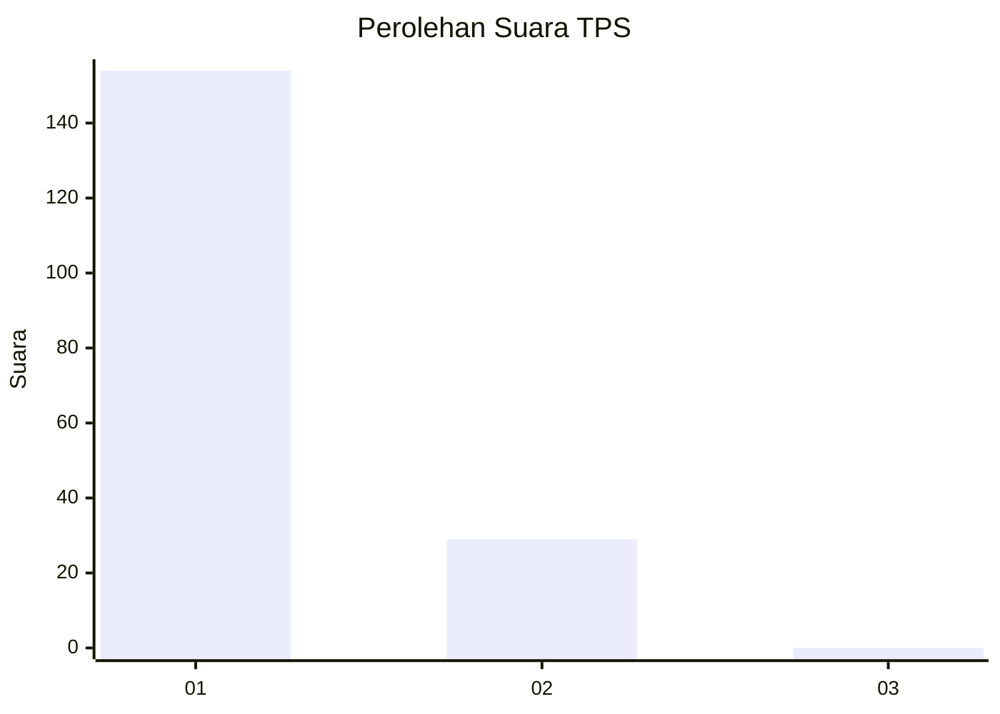
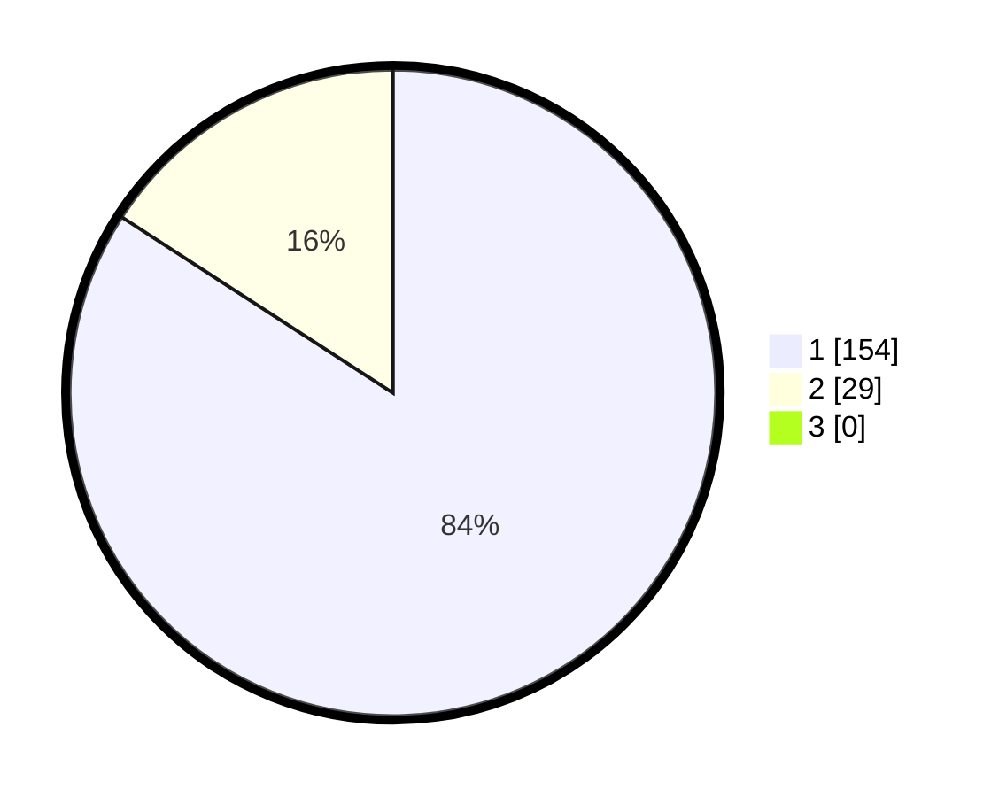

# Hasil

## Grafik

## Tabel

| No. | Nama Paslon    | Suara | Suara (raw) | Persentase |
|:--- |:-------------- | -----:| -----------:| ----------:|
| 1   | ANIES MUHAIMIN | 154   | [154][p-1]  | 84,15      |
| 2   | PRABOWO GIBRAN | 29    | [29][p-2]   | 15,85      |
| 3   | GANJAR MAHFUD  | 0     | [0][p-3]    | 0,00       |

[p-1]: https://github.com/gigit-pemilu/pemilu-2024-11-aceh/blob/main/pilpres/hitung-suara/sub/11-aceh/sub/08-aceh-utara/sub/14-t-jambo-aye/sub/2040-alue-papeun/sub/002-tps/sub/paslon-1.txt
[p-2]: https://github.com/gigit-pemilu/pemilu-2024-11-aceh/blob/main/pilpres/hitung-suara/sub/11-aceh/sub/08-aceh-utara/sub/14-t-jambo-aye/sub/2040-alue-papeun/sub/002-tps/sub/paslon-2.txt
[p-3]: https://github.com/gigit-pemilu/pemilu-2024-11-aceh/blob/main/pilpres/hitung-suara/sub/11-aceh/sub/08-aceh-utara/sub/14-t-jambo-aye/sub/2040-alue-papeun/sub/002-tps/sub/paslon-3.txt

## Foto C Plano

https://sirekap-obj-formc.kpu.go.id/06cb/pemilu/ppwp/11/08/14/20/40/1108142040002-20240215-105249--f5c0ab93-89b3-4595-85e4-39d4156de9c4.jpg

https://sirekap-obj-formc.kpu.go.id/06cb/pemilu/ppwp/11/08/14/20/40/1108142040002-20240215-105626--1438e700-80ea-4146-a793-5078ffc98052.jpg

https://sirekap-obj-formc.kpu.go.id/06cb/pemilu/ppwp/11/08/14/20/40/1108142040002-20240215-105826--89f6fd7e-f991-4370-959c-f9c20e9198c1.jpg

## Metadata

| Key        | Value               |
| ---------- | ------------------- |
| Time Stamp | 2024-02-17 16:36:25 |

