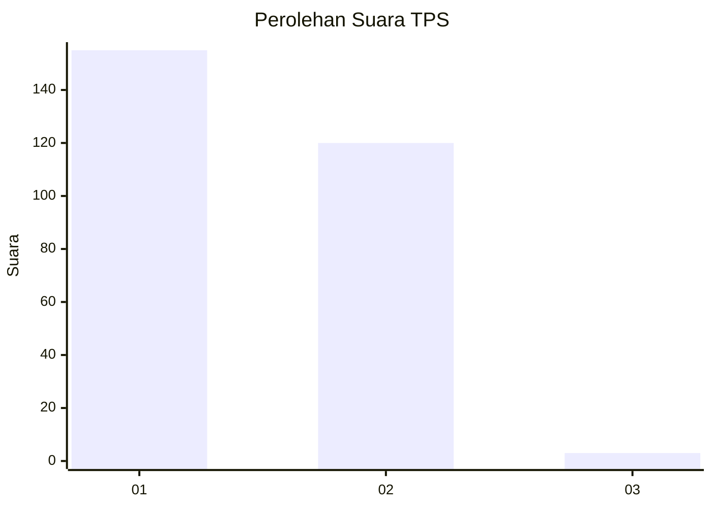
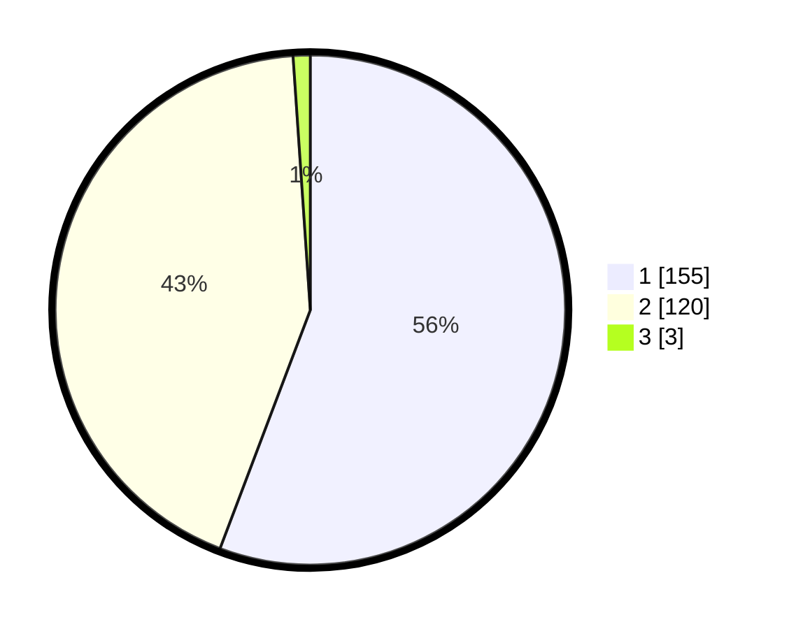

# Hasil

## Grafik

## Tabel

| No. | Nama Paslon    | Suara | Suara (raw) | Persentase |
|:--- |:-------------- | -----:| -----------:| ----------:|
| 1   | ANIES MUHAIMIN | 155   | [155][p-1]  | 55,76      |
| 2   | PRABOWO GIBRAN | 120   | [120][p-2]  | 43,17      |
| 3   | GANJAR MAHFUD  | 3     | [3][p-3]    | 1,08       |

[p-1]: https://github.com/gigit-pemilu/pemilu-2024-11-aceh/blob/main/pilpres/hitung-suara/sub/11-aceh/sub/08-aceh-utara/sub/14-t-jambo-aye/sub/2040-alue-papeun/sub/003-tps/sub/paslon-1.txt
[p-2]: https://github.com/gigit-pemilu/pemilu-2024-11-aceh/blob/main/pilpres/hitung-suara/sub/11-aceh/sub/08-aceh-utara/sub/14-t-jambo-aye/sub/2040-alue-papeun/sub/003-tps/sub/paslon-2.txt
[p-3]: https://github.com/gigit-pemilu/pemilu-2024-11-aceh/blob/main/pilpres/hitung-suara/sub/11-aceh/sub/08-aceh-utara/sub/14-t-jambo-aye/sub/2040-alue-papeun/sub/003-tps/sub/paslon-3.txt

## Foto C Plano

https://sirekap-obj-formc.kpu.go.id/fb76/pemilu/ppwp/11/08/14/20/40/1108142040003-20240215-115453--405feff8-1021-481c-a914-0731ff57f263.jpg

https://sirekap-obj-formc.kpu.go.id/fb76/pemilu/ppwp/11/08/14/20/40/1108142040003-20240215-115636--db04a244-62d7-401f-953e-b841705c4f30.jpg

https://sirekap-obj-formc.kpu.go.id/fb76/pemilu/ppwp/11/08/14/20/40/1108142040003-20240215-115742--fbaf082c-92e6-47d3-a2a7-d237bb37db6d.jpg

## Metadata

| Key        | Value               |
| ---------- | ------------------- |
| Time Stamp | 2024-02-17 16:36:25 |

