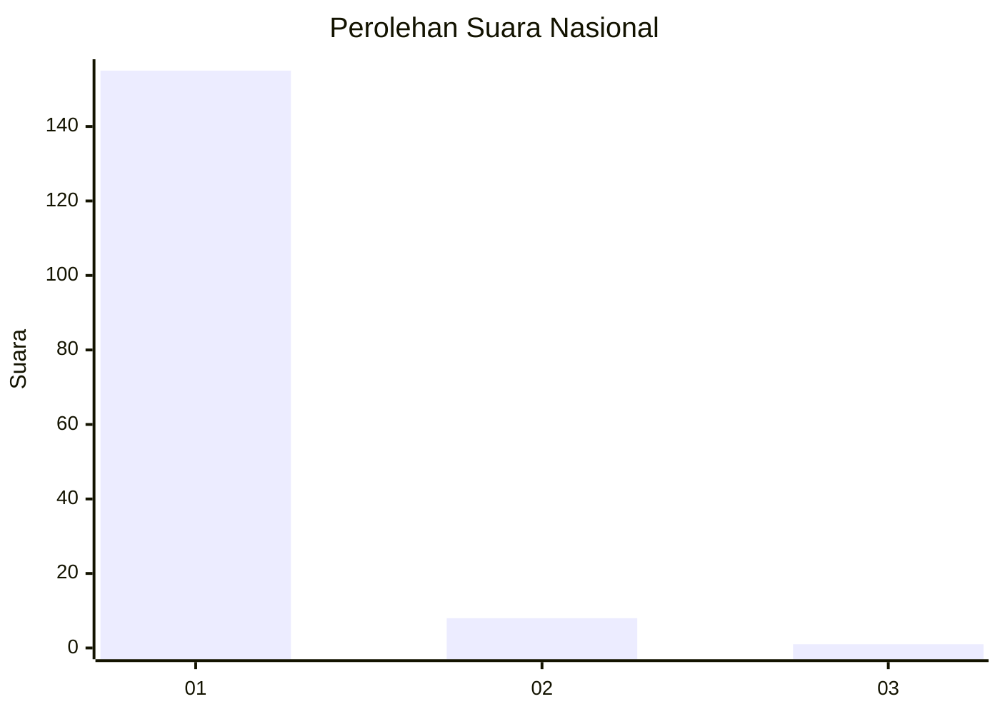
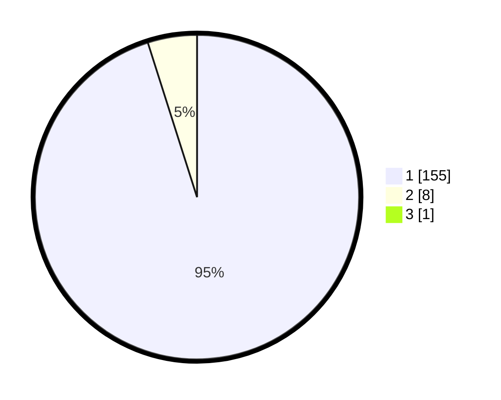

# Hasil

## Grafik

## Tabel

| No. | Nama Paslon    | Suara | Suara (raw) | Persentase |
|:--- |:-------------- | -----:| -----------:| ----------:|
| 1   | ANIES MUHAIMIN | 155   | [155][p-1]  | 94,51      |
| 2   | PRABOWO GIBRAN | 8     | [8][p-2]    | 4,88       |
| 3   | GANJAR MAHFUD  | 1     | [1][p-3]    | 0,61       |

[p-1]: https://github.com/gigit-pemilu/pemilu-2024/blob/main/pilpres/hitung-suara/sub/11-aceh/sub/08-aceh-utara/sub/14-t-jambo-aye/sub/2041-lhok-bintang-hu/sub/003-tps/sub/paslon-1.txt
[p-2]: https://github.com/gigit-pemilu/pemilu-2024/blob/main/pilpres/hitung-suara/sub/11-aceh/sub/08-aceh-utara/sub/14-t-jambo-aye/sub/2041-lhok-bintang-hu/sub/003-tps/sub/paslon-2.txt
[p-3]: https://github.com/gigit-pemilu/pemilu-2024/blob/main/pilpres/hitung-suara/sub/11-aceh/sub/08-aceh-utara/sub/14-t-jambo-aye/sub/2041-lhok-bintang-hu/sub/003-tps/sub/paslon-3.txt

## Foto C Plano

https://sirekap-obj-formc.kpu.go.id/4b4f/pemilu/ppwp/11/08/14/20/41/1108142041003-20240215-040658--6ff167d8-30fb-4ea3-b774-6b6561cbcff1.jpg

https://sirekap-obj-formc.kpu.go.id/4b4f/pemilu/ppwp/11/08/14/20/41/1108142041003-20240215-040845--dfb85940-c139-438c-8741-3779ffcabae9.jpg

https://sirekap-obj-formc.kpu.go.id/4b4f/pemilu/ppwp/11/08/14/20/41/1108142041003-20240215-041001--0a6ea184-5422-46dc-8933-5dcd1e212871.jpg

## Metadata

| Key        | Value               |
| ---------- | ------------------- |
| Time Stamp | 2024-02-17 16:00:02 |

