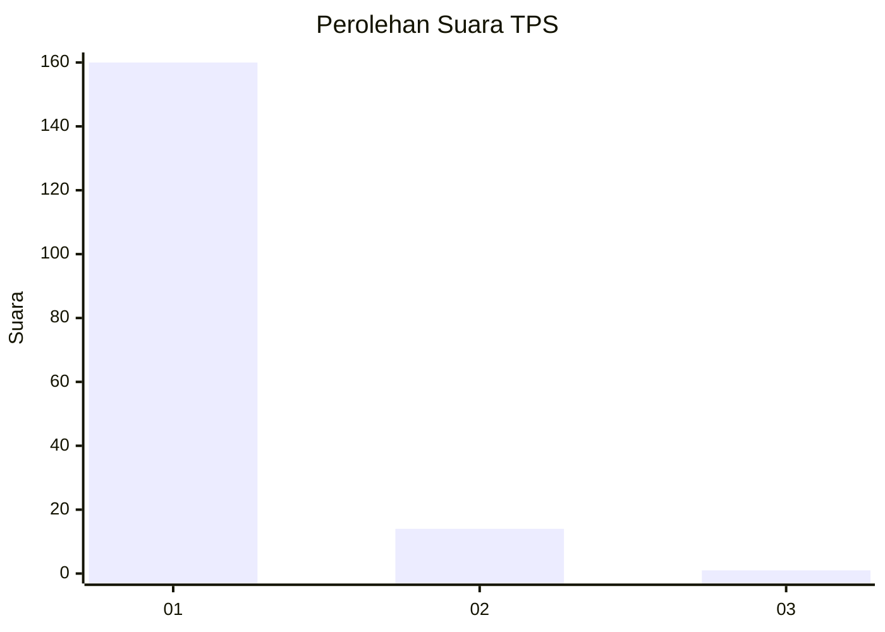
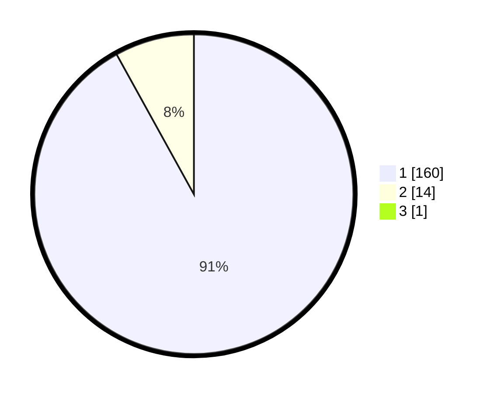

# Hasil

## Grafik

## Tabel

| No. | Nama Paslon    | Suara | Suara (raw) | Persentase |
|:--- |:-------------- | -----:| -----------:| ----------:|
| 1   | ANIES MUHAIMIN | 160   | [160][p-1]  | 91,43      |
| 2   | PRABOWO GIBRAN | 14    | [14][p-2]   | 8,00       |
| 3   | GANJAR MAHFUD  | 1     | [1][p-3]    | 0,57       |

[p-1]: https://github.com/gigit-pemilu/pemilu-2024-11-aceh/blob/main/pilpres/hitung-suara/sub/11-aceh/sub/08-aceh-utara/sub/14-t-jambo-aye/sub/2043-cot-biek/sub/002-tps/sub/paslon-1.txt
[p-2]: https://github.com/gigit-pemilu/pemilu-2024-11-aceh/blob/main/pilpres/hitung-suara/sub/11-aceh/sub/08-aceh-utara/sub/14-t-jambo-aye/sub/2043-cot-biek/sub/002-tps/sub/paslon-2.txt
[p-3]: https://github.com/gigit-pemilu/pemilu-2024-11-aceh/blob/main/pilpres/hitung-suara/sub/11-aceh/sub/08-aceh-utara/sub/14-t-jambo-aye/sub/2043-cot-biek/sub/002-tps/sub/paslon-3.txt

## Foto C Plano

https://sirekap-obj-formc.kpu.go.id/ea62/pemilu/ppwp/11/08/14/20/43/1108142043002-20240215-052450--03553932-3ba4-4c0f-b308-3234e83079d9.jpg

https://sirekap-obj-formc.kpu.go.id/ea62/pemilu/ppwp/11/08/14/20/43/1108142043002-20240215-052153--14ba828f-d13f-43a5-935d-8bc438d21e7c.jpg

https://sirekap-obj-formc.kpu.go.id/ea62/pemilu/ppwp/11/08/14/20/43/1108142043002-20240215-051628--2d8b0147-a89c-4874-9361-bb8200a7a581.jpg

## Metadata

| Key        | Value               |
| ---------- | ------------------- |
| Time Stamp | 2024-02-15 21:30:27 |

