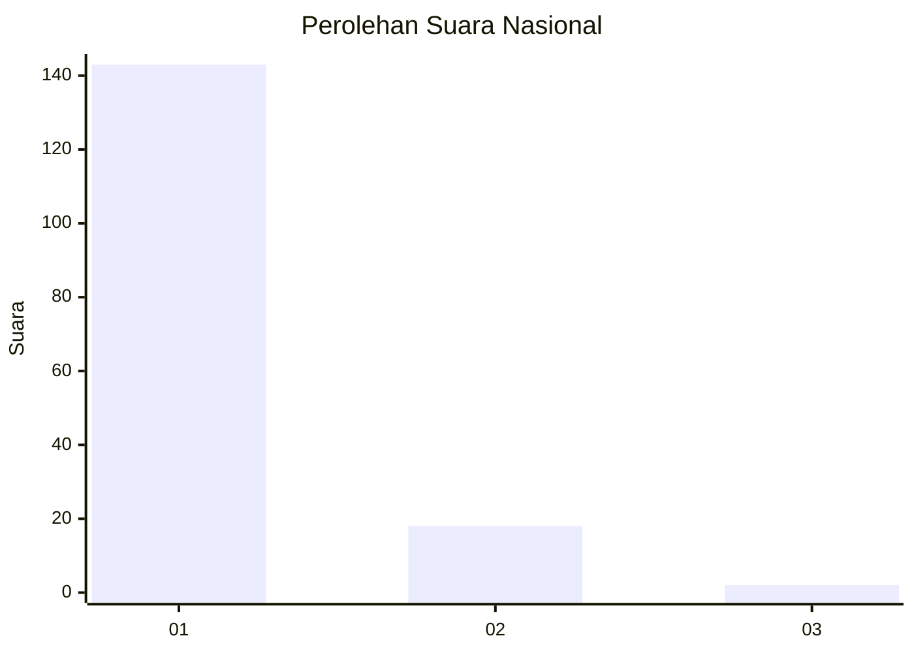
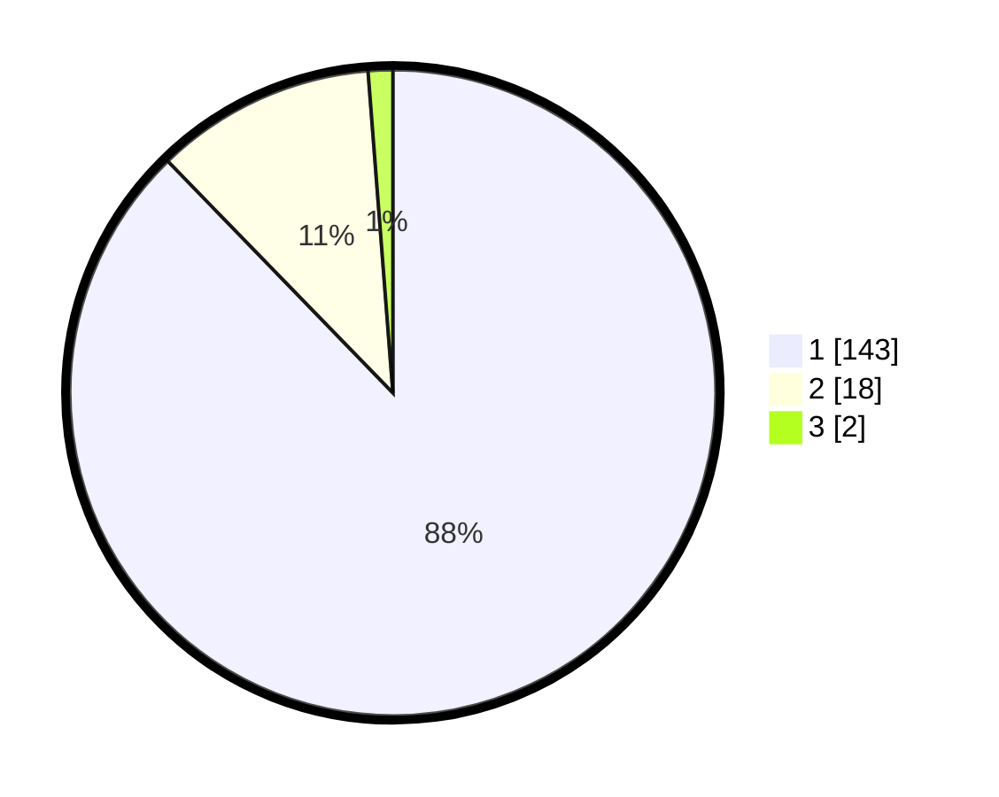

# Hasil

## Grafik

## Tabel

| No. | Nama Paslon    | Suara | Suara (raw) | Persentase |
|:--- |:-------------- | -----:| -----------:| ----------:|
| 1   | ANIES MUHAIMIN | 143   | [143][p-1]  | 87,73      |
| 2   | PRABOWO GIBRAN | 18    | [18][p-2]   | 11,04      |
| 3   | GANJAR MAHFUD  | 2     | [2][p-3]    | 1,23       |

[p-1]: https://github.com/gigit-pemilu/pemilu-2024/blob/main/pilpres/hitung-suara/sub/11-aceh/sub/08-aceh-utara/sub/14-t-jambo-aye/sub/2045-biram-cut/sub/002-tps/sub/paslon-1.txt
[p-2]: https://github.com/gigit-pemilu/pemilu-2024/blob/main/pilpres/hitung-suara/sub/11-aceh/sub/08-aceh-utara/sub/14-t-jambo-aye/sub/2045-biram-cut/sub/002-tps/sub/paslon-2.txt
[p-3]: https://github.com/gigit-pemilu/pemilu-2024/blob/main/pilpres/hitung-suara/sub/11-aceh/sub/08-aceh-utara/sub/14-t-jambo-aye/sub/2045-biram-cut/sub/002-tps/sub/paslon-3.txt

## Foto C Plano

https://sirekap-obj-formc.kpu.go.id/9617/pemilu/ppwp/11/08/14/20/45/1108142045002-20240215-032701--1fe9e976-33b9-46f1-b5d6-e448b90fdaf1.jpg

https://sirekap-obj-formc.kpu.go.id/9617/pemilu/ppwp/11/08/14/20/45/1108142045002-20240215-032847--205d923d-9953-4079-851e-6ec5eacfbe7b.jpg

https://sirekap-obj-formc.kpu.go.id/9617/pemilu/ppwp/11/08/14/20/45/1108142045002-20240215-035907--950f47c1-06fc-420c-8d50-686c312dbb3b.jpg

## Metadata

| Key        | Value               |
| ---------- | ------------------- |
| Time Stamp | 2024-02-17 16:36:25 |

