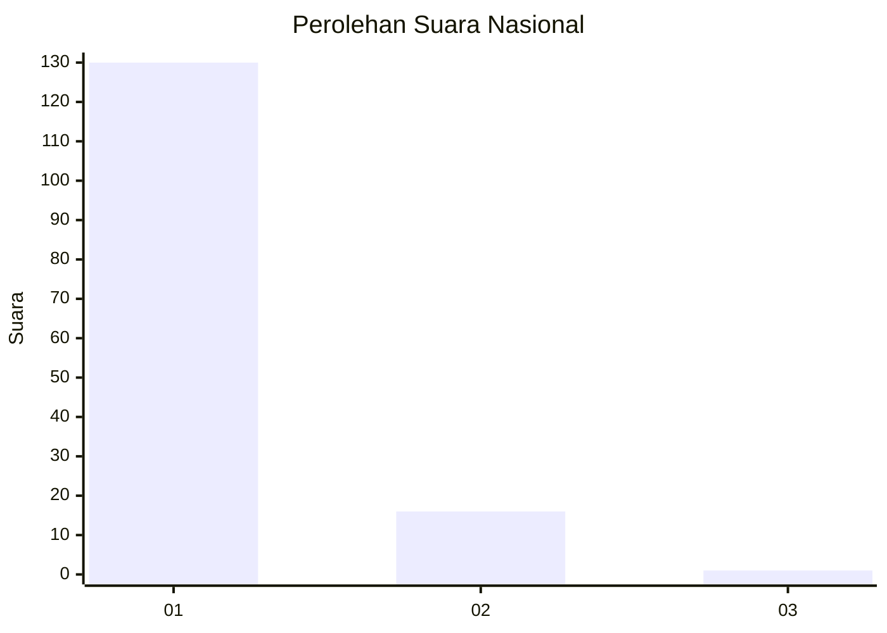
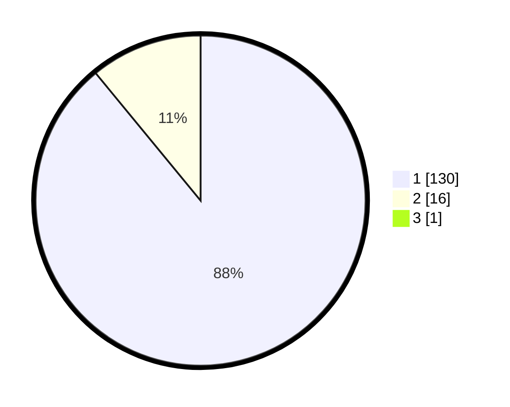

# Hasil

## Grafik

## Tabel

| No. | Nama Paslon    | Suara | Suara (raw) | Persentase |
|:--- |:-------------- | -----:| -----------:| ----------:|
| 1   | ANIES MUHAIMIN | 130   | [130][p-1]  | 88,44      |
| 2   | PRABOWO GIBRAN | 16    | [16][p-2]   | 10,88      |
| 3   | GANJAR MAHFUD  | 1     | [1][p-3]    | 0,68       |

[p-1]: https://github.com/gigit-pemilu/pemilu-2024/blob/main/pilpres/hitung-suara/sub/11-aceh/sub/08-aceh-utara/sub/14-t-jambo-aye/sub/2046-buket-batee-badan/sub/001-tps/sub/paslon-1.txt
[p-2]: https://github.com/gigit-pemilu/pemilu-2024/blob/main/pilpres/hitung-suara/sub/11-aceh/sub/08-aceh-utara/sub/14-t-jambo-aye/sub/2046-buket-batee-badan/sub/001-tps/sub/paslon-2.txt
[p-3]: https://github.com/gigit-pemilu/pemilu-2024/blob/main/pilpres/hitung-suara/sub/11-aceh/sub/08-aceh-utara/sub/14-t-jambo-aye/sub/2046-buket-batee-badan/sub/001-tps/sub/paslon-3.txt

## Foto C Plano

https://sirekap-obj-formc.kpu.go.id/17e5/pemilu/ppwp/11/08/14/20/46/1108142046001-20240215-032352--db555520-23e6-4bc1-8649-4ffeb1e6087b.jpg

https://sirekap-obj-formc.kpu.go.id/17e5/pemilu/ppwp/11/08/14/20/46/1108142046001-20240215-030847--4afb3bfe-d9eb-4fc6-8df5-3094887165b9.jpg

https://sirekap-obj-formc.kpu.go.id/17e5/pemilu/ppwp/11/08/14/20/46/1108142046001-20240215-121548--3d6cbcce-7249-4281-a538-f036677db44e.jpg

## Metadata

| Key        | Value               |
| ---------- | ------------------- |
| Time Stamp | 2024-02-16 14:30:33 |

