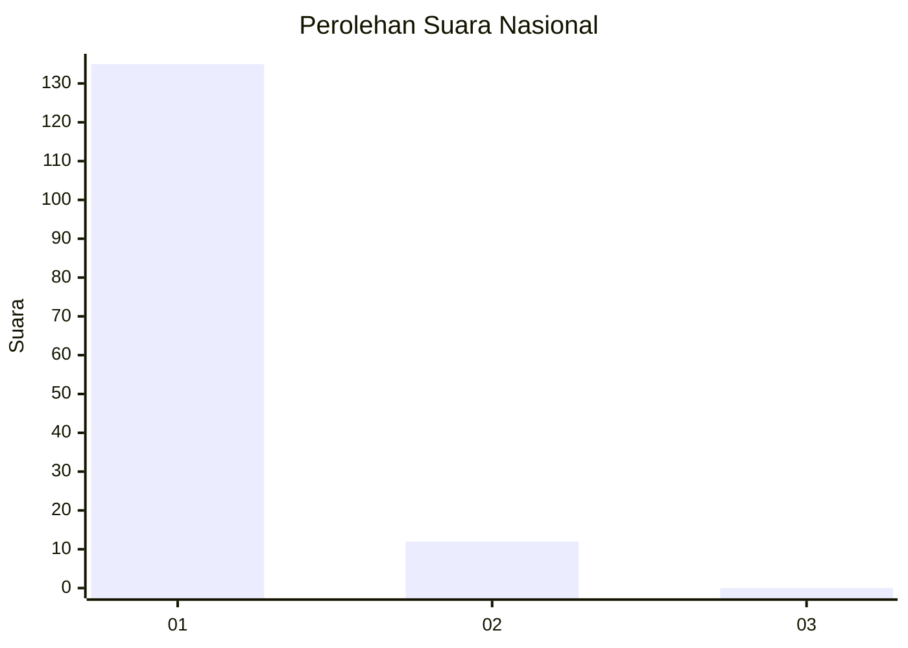
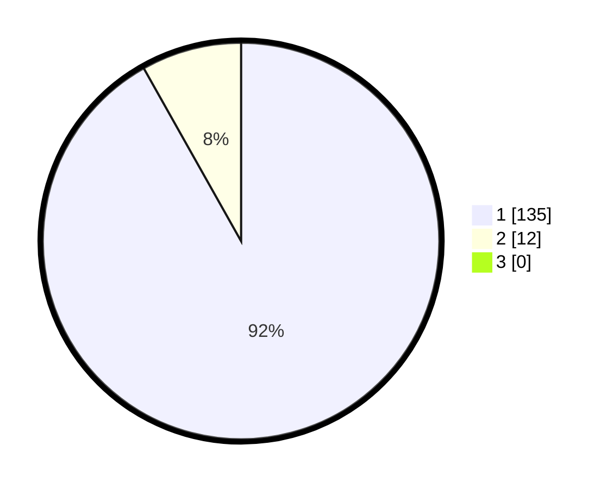

# Hasil

## Grafik

## Tabel

| No. | Nama Paslon    | Suara | Suara (raw) | Persentase |
|:--- |:-------------- | -----:| -----------:| ----------:|
| 1   | ANIES MUHAIMIN | 135   | [135][p-1]  | 91,84      |
| 2   | PRABOWO GIBRAN | 12    | [12][p-2]   | 8,16       |
| 3   | GANJAR MAHFUD  | 0     | [0][p-3]    | 0,00       |

[p-1]: https://github.com/gigit-pemilu/pemilu-2024/blob/main/pilpres/hitung-suara/sub/11-aceh/sub/08-aceh-utara/sub/15-sawang/sub/2002-abeuk-reuling/sub/001-tps/sub/paslon-1.txt
[p-2]: https://github.com/gigit-pemilu/pemilu-2024/blob/main/pilpres/hitung-suara/sub/11-aceh/sub/08-aceh-utara/sub/15-sawang/sub/2002-abeuk-reuling/sub/001-tps/sub/paslon-2.txt
[p-3]: https://github.com/gigit-pemilu/pemilu-2024/blob/main/pilpres/hitung-suara/sub/11-aceh/sub/08-aceh-utara/sub/15-sawang/sub/2002-abeuk-reuling/sub/001-tps/sub/paslon-3.txt

## Foto C Plano

https://sirekap-obj-formc.kpu.go.id/6fa2/pemilu/ppwp/11/08/15/20/02/1108152002001-20240215-090029--64013fd7-2366-4bb4-8d70-c8c29d2424f7.jpg

https://sirekap-obj-formc.kpu.go.id/6fa2/pemilu/ppwp/11/08/15/20/02/1108152002001-20240215-090210--1829d5ef-d1af-4c0b-96ca-4aedcb12d0f0.jpg

https://sirekap-obj-formc.kpu.go.id/6fa2/pemilu/ppwp/11/08/15/20/02/1108152002001-20240215-090338--1ab2e898-3524-42c0-9bf7-61fa730a4e33.jpg

## Metadata

| Key        | Value               |
| ---------- | ------------------- |
| Time Stamp | 2024-02-17 01:00:00 |

