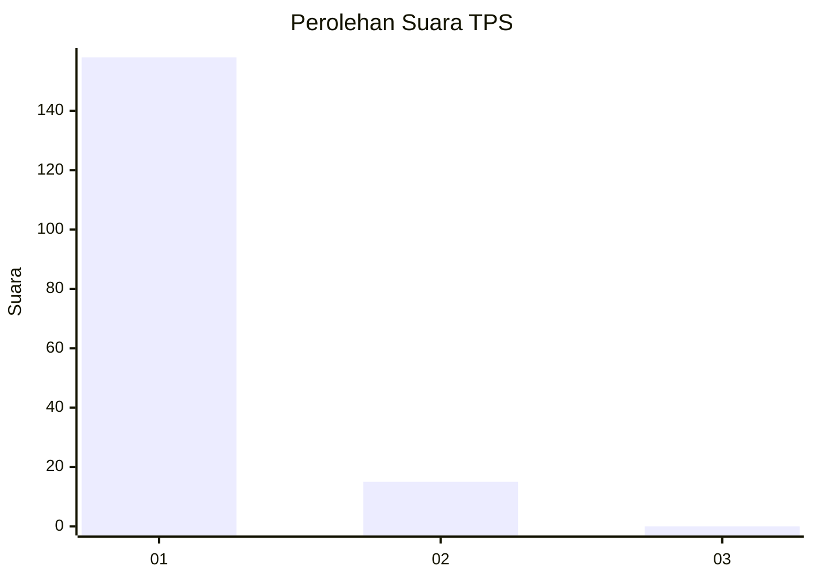
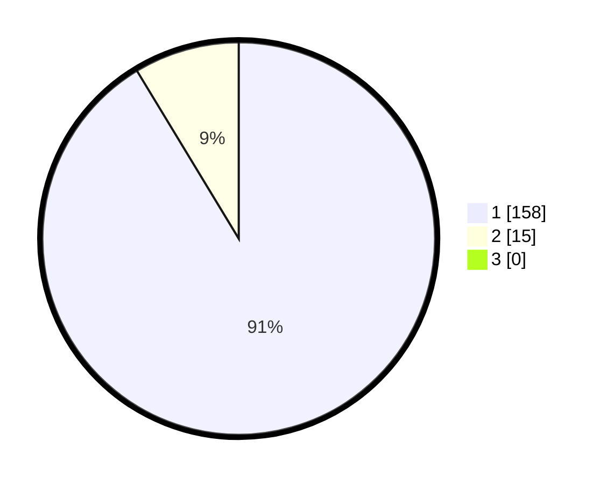

# Hasil

## Grafik

## Tabel

| No. | Nama Paslon    | Suara | Suara (raw) | Persentase |
|:--- |:-------------- | -----:| -----------:| ----------:|
| 1   | ANIES MUHAIMIN | 158   | [158][p-1]  | 91,33      |
| 2   | PRABOWO GIBRAN | 15    | [15][p-2]   | 8,67       |
| 3   | GANJAR MAHFUD  | 0     | [0][p-3]    | 0,00       |

[p-1]: https://github.com/gigit-pemilu/pemilu-2024-11-aceh/blob/main/pilpres/hitung-suara/sub/11-aceh/sub/08-aceh-utara/sub/15-sawang/sub/2005-gle-dagang/sub/001-tps/sub/paslon-1.txt
[p-2]: https://github.com/gigit-pemilu/pemilu-2024-11-aceh/blob/main/pilpres/hitung-suara/sub/11-aceh/sub/08-aceh-utara/sub/15-sawang/sub/2005-gle-dagang/sub/001-tps/sub/paslon-2.txt
[p-3]: https://github.com/gigit-pemilu/pemilu-2024-11-aceh/blob/main/pilpres/hitung-suara/sub/11-aceh/sub/08-aceh-utara/sub/15-sawang/sub/2005-gle-dagang/sub/001-tps/sub/paslon-3.txt

## Foto C Plano

https://sirekap-obj-formc.kpu.go.id/7a6f/pemilu/ppwp/11/08/15/20/05/1108152005001-20240215-062414--fb314348-675a-480e-a119-f22fe400ba59.jpg

https://sirekap-obj-formc.kpu.go.id/7a6f/pemilu/ppwp/11/08/15/20/05/1108152005001-20240214-220338--9c52d137-a33b-4efc-81eb-da8279e00d0c.jpg

https://sirekap-obj-formc.kpu.go.id/7a6f/pemilu/ppwp/11/08/15/20/05/1108152005001-20240215-062925--1131c041-3c5b-409c-9e26-cc33c9a62a7c.jpg

## Metadata

| Key        | Value               |
| ---------- | ------------------- |
| Time Stamp | 2024-02-17 16:00:02 |

