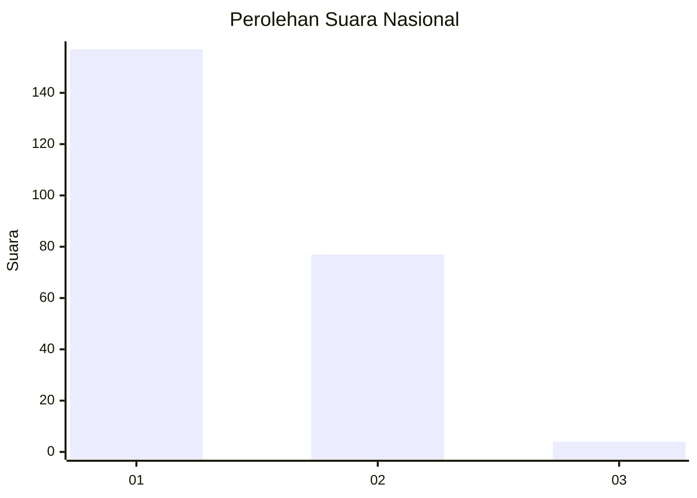
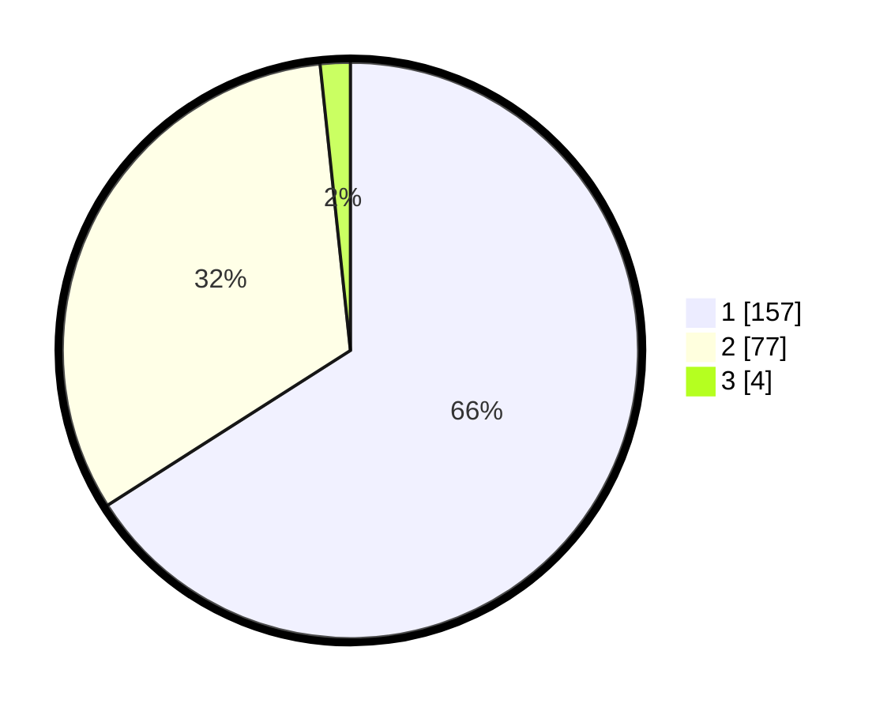

# Hasil

## Grafik

## Tabel

| No. | Nama Paslon    | Suara | Suara (raw) | Persentase |
|:--- |:-------------- | -----:| -----------:| ----------:|
| 1   | ANIES MUHAIMIN | 157   | [157][p-1]  | 65,97      |
| 2   | PRABOWO GIBRAN | 77    | [77][p-2]   | 32,35      |
| 3   | GANJAR MAHFUD  | 4     | [4][p-3]    | 1,68       |

[p-1]: https://github.com/gigit-pemilu/pemilu-2024/blob/main/pilpres/hitung-suara/sub/11-aceh/sub/08-aceh-utara/sub/15-sawang/sub/2005-gle-dagang/sub/003-tps/sub/paslon-1.txt
[p-2]: https://github.com/gigit-pemilu/pemilu-2024/blob/main/pilpres/hitung-suara/sub/11-aceh/sub/08-aceh-utara/sub/15-sawang/sub/2005-gle-dagang/sub/003-tps/sub/paslon-2.txt
[p-3]: https://github.com/gigit-pemilu/pemilu-2024/blob/main/pilpres/hitung-suara/sub/11-aceh/sub/08-aceh-utara/sub/15-sawang/sub/2005-gle-dagang/sub/003-tps/sub/paslon-3.txt

## Foto C Plano

https://sirekap-obj-formc.kpu.go.id/9063/pemilu/ppwp/11/08/15/20/05/1108152005003-20240220-132333--1910d5af-9e70-483f-9939-00b0719c600c.jpg

https://sirekap-obj-formc.kpu.go.id/9063/pemilu/ppwp/11/08/15/20/05/1108152005003-20240220-132452--cae2b35e-3992-4992-8336-a346efc02a03.jpg

https://sirekap-obj-formc.kpu.go.id/9063/pemilu/ppwp/11/08/15/20/05/1108152005003-20240220-132600--fa28804a-c35f-4a94-a873-660d101e2318.jpg

## Metadata

| Key        | Value               |
| ---------- | ------------------- |
| Time Stamp | 2024-02-24 22:31:28 |

