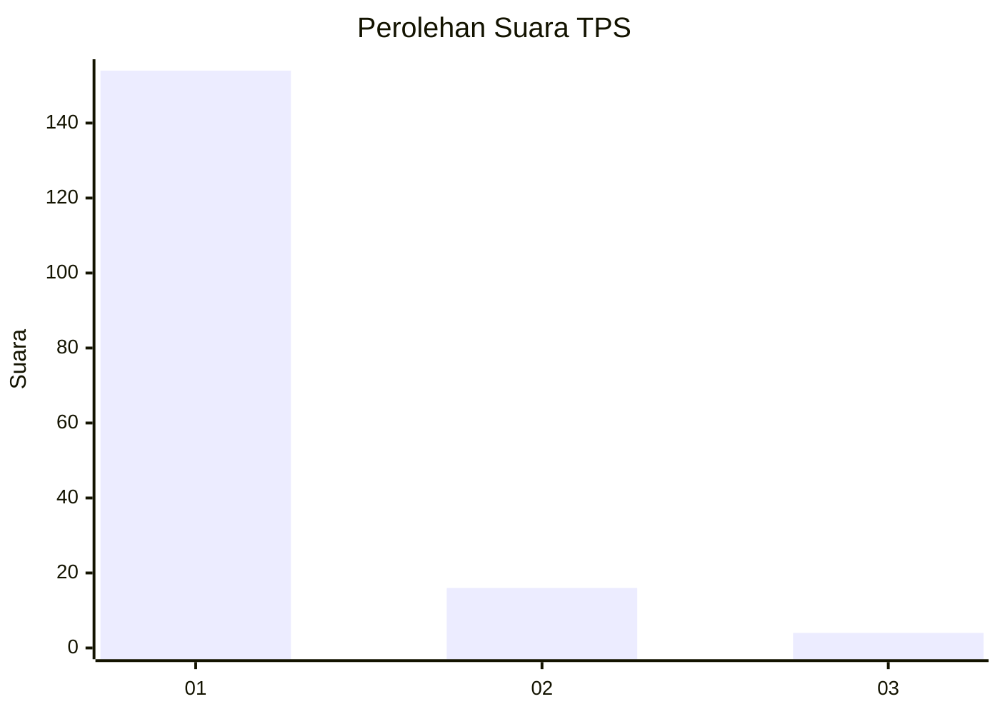
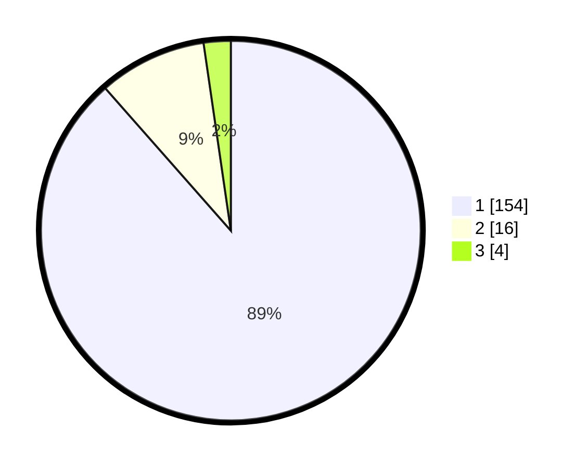

# Hasil

## Grafik

## Tabel

| No. | Nama Paslon    | Suara | Suara (raw) | Persentase |
|:--- |:-------------- | -----:| -----------:| ----------:|
| 1   | ANIES MUHAIMIN | 154   | [154][p-1]  | 88,51      |
| 2   | PRABOWO GIBRAN | 16    | [16][p-2]   | 9,20       |
| 3   | GANJAR MAHFUD  | 4     | [4][p-3]    | 2,30       |

[p-1]: https://github.com/gigit-pemilu/pemilu-2024-11-aceh/blob/main/pilpres/hitung-suara/sub/11-aceh/sub/08-aceh-utara/sub/15-sawang/sub/2006-kuta-meuligoe/sub/002-tps/sub/paslon-1.txt
[p-2]: https://github.com/gigit-pemilu/pemilu-2024-11-aceh/blob/main/pilpres/hitung-suara/sub/11-aceh/sub/08-aceh-utara/sub/15-sawang/sub/2006-kuta-meuligoe/sub/002-tps/sub/paslon-2.txt
[p-3]: https://github.com/gigit-pemilu/pemilu-2024-11-aceh/blob/main/pilpres/hitung-suara/sub/11-aceh/sub/08-aceh-utara/sub/15-sawang/sub/2006-kuta-meuligoe/sub/002-tps/sub/paslon-3.txt

## Foto C Plano

https://sirekap-obj-formc.kpu.go.id/7271/pemilu/ppwp/11/08/15/20/06/1108152006002-20240215-143831--c0e37d90-3e78-4fa8-8e45-d2decacfbe6b.jpg

https://sirekap-obj-formc.kpu.go.id/7271/pemilu/ppwp/11/08/15/20/06/1108152006002-20240215-083815--403764e3-1420-4aee-9f15-d4c175e6aeab.jpg

https://sirekap-obj-formc.kpu.go.id/7271/pemilu/ppwp/11/08/15/20/06/1108152006002-20240215-083939--83df8082-f55b-449d-8170-2936741f398a.jpg

## Metadata

| Key        | Value               |
| ---------- | ------------------- |
| Time Stamp | 2024-02-17 16:00:02 |

