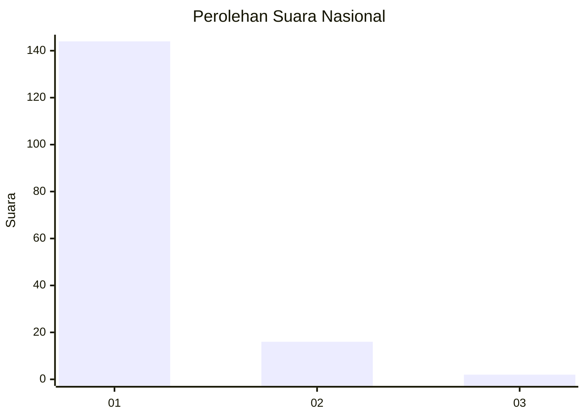
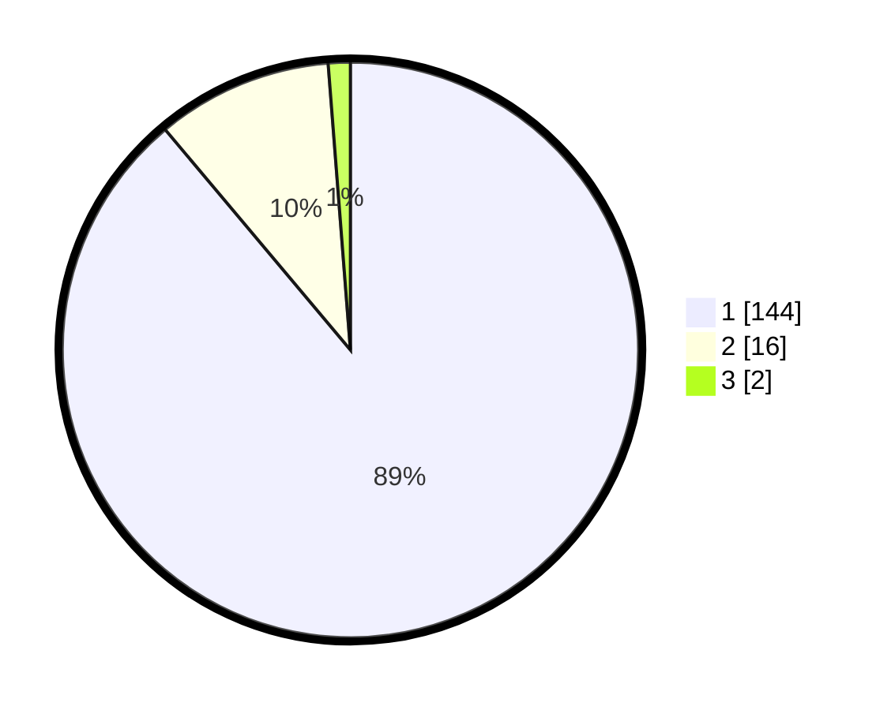

# Hasil

## Grafik

## Tabel

| No. | Nama Paslon    | Suara | Suara (raw) | Persentase |
|:--- |:-------------- | -----:| -----------:| ----------:|
| 1   | ANIES MUHAIMIN | 144   | [144][p-1]  | 88,89      |
| 2   | PRABOWO GIBRAN | 16    | [16][p-2]   | 9,88       |
| 3   | GANJAR MAHFUD  | 2     | [2][p-3]    | 1,23       |

[p-1]: https://github.com/gigit-pemilu/pemilu-2024/blob/main/pilpres/hitung-suara/sub/11-aceh/sub/08-aceh-utara/sub/15-sawang/sub/2006-kuta-meuligoe/sub/003-tps/sub/paslon-1.txt
[p-2]: https://github.com/gigit-pemilu/pemilu-2024/blob/main/pilpres/hitung-suara/sub/11-aceh/sub/08-aceh-utara/sub/15-sawang/sub/2006-kuta-meuligoe/sub/003-tps/sub/paslon-2.txt
[p-3]: https://github.com/gigit-pemilu/pemilu-2024/blob/main/pilpres/hitung-suara/sub/11-aceh/sub/08-aceh-utara/sub/15-sawang/sub/2006-kuta-meuligoe/sub/003-tps/sub/paslon-3.txt

## Foto C Plano

https://sirekap-obj-formc.kpu.go.id/f6ae/pemilu/ppwp/11/08/15/20/06/1108152006003-20240215-100019--d606caee-e17a-4fba-b5d3-fb2bf059025f.jpg

https://sirekap-obj-formc.kpu.go.id/f6ae/pemilu/ppwp/11/08/15/20/06/1108152006003-20240215-100359--1d46e173-951e-4cf9-b425-46f2e141c9e0.jpg

https://sirekap-obj-formc.kpu.go.id/f6ae/pemilu/ppwp/11/08/15/20/06/1108152006003-20240215-100500--c597586a-195c-40d2-b358-60e300a86fef.jpg

## Metadata

| Key        | Value               |
| ---------- | ------------------- |
| Time Stamp | 2024-02-16 10:30:29 |

