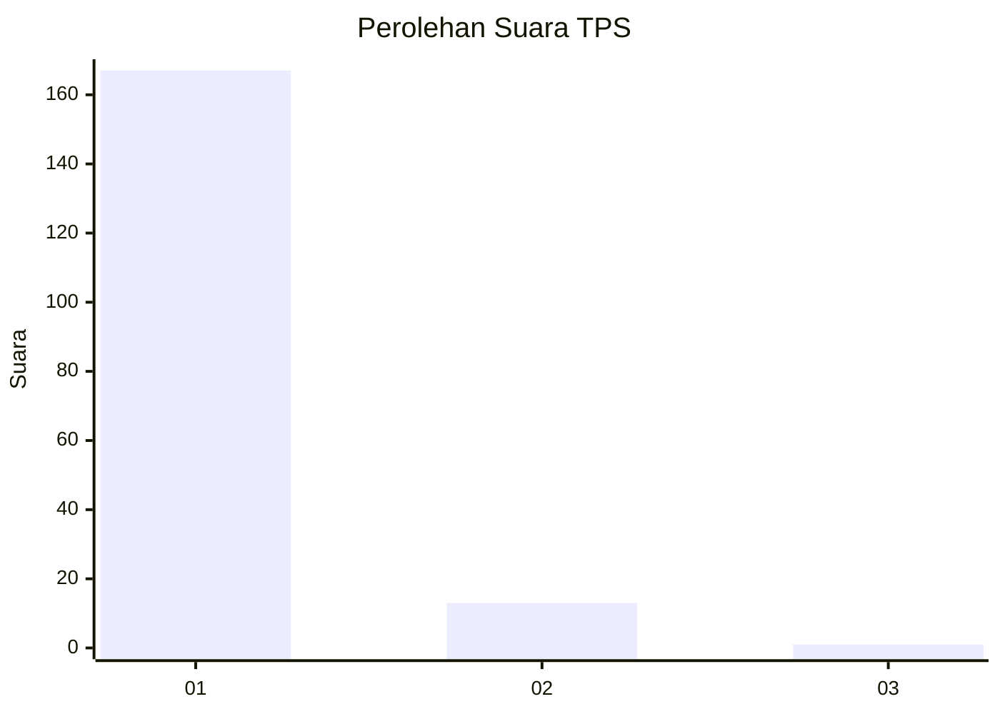
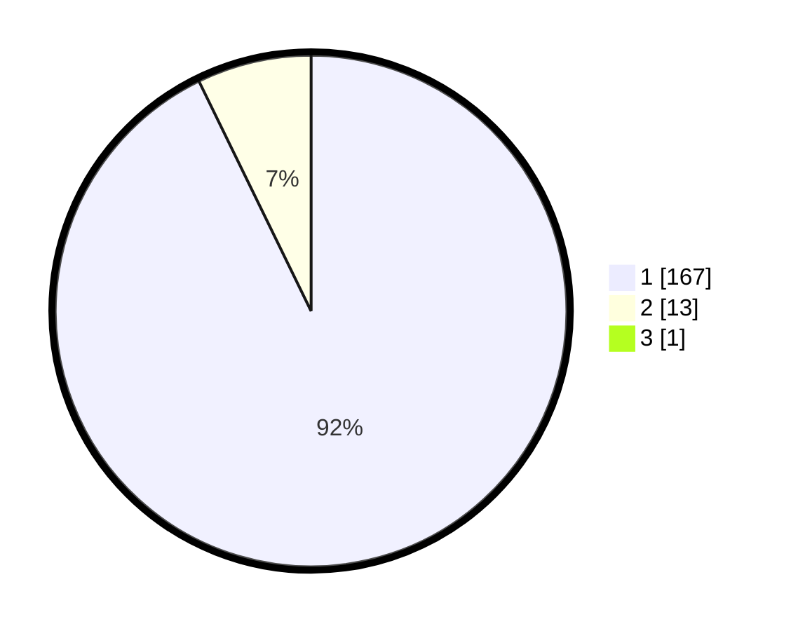

# Hasil

## Grafik

## Tabel

| No. | Nama Paslon    | Suara | Suara (raw) | Persentase |
|:--- |:-------------- | -----:| -----------:| ----------:|
| 1   | ANIES MUHAIMIN | 167   | [167][p-1]  | 92,27      |
| 2   | PRABOWO GIBRAN | 13    | [13][p-2]   | 7,18       |
| 3   | GANJAR MAHFUD  | 1     | [1][p-3]    | 0,55       |

[p-1]: https://github.com/gigit-pemilu/pemilu-2024-11-aceh/blob/main/pilpres/hitung-suara/sub/11-aceh/sub/08-aceh-utara/sub/15-sawang/sub/2007-gampong-teungoh/sub/002-tps/sub/paslon-1.txt
[p-2]: https://github.com/gigit-pemilu/pemilu-2024-11-aceh/blob/main/pilpres/hitung-suara/sub/11-aceh/sub/08-aceh-utara/sub/15-sawang/sub/2007-gampong-teungoh/sub/002-tps/sub/paslon-2.txt
[p-3]: https://github.com/gigit-pemilu/pemilu-2024-11-aceh/blob/main/pilpres/hitung-suara/sub/11-aceh/sub/08-aceh-utara/sub/15-sawang/sub/2007-gampong-teungoh/sub/002-tps/sub/paslon-3.txt

## Foto C Plano

https://sirekap-obj-formc.kpu.go.id/ece7/pemilu/ppwp/11/08/15/20/07/1108152007002-20240222-222511--6bc008f2-a865-4ffb-91d1-5c6c9e2a4e60.jpg

https://sirekap-obj-formc.kpu.go.id/ece7/pemilu/ppwp/11/08/15/20/07/1108152007002-20240215-050130--b29bfe3c-e94e-4ab1-b5e7-eb252aad5823.jpg

https://sirekap-obj-formc.kpu.go.id/ece7/pemilu/ppwp/11/08/15/20/07/1108152007002-20240215-050252--d14f7b7a-0e9e-4740-8f8a-03028869112d.jpg

## Metadata

| Key        | Value               |
| ---------- | ------------------- |
| Time Stamp | 2024-02-22 23:00:00 |

