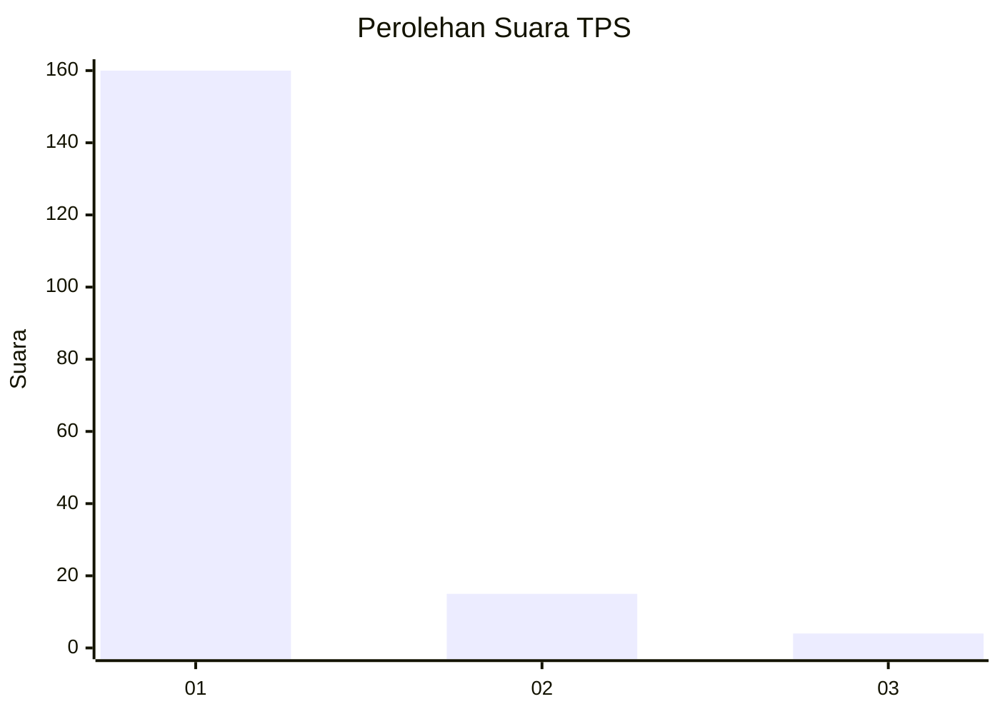
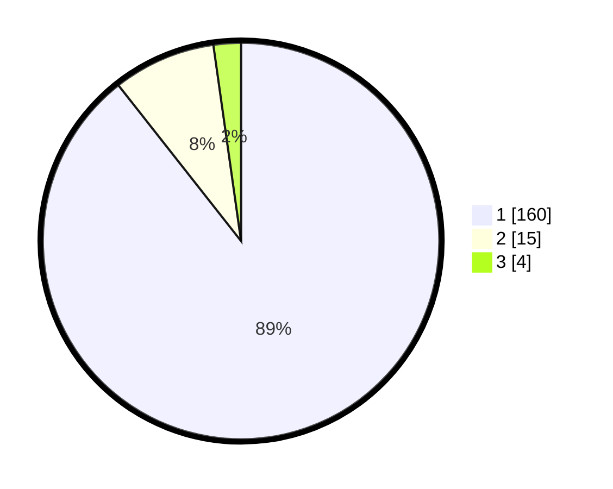

# Hasil

## Grafik

## Tabel

| No. | Nama Paslon    | Suara | Suara (raw) | Persentase |
|:--- |:-------------- | -----:| -----------:| ----------:|
| 1   | ANIES MUHAIMIN | 160   | [160][p-1]  | 89,39      |
| 2   | PRABOWO GIBRAN | 15    | [15][p-2]   | 8,38       |
| 3   | GANJAR MAHFUD  | 4     | [4][p-3]    | 2,23       |

[p-1]: https://github.com/gigit-pemilu/pemilu-2024-11-aceh/blob/main/pilpres/hitung-suara/sub/11-aceh/sub/08-aceh-utara/sub/15-sawang/sub/2007-gampong-teungoh/sub/003-tps/sub/paslon-1.txt
[p-2]: https://github.com/gigit-pemilu/pemilu-2024-11-aceh/blob/main/pilpres/hitung-suara/sub/11-aceh/sub/08-aceh-utara/sub/15-sawang/sub/2007-gampong-teungoh/sub/003-tps/sub/paslon-2.txt
[p-3]: https://github.com/gigit-pemilu/pemilu-2024-11-aceh/blob/main/pilpres/hitung-suara/sub/11-aceh/sub/08-aceh-utara/sub/15-sawang/sub/2007-gampong-teungoh/sub/003-tps/sub/paslon-3.txt

## Foto C Plano

https://sirekap-obj-formc.kpu.go.id/02e5/pemilu/ppwp/11/08/15/20/07/1108152007003-20240215-050044--f96d4226-ccce-4b33-93c7-ea1df3ccd664.jpg

https://sirekap-obj-formc.kpu.go.id/02e5/pemilu/ppwp/11/08/15/20/07/1108152007003-20240222-225244--6bd198b0-20fa-4ec2-a213-0308c6286a28.jpg

https://sirekap-obj-formc.kpu.go.id/02e5/pemilu/ppwp/11/08/15/20/07/1108152007003-20240215-050301--41da7666-d60b-44ac-8936-0c9a3a288bb3.jpg

## Metadata

| Key        | Value               |
| ---------- | ------------------- |
| Time Stamp | 2024-02-24 22:31:28 |

