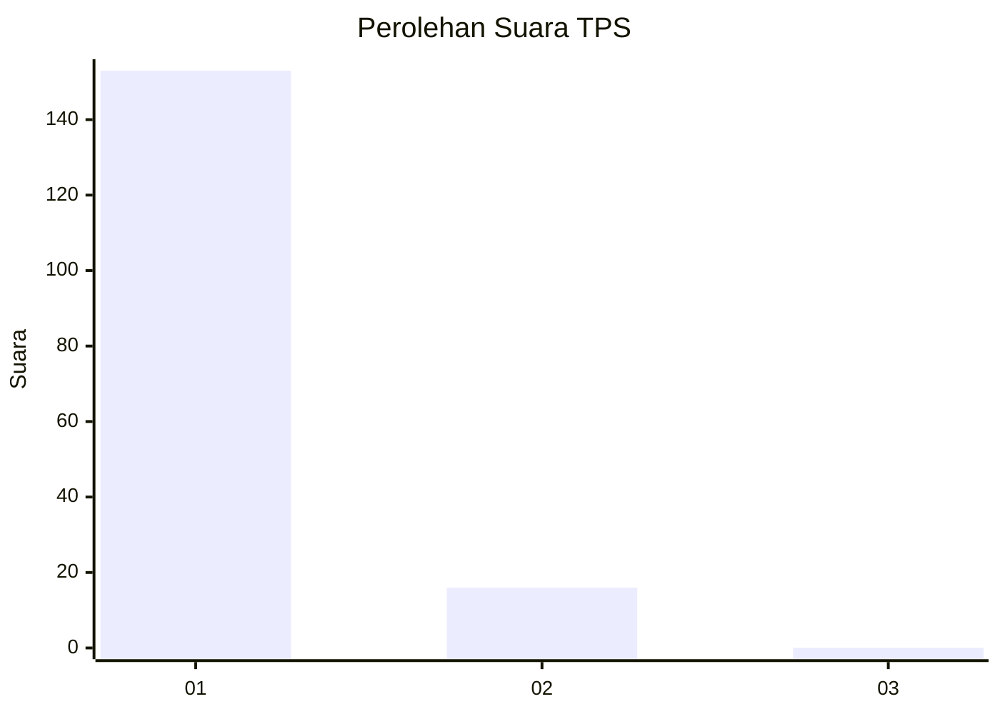
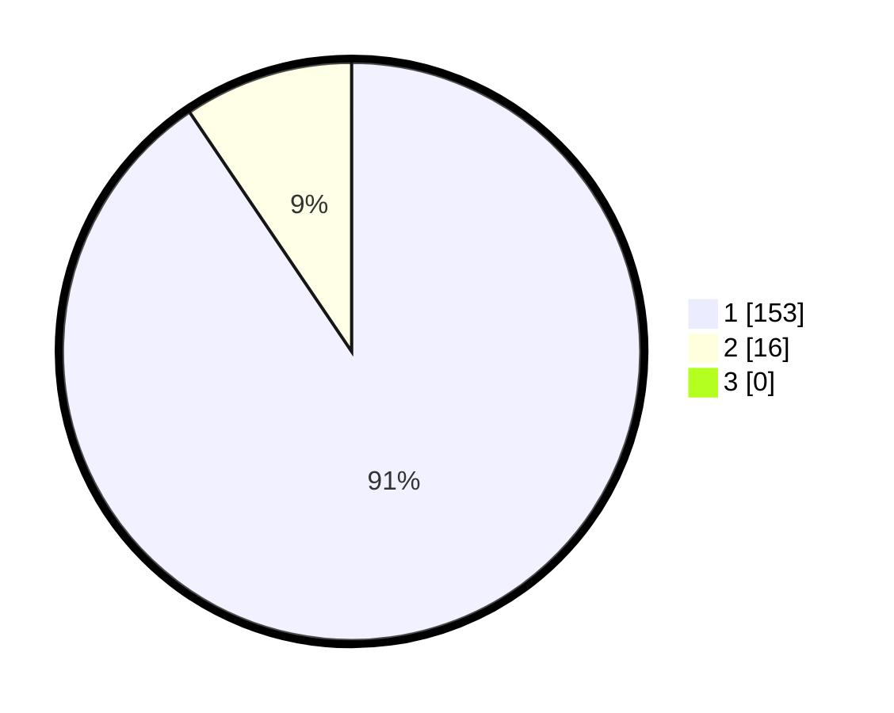

# Hasil

## Grafik

## Tabel

| No. | Nama Paslon    | Suara | Suara (raw) | Persentase |
|:--- |:-------------- | -----:| -----------:| ----------:|
| 1   | ANIES MUHAIMIN | 153   | [153][p-1]  | 90,53      |
| 2   | PRABOWO GIBRAN | 16    | [16][p-2]   | 9,47       |
| 3   | GANJAR MAHFUD  | 0     | [0][p-3]    | 0,00       |

[p-1]: https://github.com/gigit-pemilu/pemilu-2024-11-aceh/blob/main/pilpres/hitung-suara/sub/11-aceh/sub/08-aceh-utara/sub/15-sawang/sub/2008-babah-buloh/sub/005-tps/sub/paslon-1.txt
[p-2]: https://github.com/gigit-pemilu/pemilu-2024-11-aceh/blob/main/pilpres/hitung-suara/sub/11-aceh/sub/08-aceh-utara/sub/15-sawang/sub/2008-babah-buloh/sub/005-tps/sub/paslon-2.txt
[p-3]: https://github.com/gigit-pemilu/pemilu-2024-11-aceh/blob/main/pilpres/hitung-suara/sub/11-aceh/sub/08-aceh-utara/sub/15-sawang/sub/2008-babah-buloh/sub/005-tps/sub/paslon-3.txt

## Foto C Plano

https://sirekap-obj-formc.kpu.go.id/96de/pemilu/ppwp/11/08/15/20/08/1108152008005-20240223-150320--d86848a9-9b7a-4325-864f-c83c2606a3db.jpg

https://sirekap-obj-formc.kpu.go.id/96de/pemilu/ppwp/11/08/15/20/08/1108152008005-20240223-150408--ec7914be-f9db-4afe-9e40-7e711f3b94e8.jpg

https://sirekap-obj-formc.kpu.go.id/96de/pemilu/ppwp/11/08/15/20/08/1108152008005-20240223-150438--c0abc038-436e-4375-9c49-882a78941090.jpg

## Metadata

| Key        | Value               |
| ---------- | ------------------- |
| Time Stamp | 2024-02-24 22:31:28 |

