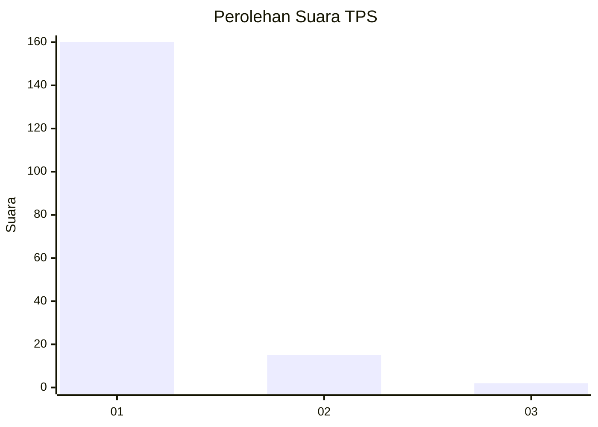
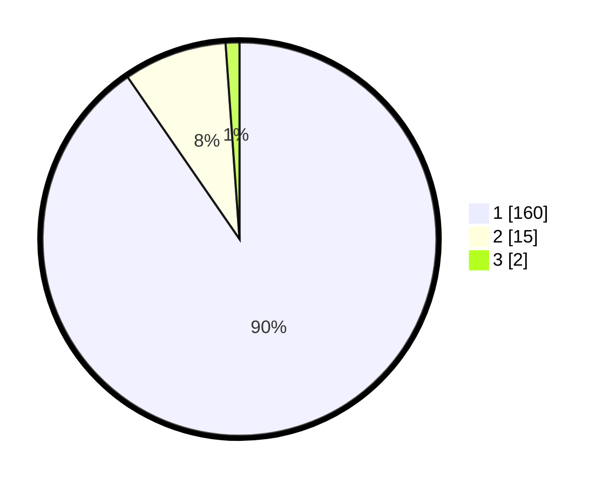

# Hasil

## Grafik

## Tabel

| No. | Nama Paslon    | Suara | Suara (raw) | Persentase |
|:--- |:-------------- | -----:| -----------:| ----------:|
| 1   | ANIES MUHAIMIN | 160   | [160][p-1]  | 90,40      |
| 2   | PRABOWO GIBRAN | 15    | [15][p-2]   | 8,47       |
| 3   | GANJAR MAHFUD  | 2     | [2][p-3]    | 1,13       |

[p-1]: https://github.com/gigit-pemilu/pemilu-2024-11-aceh/blob/main/pilpres/hitung-suara/sub/11-aceh/sub/08-aceh-utara/sub/15-sawang/sub/2009-meunasah-pulo/sub/002-tps/sub/paslon-1.txt
[p-2]: https://github.com/gigit-pemilu/pemilu-2024-11-aceh/blob/main/pilpres/hitung-suara/sub/11-aceh/sub/08-aceh-utara/sub/15-sawang/sub/2009-meunasah-pulo/sub/002-tps/sub/paslon-2.txt
[p-3]: https://github.com/gigit-pemilu/pemilu-2024-11-aceh/blob/main/pilpres/hitung-suara/sub/11-aceh/sub/08-aceh-utara/sub/15-sawang/sub/2009-meunasah-pulo/sub/002-tps/sub/paslon-3.txt

## Foto C Plano

https://sirekap-obj-formc.kpu.go.id/15c1/pemilu/ppwp/11/08/15/20/09/1108152009002-20240215-091435--bf8ce21f-8fca-4b66-a953-88fc70acd17f.jpg

https://sirekap-obj-formc.kpu.go.id/15c1/pemilu/ppwp/11/08/15/20/09/1108152009002-20240215-092207--b5b48908-cb02-47c3-8633-e5934af3e091.jpg

https://sirekap-obj-formc.kpu.go.id/15c1/pemilu/ppwp/11/08/15/20/09/1108152009002-20240215-094234--c20a3a2f-8ec1-4c69-b326-8eba6171f0ab.jpg

## Metadata

| Key        | Value               |
| ---------- | ------------------- |
| Time Stamp | 2024-02-15 18:00:26 |

