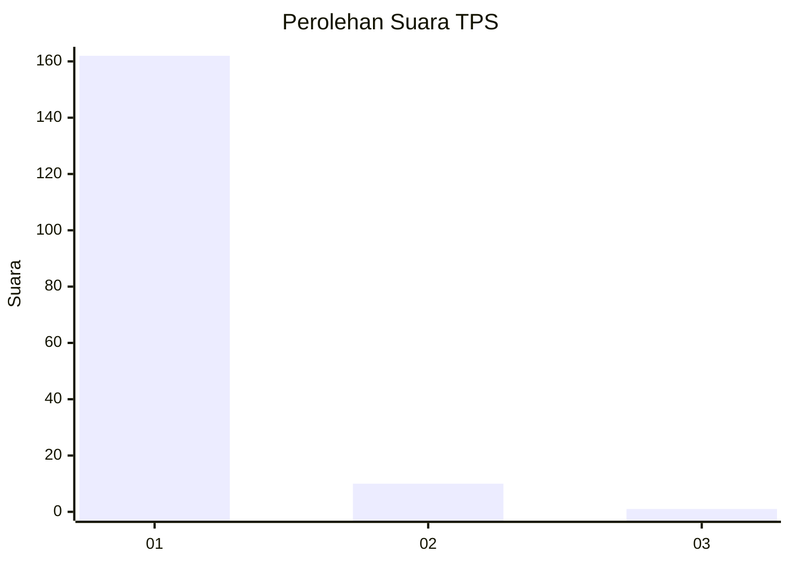
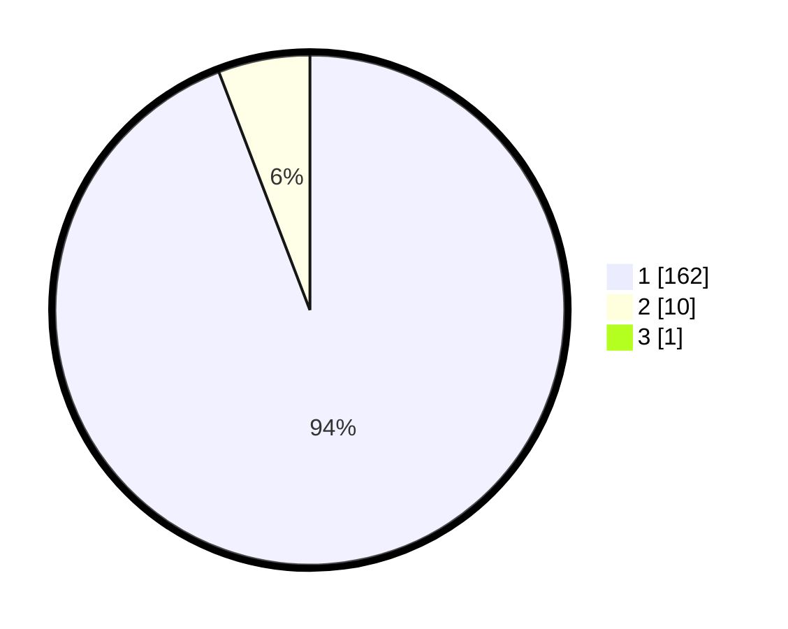

# Hasil

## Grafik

## Tabel

| No. | Nama Paslon    | Suara | Suara (raw) | Persentase |
|:--- |:-------------- | -----:| -----------:| ----------:|
| 1   | ANIES MUHAIMIN | 162   | [162][p-1]  | 93,64      |
| 2   | PRABOWO GIBRAN | 10    | [10][p-2]   | 5,78       |
| 3   | GANJAR MAHFUD  | 1     | [1][p-3]    | 0,58       |

[p-1]: https://github.com/gigit-pemilu/pemilu-2024-11-aceh/blob/main/pilpres/hitung-suara/sub/11-aceh/sub/08-aceh-utara/sub/15-sawang/sub/2009-meunasah-pulo/sub/003-tps/sub/paslon-1.txt
[p-2]: https://github.com/gigit-pemilu/pemilu-2024-11-aceh/blob/main/pilpres/hitung-suara/sub/11-aceh/sub/08-aceh-utara/sub/15-sawang/sub/2009-meunasah-pulo/sub/003-tps/sub/paslon-2.txt
[p-3]: https://github.com/gigit-pemilu/pemilu-2024-11-aceh/blob/main/pilpres/hitung-suara/sub/11-aceh/sub/08-aceh-utara/sub/15-sawang/sub/2009-meunasah-pulo/sub/003-tps/sub/paslon-3.txt

## Foto C Plano

https://sirekap-obj-formc.kpu.go.id/5d49/pemilu/ppwp/11/08/15/20/09/1108152009003-20240215-080606--a126c8b8-3e0a-41c9-871f-dc5a5eb46c90.jpg

https://sirekap-obj-formc.kpu.go.id/5d49/pemilu/ppwp/11/08/15/20/09/1108152009003-20240215-080715--d34a3867-6b17-4386-9096-012a52d9ee62.jpg

https://sirekap-obj-formc.kpu.go.id/5d49/pemilu/ppwp/11/08/15/20/09/1108152009003-20240215-080827--b5a50b0e-39ee-4af7-9c95-d5bc9e642f3f.jpg

## Metadata

| Key        | Value               |
| ---------- | ------------------- |
| Time Stamp | 2024-02-15 16:30:25 |

