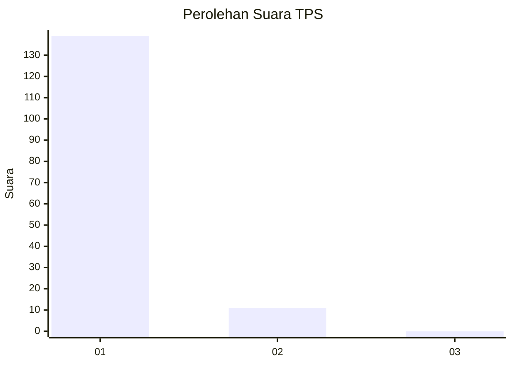
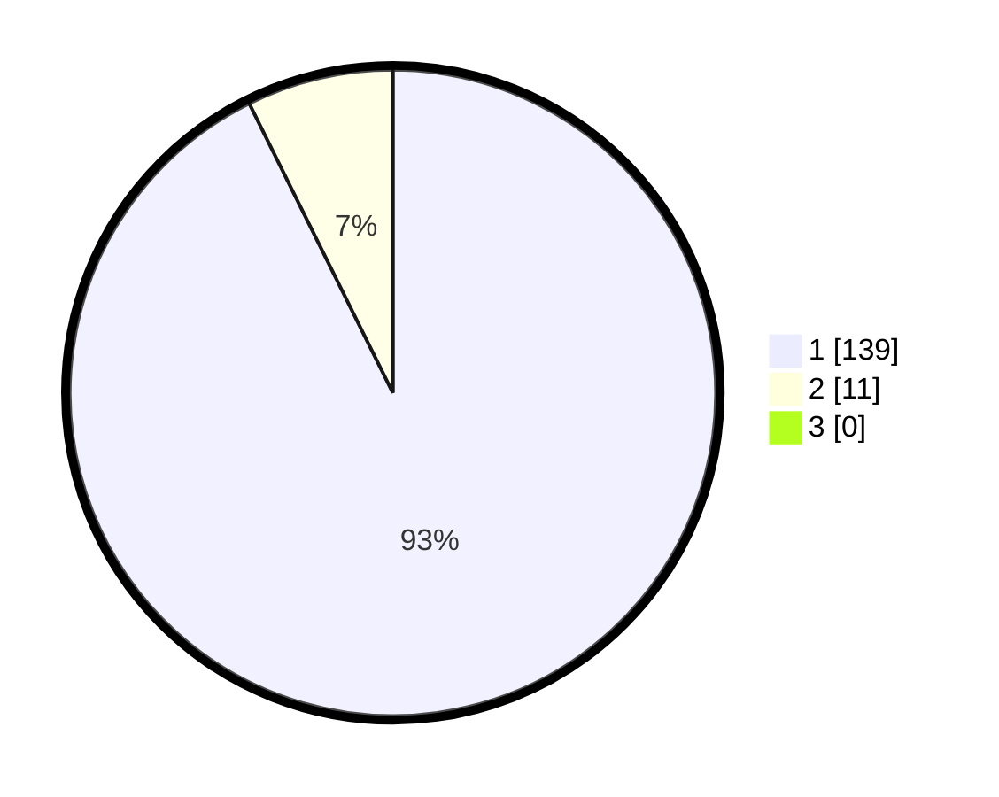

# Hasil

## Grafik

## Tabel

| No. | Nama Paslon    | Suara | Suara (raw) | Persentase |
|:--- |:-------------- | -----:| -----------:| ----------:|
| 1   | ANIES MUHAIMIN | 139   | [139][p-1]  | 92,67      |
| 2   | PRABOWO GIBRAN | 11    | [11][p-2]   | 7,33       |
| 3   | GANJAR MAHFUD  | 0     | [0][p-3]    | 0,00       |

[p-1]: https://github.com/gigit-pemilu/pemilu-2024-11-aceh/blob/main/pilpres/hitung-suara/sub/11-aceh/sub/08-aceh-utara/sub/15-sawang/sub/2012-lhok-kuyun/sub/002-tps/sub/paslon-1.txt
[p-2]: https://github.com/gigit-pemilu/pemilu-2024-11-aceh/blob/main/pilpres/hitung-suara/sub/11-aceh/sub/08-aceh-utara/sub/15-sawang/sub/2012-lhok-kuyun/sub/002-tps/sub/paslon-2.txt
[p-3]: https://github.com/gigit-pemilu/pemilu-2024-11-aceh/blob/main/pilpres/hitung-suara/sub/11-aceh/sub/08-aceh-utara/sub/15-sawang/sub/2012-lhok-kuyun/sub/002-tps/sub/paslon-3.txt

## Foto C Plano

https://sirekap-obj-formc.kpu.go.id/2758/pemilu/ppwp/11/08/15/20/12/1108152012002-20240215-014354--e2527fab-a106-4aaf-b2dd-47081984e870.jpg

https://sirekap-obj-formc.kpu.go.id/2758/pemilu/ppwp/11/08/15/20/12/1108152012002-20240214-214728--d6c1045b-64d5-492e-8416-541e22cf41d8.jpg

https://sirekap-obj-formc.kpu.go.id/2758/pemilu/ppwp/11/08/15/20/12/1108152012002-20240215-074631--734f0553-dd2e-42d9-bde8-2af9172d2440.jpg

## Metadata

| Key        | Value               |
| ---------- | ------------------- |
| Time Stamp | 2024-02-17 16:00:02 |

