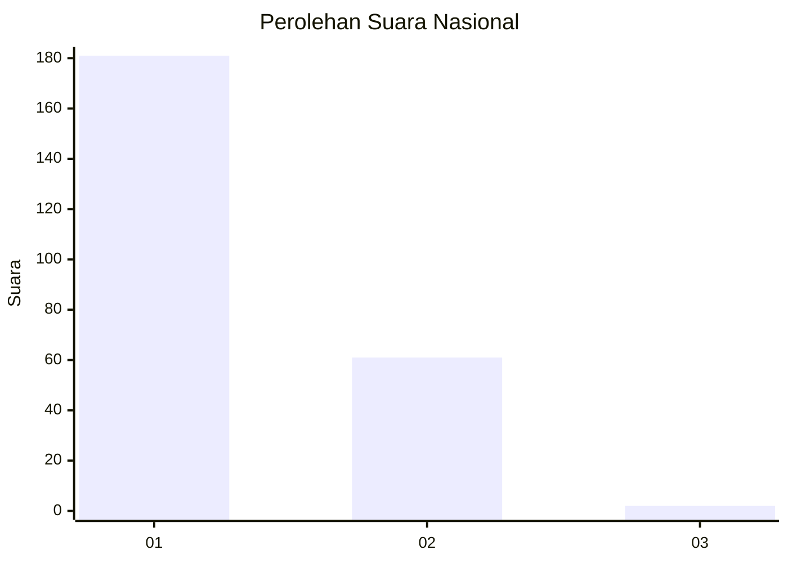
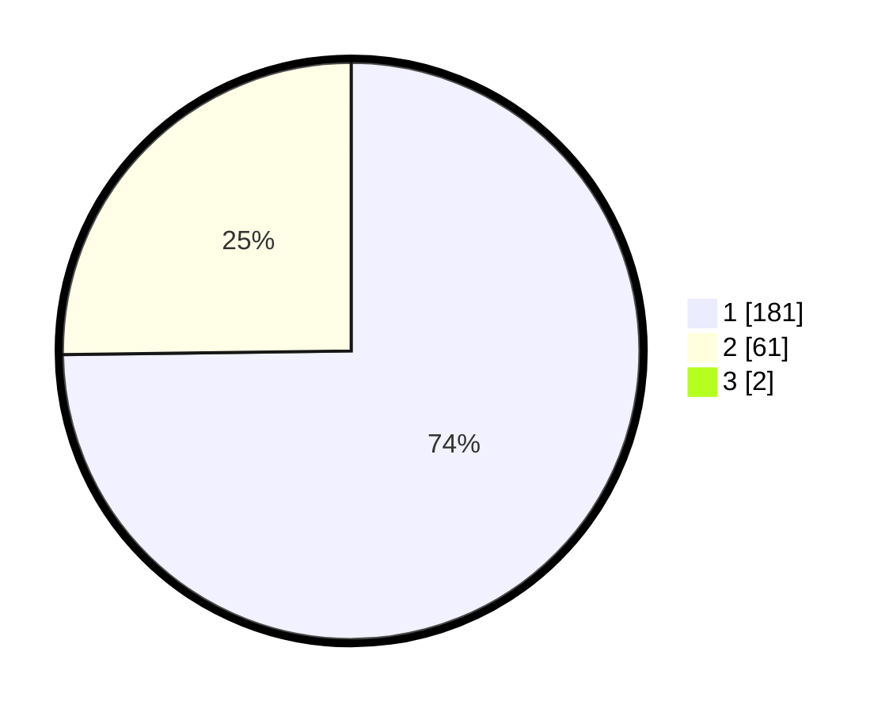

# Hasil

## Grafik

## Tabel

| No. | Nama Paslon    | Suara | Suara (raw) | Persentase |
|:--- |:-------------- | -----:| -----------:| ----------:|
| 1   | ANIES MUHAIMIN | 181   | [181][p-1]  | 74,18      |
| 2   | PRABOWO GIBRAN | 61    | [61][p-2]   | 25,00      |
| 3   | GANJAR MAHFUD  | 2     | [2][p-3]    | 0,82       |

[p-1]: https://github.com/gigit-pemilu/pemilu-2024/blob/main/pilpres/hitung-suara/sub/11-aceh/sub/08-aceh-utara/sub/15-sawang/sub/2013-blang-reuling/sub/001-tps/sub/paslon-1.txt
[p-2]: https://github.com/gigit-pemilu/pemilu-2024/blob/main/pilpres/hitung-suara/sub/11-aceh/sub/08-aceh-utara/sub/15-sawang/sub/2013-blang-reuling/sub/001-tps/sub/paslon-2.txt
[p-3]: https://github.com/gigit-pemilu/pemilu-2024/blob/main/pilpres/hitung-suara/sub/11-aceh/sub/08-aceh-utara/sub/15-sawang/sub/2013-blang-reuling/sub/001-tps/sub/paslon-3.txt

## Foto C Plano

https://sirekap-obj-formc.kpu.go.id/eef9/pemilu/ppwp/11/08/15/20/13/1108152013001-20240222-030654--65a3d210-1359-4ac2-babf-9618c3a5c2a4.jpg

https://sirekap-obj-formc.kpu.go.id/eef9/pemilu/ppwp/11/08/15/20/13/1108152013001-20240222-030720--1a81d19c-4f66-44eb-ac2e-e8b2a7befc70.jpg

https://sirekap-obj-formc.kpu.go.id/eef9/pemilu/ppwp/11/08/15/20/13/1108152013001-20240222-030744--d1a81aa2-a3d9-44b9-a711-a279d0756ee6.jpg

## Metadata

| Key        | Value               |
| ---------- | ------------------- |
| Time Stamp | 2024-02-24 22:31:28 |

