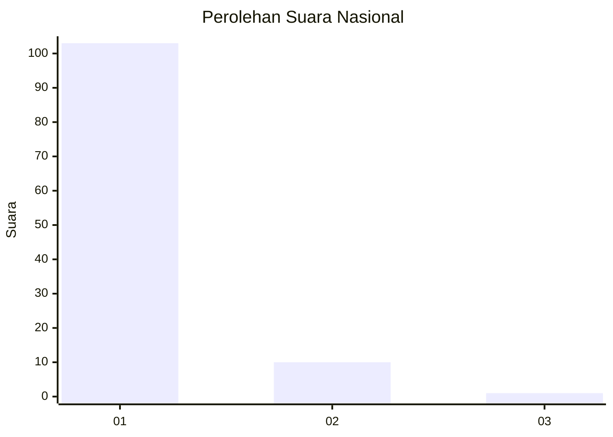
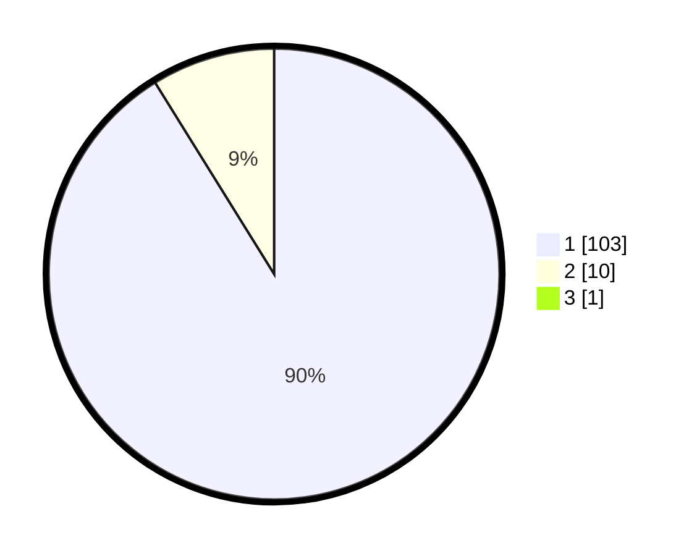

# Hasil

## Grafik

## Tabel

| No. | Nama Paslon    | Suara | Suara (raw) | Persentase |
|:--- |:-------------- | -----:| -----------:| ----------:|
| 1   | ANIES MUHAIMIN | 103   | [103][p-1]  | 90,35      |
| 2   | PRABOWO GIBRAN | 10    | [10][p-2]   | 8,77       |
| 3   | GANJAR MAHFUD  | 1     | [1][p-3]    | 0,88       |

[p-1]: https://github.com/gigit-pemilu/pemilu-2024/blob/main/pilpres/hitung-suara/sub/11-aceh/sub/08-aceh-utara/sub/15-sawang/sub/2014-lhok-gajah/sub/001-tps/sub/paslon-1.txt
[p-2]: https://github.com/gigit-pemilu/pemilu-2024/blob/main/pilpres/hitung-suara/sub/11-aceh/sub/08-aceh-utara/sub/15-sawang/sub/2014-lhok-gajah/sub/001-tps/sub/paslon-2.txt
[p-3]: https://github.com/gigit-pemilu/pemilu-2024/blob/main/pilpres/hitung-suara/sub/11-aceh/sub/08-aceh-utara/sub/15-sawang/sub/2014-lhok-gajah/sub/001-tps/sub/paslon-3.txt

## Foto C Plano

https://sirekap-obj-formc.kpu.go.id/5c62/pemilu/ppwp/11/08/15/20/14/1108152014001-20240218-102811--678361e8-b983-4e5a-81ea-9b612705f504.jpg

https://sirekap-obj-formc.kpu.go.id/5c62/pemilu/ppwp/11/08/15/20/14/1108152014001-20240215-034741--a9e50c39-c841-464d-a3bb-fd34a5b80533.jpg

https://sirekap-obj-formc.kpu.go.id/5c62/pemilu/ppwp/11/08/15/20/14/1108152014001-20240215-040928--8f1ec887-e64e-44d8-9441-2467faff9fbc.jpg

## Metadata

| Key        | Value               |
| ---------- | ------------------- |
| Time Stamp | 2024-02-19 06:16:00 |

