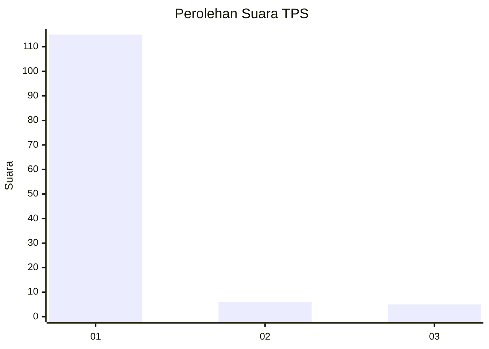
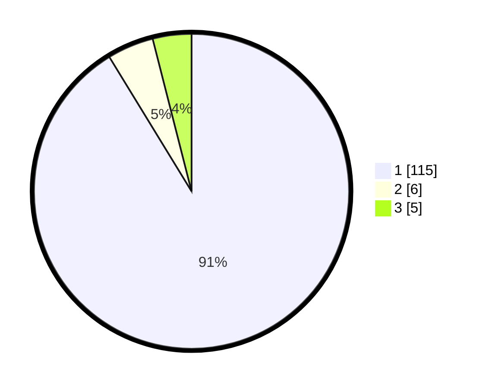

# Hasil

## Grafik

## Tabel

| No. | Nama Paslon    | Suara | Suara (raw) | Persentase |
|:--- |:-------------- | -----:| -----------:| ----------:|
| 1   | ANIES MUHAIMIN | 115   | [115][p-1]  | 91,27      |
| 2   | PRABOWO GIBRAN | 6     | [6][p-2]    | 4,76       |
| 3   | GANJAR MAHFUD  | 5     | [5][p-3]    | 3,97       |

[p-1]: https://github.com/gigit-pemilu/pemilu-2024-11-aceh/blob/main/pilpres/hitung-suara/sub/11-aceh/sub/08-aceh-utara/sub/15-sawang/sub/2014-lhok-gajah/sub/002-tps/sub/paslon-1.txt
[p-2]: https://github.com/gigit-pemilu/pemilu-2024-11-aceh/blob/main/pilpres/hitung-suara/sub/11-aceh/sub/08-aceh-utara/sub/15-sawang/sub/2014-lhok-gajah/sub/002-tps/sub/paslon-2.txt
[p-3]: https://github.com/gigit-pemilu/pemilu-2024-11-aceh/blob/main/pilpres/hitung-suara/sub/11-aceh/sub/08-aceh-utara/sub/15-sawang/sub/2014-lhok-gajah/sub/002-tps/sub/paslon-3.txt

## Foto C Plano

https://sirekap-obj-formc.kpu.go.id/a9fd/pemilu/ppwp/11/08/15/20/14/1108152014002-20240215-035719--59c0f78d-bb49-4cb8-b6b7-5e6b59d51985.jpg

https://sirekap-obj-formc.kpu.go.id/a9fd/pemilu/ppwp/11/08/15/20/14/1108152014002-20240215-035912--5e043aaa-b69f-4219-a76b-26ee405aac45.jpg

https://sirekap-obj-formc.kpu.go.id/a9fd/pemilu/ppwp/11/08/15/20/14/1108152014002-20240215-035713--65e893ca-398e-43ca-8e20-91b6a919448a.jpg

## Metadata

| Key        | Value               |
| ---------- | ------------------- |
| Time Stamp | 2024-02-15 15:00:29 |

